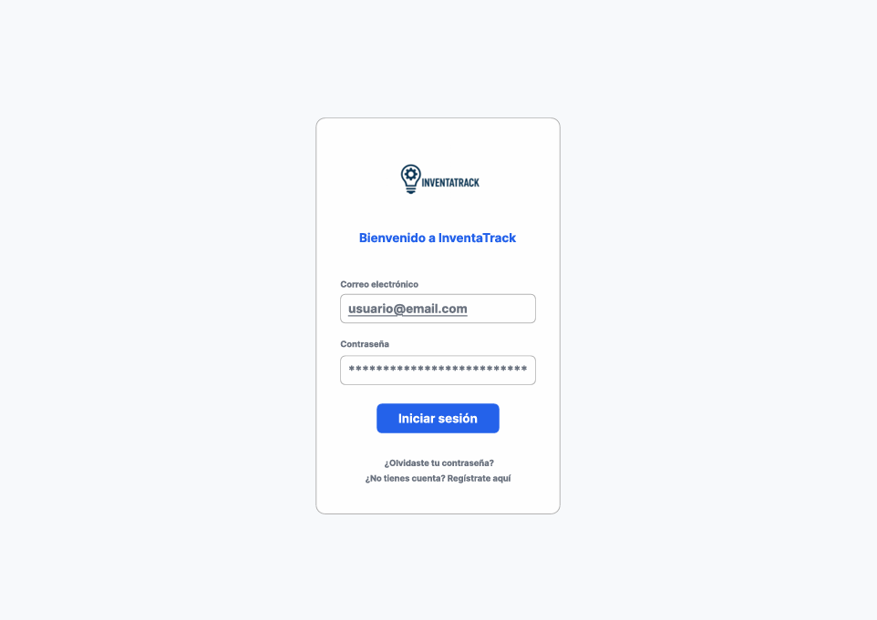
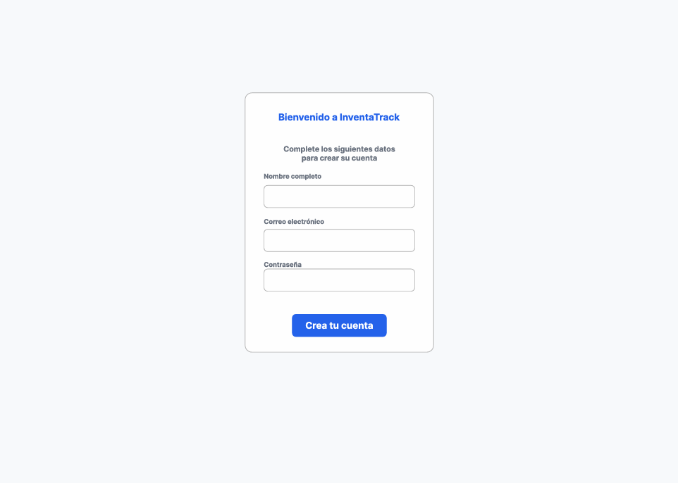
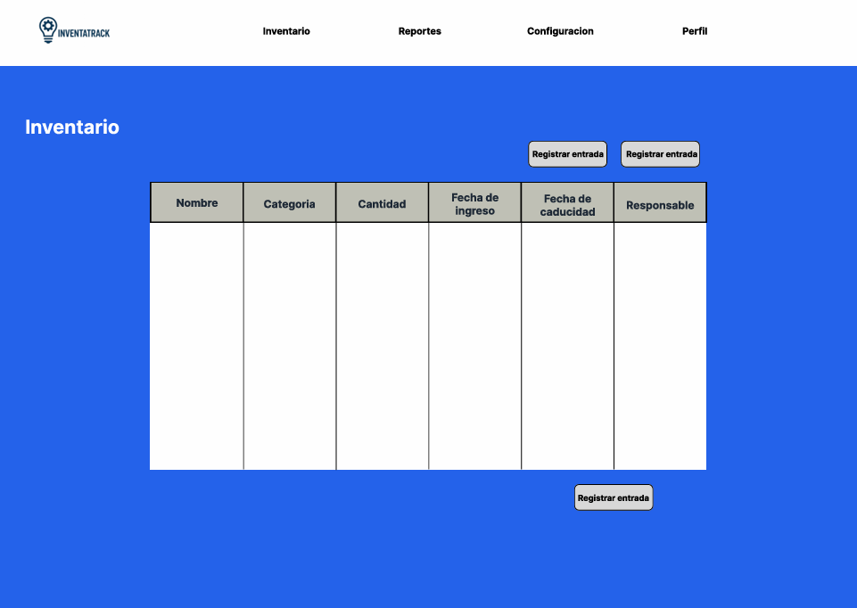
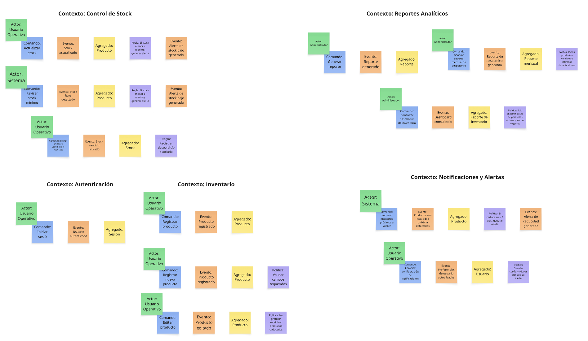
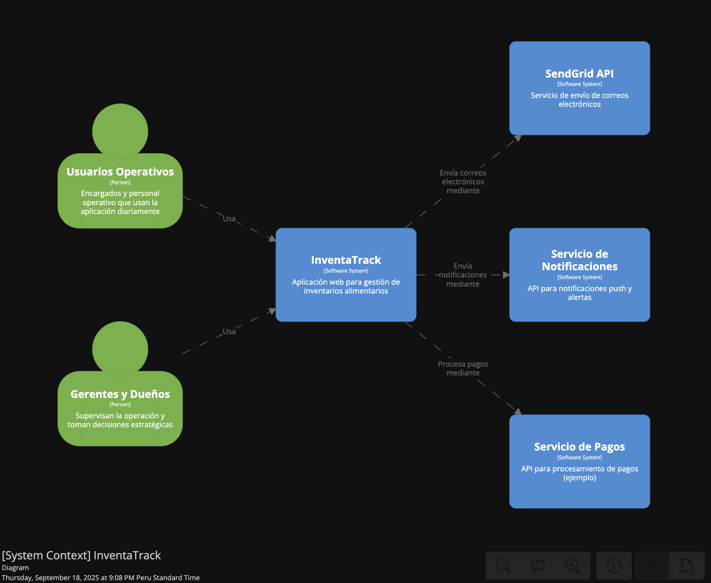
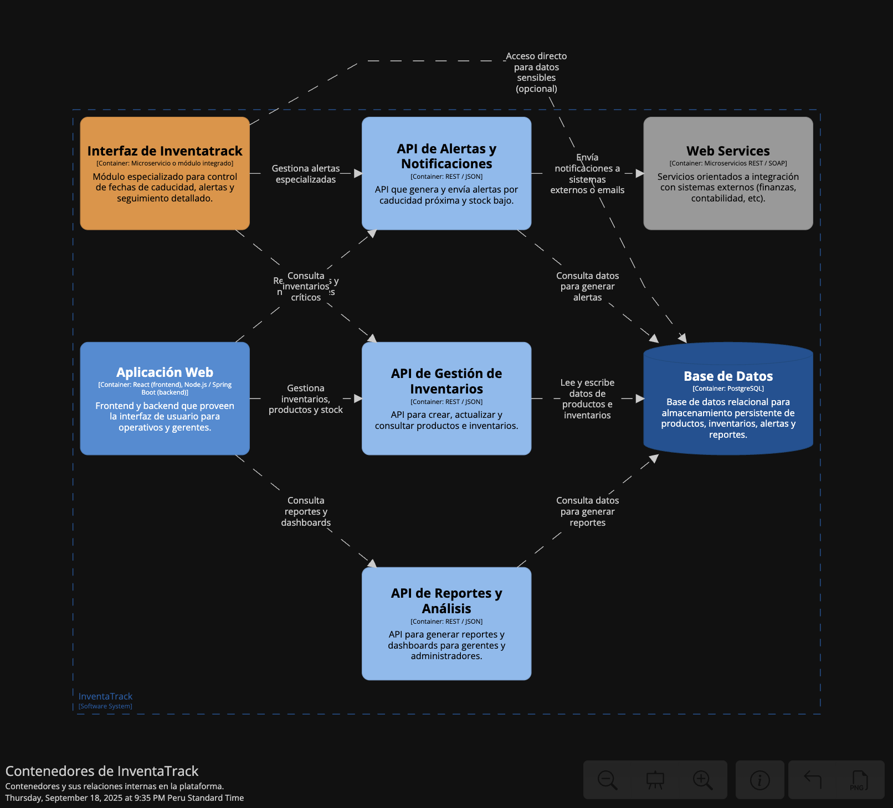
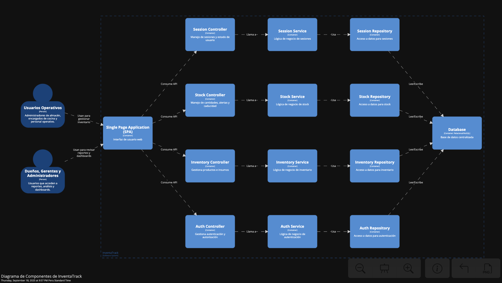
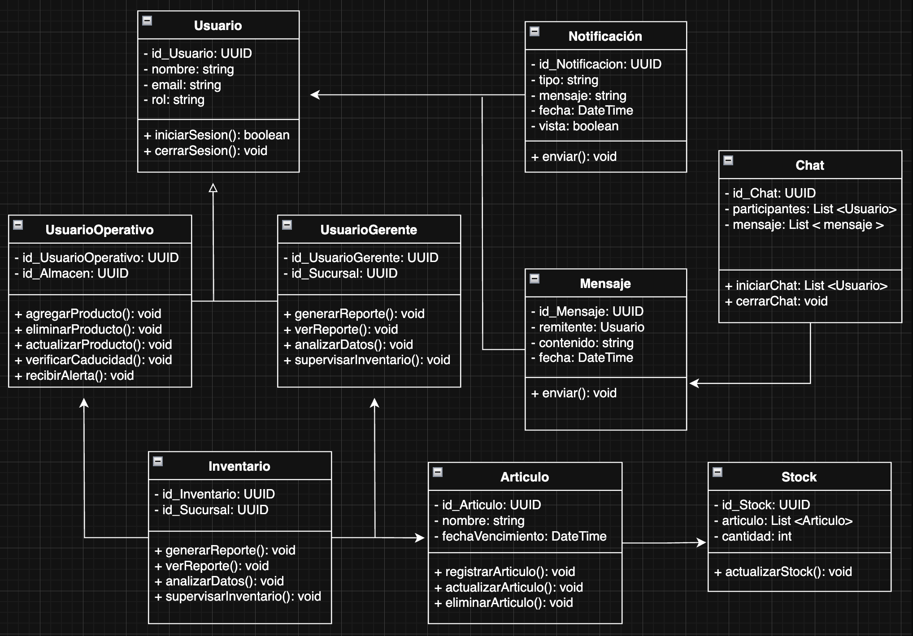
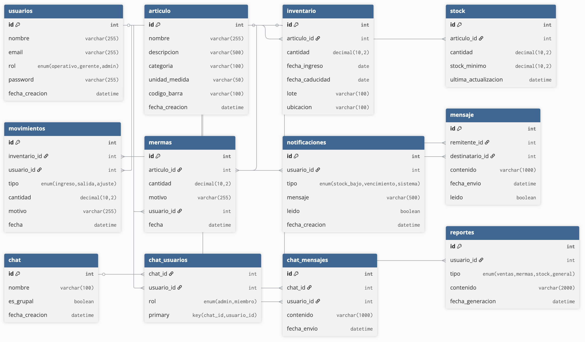

<h3 align="center"> Universidad Peruana de Ciencias Aplicadas </h3>

<h3 align="center"> Ingeniería de Software </h3>
<h3 align="center"> Ciclo 2025 - 2</h3>

<br>

<div align="center">
    </img><br>
</div>

<br>

<h1 align="center"> TB1 Report </h1>

<h3 align="center"> Desarrollo de Aplicaciones Open Source </h3>

<h3 align="center"> 1ASI0729-2520-7394 </h3>

<h3 align="center"> Docente: Hugo Allan Mori Paiva </h3>

<h3 align="center"> Startup: InventaTech </h3>

<h3 align="center"> Producto: InventaTrack </h3>

<h3> Team Members: </h3>

|                Nombre                |   Código   |
| :----------------------------------: | :--------: |
| Gonzalo Alonso Carhuancote Dominguez | U202210720 |
|   Juan Carlos Alvarado de la Cruz    | U202216150 |
|    Joan Fernando Teves Samaniego     | U202117303 |
|      Antonio Rodrigo Duran Díaz      | U202215721 |
|     Daiki Oscar Oshiro Yamashita     | U20201f846 |
<h3 align="center">Septiembre, 2025</h3>

<div style="page-break-after: always;"></div>


## Registro de Versiones del Informe

| Versión | Fecha | Autor | Descripción de modificación |
| :-------: | :---------: | :----------------: | :----------------------:|
|TB1|15/09/25|Gonzalo Carhuancote, Juan Carlos Alvarado, Joan Teves, Antonio Duran, Daiki Oshiro|Para esta primera entrega, realizamos los primeros 5 capítulos del informe y desarrollamos la primera versión del landing page|


## Project Report Collaboration Insights

A continuación, se detallan los repositorios utilizados a lo largo del proyecto:

#### Link del repositorio del Reporte: 

- 

#### Link del repositorio de la Landing Page: 

-

### Entrega TB1:

Durante esta entrega se elaboraron los capítulos 1 al 5 del informe. La redacción fue dividida equitativamente entre los integrantes del equipo, quienes se encargaron de desarrollar sus respectivas secciones de manera paralela. Cada miembro subió sus contribuciones directamente al repositorio de GitHub, asegurando así un seguimiento claro de los avances y la colaboración conjunta.

##### Participación por integrante:

- Gonzalo Alonso Carhuancote Dominguez:

- Juan Carlos Alvarado de la Cruz:

- Joan Fernando Teves Samaniego:

- Antonio Rodrigo Duran Díaz:

- Daiki Oscar Oshiro Yamashita:


# Contenido

## Índice

- [Registro de versiones del informe](#registro-de-versiones-del-informe)

- [Project Report Collaboration Insights](#project-report-collaboration-insights)

- [Contenido](#contenido)

- [Student Outcome](#student-outcome-1)

- [Capítulo I: Introducción](#capitulo-i-introduccion)
    - [1.1. StartUp Profile](#11-startup-profile)
        - [1.1.1. Descripción de la StartUp](#111-descripción-de-la-startup)
        - [1.1.2. Perfiles de Integrantes del equipo](#112-perfiles-de-integrantes-del-equipo)
    - [1.2. Solution Profile](#12-solution-profile)
        - [1.2.1. Antecedentes y Problemática](#121-antecedentes-y-problemática)
        - [1.2.2. Lean UX Process](#122-lean-ux-process)
            - [1.2.2.1. Lean UX Problem Statements](#1221-lean-ux-problem-statements)
            - [1.2.2.2. Lean UX Assumptions](#1222-lean-ux-assumptions)
            - [1.2.2.3. Lean UX Hyphotesis Statements](#1223-lean-ux-hyphotesis-statements)
            - [1.2.2.4. Lean UX Canvas](#1224-lean-ux-canvas)
    - [1.3. Segmentos objetivo](#13-segmentos-objetivo)
- [Capítulo II: Requirements Elicitation & Analysis]()
    - [2.1. Competidores](#21-competidores)
        - [2.1.1. Análisis competitivo](#211-análisis-competitivo)
        - [2.1.2. Estrategias y tácticas frente a competidores](#212-estrategias-y-tácticas-frente-a-competidores)
    - [2.2. Entrevistas](#22-entrevistas)
        - [2.2.1. Diseño de entrevistas](#221-diseño-de-entrevistas)
        - [2.2.2. Registro de entrevistas](#222-registro-de-entrevistas)
        - [2.2.3. Análisis de entrevistas](#223-análisis-de-entrevistas)
    - [2.3. Needfinding](#23-needfinding)
        - [2.3.1. User Persona](#231-user-persona)
        - [2.3.2. User Task Matrix](#232-user-task-matrix)
        - [2.3.3. User Journey Mapping](#233-user-journey-mapping)
        - [2.3.4. Empathy Mapping](#234-empathy-mapping)
    - [2.4 Big Picture Event Storming](#24-big-picture-event-storming)
    - [2.5 Ubiquitous Language](#25-ubiquitous-language)
- [Capítulo III: Requirements Specification]()
    - [3.1. User Stories](#31-user-stories)
    - [3.2. Impact Mapping](#32-impact-mapping)
    - [3.3. Product Backlog](#33-product-backlog)
- [Capítulo IV: Product Design]()
    - [4.1. Style Guidelines](#41-style-guidelines)
        - [4.1.1. General Style Guidelines](#411-general-style-guidelines)
        - [4.1.2. Web Style Guidelines](#412-web-style-guidelines)
    - [4.2. Information Architecture](#42-information-architecture)
        - [4.2.1. Organization Systems](#421-organization-systems)
        - [4.2.2. Labeling Systems](#422-labeling-systems)
        - [4.2.3. SEO Tags and Meta Tags](#423-seo-tags-and-meta-tags)
        - [4.2.4. Searching Systems](#424-searching-systems)
        - [4.2.5. Navigation Systems](#425-navigation-systems)
    - [4.3. Landing Page UI Design](#43-landing-page-ui-design)
        - [4.3.1. Landing Page Wireframe](#431-landing-page-wireframe)
        - [4.3.2. Landing Page Mock-up](#432-landing-page-mock-up)
    - [4.4. Web Applications UX/UI Design](#44-web-applications-uxui-design)
        - [4.4.1. Web Applications Wireframes](#441-web-applications-wireframes)
        - [4.4.2. Web Applications Wireflow Diagrams](#442-web-applications-wireflow-diagrams)
        - [4.4.3. Web Applications Mock-ups](#443-web-applications-mock-ups)
        - [4.4.4. Web Applications User Flow Diagrams](#444-web-applications-user-flow-diagrams)
    - [4.5. Web Applications Prototyping](#45-web-applications-prototyping)
    - [4.6. Domain-Driven Software Architecture](#46-domain-driven-software-architecture)
        - [4.6.1. Design-Level Event Storming](#461-design-level-event-storming)
        - [4.6.2. Software Architecture Context Diagram](#462-software-architecture-context-diagram)
        - [4.6.3. Software Architecture Container Diagrams](#463-software-architecture-container-diagrams)
        - [4.6.4. Software Architecture Components Diagrams](#464-software-architecture-components-diagrams)
    - [4.7. Software Object-Oriented Design](#47-software-object-oriented-design)
        - [4.7.1. Class Diagrams](#471-class-diagrams)
    - [4.8. Database Design](#48-database-design)
        - [4.8.1. Database Diagram](#481-database-diagram)
- [Capítulo V: Product Implementation, Validation & Deployment]()
    - [5.1. Software Configuration Management](#51-software-configuration-management)
        - [5.1.1. Software Development Environment Configuration](#511-software-development-environment-configuration)
        - [5.1.2. Source Code Management](#512-source-code-management)
        - [5.1.3. Source Code Style Guide & Conventions](#513-source-code-style-guide--conventions)
        - [5.1.4. Software Deployment Configuration](#514-software-deployment-configuration)
    - [5.2. Landing Page, Services & Applications Implementation](#52-landing-page-services--applications-implementation)
        - [5.2.1. Sprint 1](#521-sprint-1)
            - [5.2.1.1. Sprint Planning 1](#5211-sprint-planning-1)
            - [5.2.1.3. Sprint Backlog 1](#5213-sprint-backlog-1)
            - [5.2.1.4. Development Evidence for Sprint Review](#5214-development-evidence-for-sprint-review)
            - [5.2.1.5. Execution Evidence for Sprint Review](#5215-execution-evidence-for-sprint-review)
            - [5.2.1.6. Services Documentation Evidence for Sprint Review](#5216-services-documentation-evidence-for-sprint-review)
            - [5.2.1.7. Software Deployment Evidence for Sprint Review](#5217-software-deployment-evidence-for-sprint-review)
            - [5.2.1.8. Team Collaboration Insights during Sprint](#5218-team-collaboration-insights-during-sprint)
    - [5.3. Validation Interviews]()
        - [5.3.1. Diseño de Entrevistas](#531-diseño-de-entrevistas)
        - [5.3.2. Registro de Entrevistas](#532-registro-de-entrevistas)
        - [5.3.3. Evaluaciones según heuristicas](#533-evaluaciones-segun-heuristicas)
    - [5.4. Video About-the-Product](#54-video-about-the-product)
- [Conclusiones](#conclusiones)
    - [Conclusiones y recomendaciones](#conclusiones-y-recomendaciones)
- [Bibliografía](#bibliografía)
- [Anexos](#anexos)

## Student Outcome

Objetivo general, ABET – EAC - Student Outcome 3: Capacidad de comunicarse efectivamente con un rango de audiencias.

| **Criterio específico** | **Acciones realizadas** | **Conclusiones** |
|-------------------------|--------------------------|------------------|
| **Comunica oralmente con efectividad a diferentes rangos de audiencia** | Gonzalo Alonso Carhuancote Dominguez <br>**TB1**: <br> Juan Carlos Alvarado de la Cruz <br>**TB1**: <br> Joan Fernando Teves Samaniego <br>**TB1**: <br> Antonio Rodrigo Duran Díaz <br>**TB1**: <br> Daiki Oscar Oshiro Yamashita <br>**TB1**: <br> | Gonzalo Alonso Carhuancote Dominguez <br>**TB1**: <br> Juan Carlos Alvarado de la Cruz <br>**TB1**: <br> Joan Fernando Teves Samaniego <br>**TB1**: <br> Antonio Rodrigo Duran Díaz <br>**TB1**: <br> Daiki Oscar Oshiro Yamashita <br>**TB1**: <br> |
| **Comunica por escrito con efectividad a diferentes rangos de audiencia** | Gonzalo Alonso Carhuancote Dominguez <br>**TB1**: <br> Juan Carlos Alvarado de la Cruz <br>**TB1**: <br> Joan Fernando Teves Samaniego <br>**TB1**: <br> Antonio Rodrigo Duran Díaz <br>**TB1**: <br> Daiki Oscar Oshiro Yamashita <br>**TB1**: <br> | Gonzalo Alonso Carhuancote Dominguez <br>**TB1**: <br> Juan Carlos Alvarado de la Cruz <br>**TB1**: <br> Joan Fernando Teves Samaniego <br>**TB1**: <br> Antonio Rodrigo Duran Díaz <br>**TB1**: <br> Daiki Oscar Oshiro Yamashita <br>**TB1**: <br> |
<div style="page-break-after: always;"></div>

<div style="page-break-after: always;"></div>

# Capítulo IV: Product Design

## 4.1 Style Guidelines

Las guías de estilo son fundamentales para asegurar una comunicación clara, coherente y profesional en todos los aspectos del proyecto. En esta sección, definiremos las pautas que el equipo utilizará para diseñar la aplicación InventaTech. Estas directrices abarcan aspectos como la selección de colores, tipografía y la estructura general del diseño.

A continuación, se detallan los aspectos clave de este enfoque de diseño.

## 4.1.1 Gereral Style Guidelines

**Branding:**


**Brand Name:**


**Typography:**

La tipografía organiza el lenguaje visual de las plataformas, garantizando legibilidad y mejorando la experiencia del usuario. Por eso, se eligieron estos tipos de letra.


**Head:**


**Body:**


**Colors:**

| Rol | HEX | Uso |
|---|---:|---|
| Primary | `#2563eb` | Títulos, enlaces y elementos de marca |
| Primary Dark | `#1e40af` | Gradientes y fondos de énfasis |
| Secondary | `#10b981` | Indicadores (éxito, progreso) |
| Accent | `#f59e0b` | Llamadas de atención / acentos |
| Text Dark | `#1f2937` | Texto principal |
| Text Light | `#6b7280` | Texto secundario |
| Background Light | `#f8fafc` | Fondos generales |
| White | `#ffffff` | Fondos de tarjetas / botones claros |

**Spacing:**


## 4.1.2 Web Style Guidelines

En esta sección se establecen los estándares visuales y de interacción aplicados a las interfaces web de InventaTech, asegurando consistencia, accesibilidad y una experiencia de usuario óptima en cualquier dispositivo.

**Elementos Visuales (Imágenes)**

Las imágenes juegan un papel fundamental dentro de la interfaz, ya sea como íconos funcionales, fotografías de perfil o ilustraciones. Los íconos funcionales se emplean en menús, botones y notificaciones, y deben ser minimalistas, lineales y adaptados a tamaños de entre 20px y 32px según el contexto. Las fotografías de perfil de los usuarios deben tener un formato cuadrado o circular, con resolución mínima de 300x300px, optimizadas para carga rápida sin perder calidad. Las imágenes ilustrativas se utilizarán en landing pages, pantallas de onboarding y secciones de ayuda, buscando transmitir confianza, modernidad y profesionalismo, siempre respetando la paleta de colores definida para la marca. Todas las imágenes deberán estar optimizadas, preferiblemente en formato WebP, y su peso no debe superar los 200kb cuando sea posible.

**Botones**

Los botones son elementos clave para la interacción del usuario y deben ser fácilmente reconocibles en cualquier pantalla. Se diferencian principalmente en tres tipos: botones primarios para acciones principales como “Guardar” o “Enviar”, botones secundarios para acciones complementarias como “Cancelar” o “Volver” y botones de acento para llamadas de atención específicas como “Reintentar”. Cada botón debe incluir estados visuales claramente definidos, incluyendo el estado por defecto, hover, activo y deshabilitado, siempre respetando el contraste y la accesibilidad.

**Formularios**

Los formularios se implementarán en diferentes secciones de la aplicación, como inicio de sesión, registro de usuarios, inventario y reportes. El diseño de los formularios debe priorizar la claridad, mostrando etiquetas visibles sobre los campos, validación en tiempo real y mensajes de error y éxito diferenciados con colores específicos. La consistencia visual se mantiene mediante bordes suaves, espaciado interno uniforme y tipografía legible. Además, los formularios deben ser accesibles mediante teclado y contener placeholders claros que guíen al usuario. Se considerará el perfil de usuario para la adaptación del formulario: los usuarios operativos tendrán formularios breves y rápidos de llenar, mientras que los usuarios gerenciales dispondrán de formularios más completos con filtros y opciones avanzadas para generar reportes y análisis.

## 4.2. Information Architecture

### 4.2.1. Organization Systems

En InventaTech, la información se organiza estratégicamente para facilitar la operación de los usuarios operativos y la supervisión de gerentes y administradores. Se aplican distintos tipos de organización visual y categorización según el tipo de contenido y el perfil del usuario:

- **Por categorías de insumos:** Alimentos, bebidas, material de limpieza, utensilios, ingredientes especiales. Esto permite a los usuarios operativos localizar rápidamente los productos y generar reportes específicos.
- **Por tipo de movimiento:** Entradas, salidas y devoluciones. La organización secuencial garantiza consistencia en los registros y facilidad en la auditoría de procesos.
- **Por estado del stock:** Crítico, medio o suficiente. La estructura jerárquica permite resaltar insumos que requieren atención inmediata en dashboards y reportes gerenciales.
- **Por información temporal:** Fecha de ingreso, fecha de caducidad y última actualización. La organización cronológica facilita priorizar insumos próximos a vencer y auditar el historial de movimientos.
- **Por usuario responsable:** Encargados de cocina o administradores de almacén. La categorización matricial permite filtrar registros según quién realizó cada acción, útil para trazabilidad y seguimiento.
- **Por alertas y notificaciones:** Stock bajo, caducidad próxima, movimientos pendientes. Se combinan jerarquía y organización matricial para asegurar que la información crítica sea visible y accesible.
- **Por prioridad de gestión:** Urgentes, regulares y de baja rotación. La organización jerárquica ayuda a planificar eficientemente las tareas diarias y proporciona información estratégica para la toma de decisiones.

Con esta estructura, InventaTech asegura que la información sea accesible, eficiente y útil tanto para la operación diaria como para la supervisión estratégica.

### 4.2.2. Labeling Systems

En InventaTech, los íconos y etiquetas se diseñan para ofrecer a los usuarios una navegación intuitiva y rápida comprensión de las funciones disponibles. Cada ícono representa un conjunto de información o acción clave dentro de la plataforma.

| Ícono | Nombre | Descripción |
|-------|--------|-------------|
| 👤    | Mi Perfil | Permite a los usuarios (operativos o gerenciales) acceder y modificar su información personal, consultar historial de movimientos de insumos y revisar su actividad reciente. |
| 📦    | Inventario / Áreas de insumos | Menú desplegable que organiza los insumos por categoría, tipo de producto o ubicación en almacén, facilitando la consulta rápida y eficiente. |
| 🔍    | Buscar insumo | Permite localizar insumos específicos dentro del inventario, con filtros por nombre, cantidad disponible, fecha de caducidad o proveedor. |
| ⚠️    | Alertas de caducidad | Notifica a los usuarios sobre insumos próximos a vencer o vencidos, para tomar acciones preventivas y evitar desperdicios. |
| 📈    | Reportes de consumo | Acceso a reportes detallados sobre consumo de insumos, permitiendo a gerentes tomar decisiones estratégicas sobre compras y control de costos. |
| 📊    | Dashboard de stock crítico | Visualiza los insumos con nivel crítico, alertando sobre cantidades bajas y ayudando en la planificación de reabastecimiento. |
| ⚙️    | Configuración | Permite a los usuarios modificar ajustes de la cuenta, preferencias de notificación, roles y permisos dentro de la plataforma. |
| 🏠    | Inicio / Home | Lleva al usuario a la página principal del panel, mostrando resumen de stock, alertas y accesos rápidos a funciones frecuentes. |
| 🔔    | Notificaciones | Muestra alertas importantes sobre stock bajo, movimientos recientes, mensajes recibidos o acciones pendientes. |
| 📝    | Registrar insumo | Acceso rápido a la funcionalidad para agregar nuevos insumos al inventario, completando información como cantidad, fecha y categoría. |
| ✏️    | Editar insumo | Permite actualizar información de insumos existentes, como cantidad, fecha de caducidad o ubicación en almacén. |
| ➕    | Registrar entradas | Funcionalidad para registrar entradas de insumos al inventario, aumentando las cantidades disponibles. |
| ➖    | Registrar salidas | Permite registrar el consumo o salida de insumos, disminuyendo el stock disponible y actualizando registros. |
| 🔄    | Registrar devoluciones | Función para registrar devoluciones de insumos al inventario, asegurando la consistencia de los datos. |
| 📜    | Historial de movimientos | Permite consultar el historial completo de entradas, salidas y devoluciones, con filtros por fecha y usuario responsable. |
| 📤    | Exportar reportes | Función para descargar reportes en PDF o Excel, facilitando análisis fuera de la plataforma. |
| 🔁    | Comparar periodos de consumo | Permite generar comparaciones entre diferentes periodos para identificar tendencias y patrones de consumo. |
| 📉    | Notificaciones de stock bajo | Alertas automáticas cuando los insumos llegan a su nivel mínimo configurado, para prevenir faltantes. |
| ⏰    | Resumen diario automático | Envía un resumen diario de stock y movimientos al correo o panel del gerente, manteniéndolo informado sin necesidad de ingresar manualmente. |

### 4.2.3. SEO Tags and Meta Tags

Para garantizar la visibilidad del producto en motores de búsqueda y mejorar la experiencia en redes sociales, se implementaron etiquetas **SEO (Search Engine Optimization)** y **meta tags** en el archivo `index.html`.  

#### Meta tags básicas
```html
<meta charset="UTF-8" />
<meta name="viewport" content="width=device-width, initial-scale=1.0" />
<title>InventaTrack - Smart Food Inventory Management</title>
<meta name="description" content="Gestiona inventarios y fechas de caducidad fácilmente con InventaTrack, la solución digital para negocios alimentarios." />
<meta name="keywords" content="inventarios, alimentos perecederos, control de stock, alertas de caducidad, gestión digital" />
<meta name="author" content="InventaTrack" />

```

#### Open Graph y redes sociales
```html
<meta property="og:title" content="InventaTrack" />
<meta property="og:description" content="Gestiona inventarios y fechas de caducidad fácilmente." />
<meta property="og:image" content="https://inventaTrack.com/og-image.jpg" />

<meta name="twitter:card" content="summary_large_image" />
<meta name="twitter:title" content="InventaTrack" />
<meta name="twitter:description" content="Gestiona inventarios y fechas de caducidad fácilmente." />
<meta name="twitter:image" content="https://inventaTrack.com/twitter-image.jpg" />

```

### 4.2.4 Searching Systems

En esta sección se describen los medios de ayuda que se brindarán al usuario para la búsqueda eficiente de datos dentro del producto digital. El objetivo principal es evitar que los usuarios se sientan abrumados o perdidos ante un gran volumen de información, facilitando el acceso rápido y preciso a los datos relevantes.

###### Opciones de búsqueda

- **Búsqueda por texto libre:** Los usuarios podrán ingresar palabras clave o términos relacionados para localizar rápidamente productos, insumos o reportes dentro de la plataforma.

- **Búsqueda avanzada:** Se ofrecerá una búsqueda con filtros específicos que permiten acotar resultados según parámetros relevantes.

###### Filtros disponibles

Dependiendo del contexto y sección, los usuarios podrán filtrar los resultados por:

- Nombre del producto o insumo
- Categoría o tipo de alimento
- Fecha de caducidad
- Estado del stock 
- Fecha de ingreso o última actualización

### 4.2.5 Navigation Systems

A continuación, se mostrarán los sistemas de navegación que le permitirán a nuestros usuarios moverse a través de las distintas piezas de contenido o información.

- **Menú principal (Header):**  
  Ubicado en la parte superior, contiene enlaces ancla hacia las secciones *Features*, *Industries* y *Contact*. Incluye además un botón para cambiar de idioma (`language-switcher`).  

- **Menú móvil (Hamburger menu):**  
  Para dispositivos con pantallas pequeñas, se implementa un botón tipo hamburguesa que despliega los enlaces en columna (`.nav-links.active`).

- **Botones de acción (Call to Action - CTA) claros y visibles:**
  “Agregar producto”, “Editar insumo”, “Generar alerta” y “Ver reporte”. Esto facilita que el usuario realice sus tareas de manera rápida e intuitiva.

- **Footer:**  
  Contiene enlaces secundarios agrupados en cuatro columnas: *Product*, *Support*, *Company* y *Brand description*.  

- **Interactividad:**  
  El archivo `main.js` implementa un **scroll suave** al hacer clic en los enlaces, mejorando la experiencia de navegación.  
  Además, el header cambia de estilo visual al desplazarse la página (`window.scroll` event).  

## 4.3. Landing Page UI Design

### 4.3.1. Landing Page Wireframe

El wireframe define la estructura básica de la landing page en bloques principales:

##### Home Wireframe

##### About Us Wireframe

##### Learn More Wireframe

##### Suscribe Wireframe

### 4.3.1. Landing Page Mock-ups

##### Home Mock-up

##### About Us Mock-up

##### Learn More Mock-up

##### Suscribe Mock-up

## 4.4. Web Applications UX/UI Design

### 4.4.1. Web Applications Wireframes

#### Desktop Browser:

##### Inicio de sesión y registro:


### 4.4.2. Web Applications Wireflow Diagrams

##### Usuario ingresa a la aplicación iniciando sesión o registrándose:


##### Usuario desea realizar un inventario:

##### Usuario desea ver el reporte del inventario:

### 4.4.3. Web Applications Mock-ups

##### Inicio de sesión y registro:




##### Vista de inventarios:


#### Vista de reportes:


### 4.4.4. Web Applications User Flow Diagrams

##### User Goal 1: Acceder a la aplicación ya sea con registro o inicio de sesión.

##### Descripción:

##### Flujo principal (Happy Path):

##### Flujos alternativos parciales:

##### User Goal 2: 

##### Descripción:

##### Flujo principal (Happy Path):

##### Flujos alternativos parciales:

##### User Goal 3: 

##### Descripción:

##### Flujo principal (Happy Path):

##### Flujos alternativos parciales:

## 4.5. Web Applications Prototyping

## 4.6. Domain-Driven Software Architecture

### 4.6.1 Design-Level Event Storming

En esta sección se presenta el resultado de la sesión de Design-Level EventStorming realizada para InventaTrack. Esta técnica colaborativa permitió mapear los eventos clave, comandos, actores y subdominios del sistema, facilitando la comprensión detallada del dominio y la definición de los bounded contexts. A continuación, se muestra una captura del tablero digital donde se registraron y organizaron estos elementos durante la sesión.



Link del miro: https://miro.com/app/board/uXjVJGeS0Kc=/?share_link_id=913695019646

### 4.6.2 Software Architecture Context Diagram



### 4.6.3 Software Architecture Container Diagrams



### 4.6.4 Software Architecture Components Diagrams



## 4.7 Software Object-Oriented Design

### 4.7.1  Class Diagrams



Link del diagrama: https://drive.google.com/file/d/1jcCJUNHeWBzlNkrEl9jwdaP_kr-qJreI/view?usp=sharing

## 4.8 Database Design

### 4.8.1 Database Diagrams


