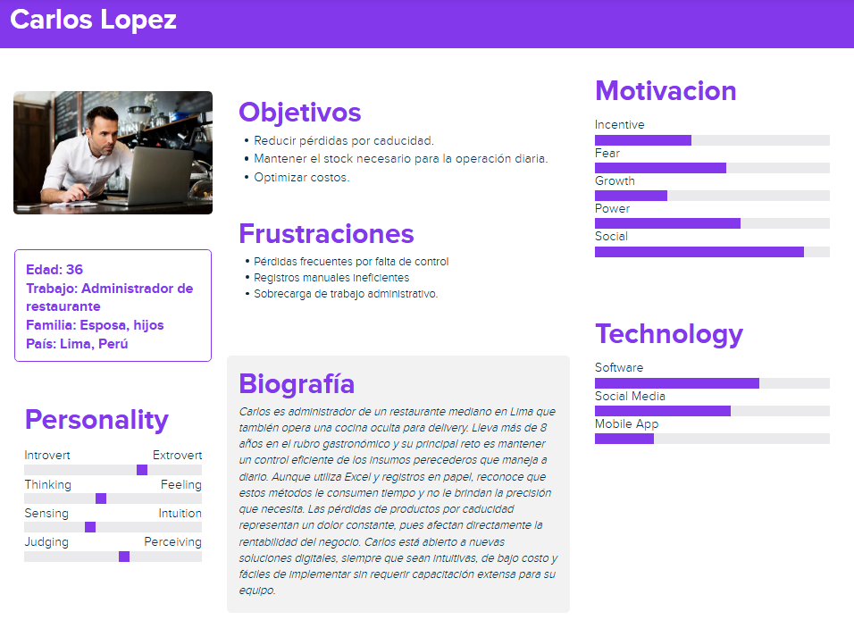
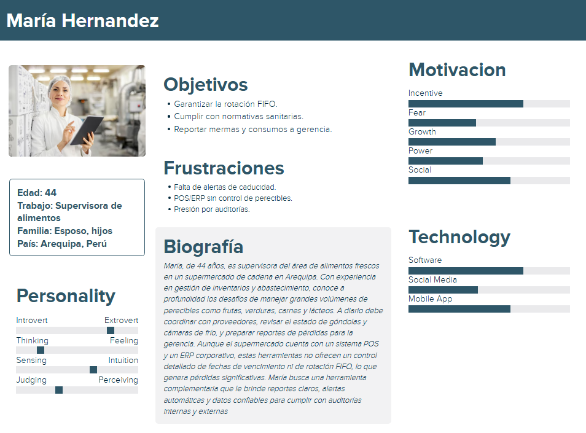

<h1>Informe del Trabajo Final</h1>
<h2>Universidad Peruana de Ciencias Aplicadas</h2>

<h4>Ingeniería de Software</h4>
<h4>Desarrollo de Aplicaciones Open Source</h4>
<h4>1ASI0729-2520-7394</h4>
<h4>Docente: Hugo Allan Mori Paiva</h4>
<h4>Startup: InventaTech</h4>
<h4>Producto: InventaTrack</h4>

## Team memebers:

|                Nombre                |   Código   |
| :----------------------------------: | :--------: |
| Gonzalo Alonso Carhuancote Dominguez | U202210720 |
|   Juan Carlos Alvarado de la Cruz    | U202216150 |
|    Joan Fernando Teves Samaniego     | U202117303 |
|      Antonio Rodrigo Duran Díaz      | U202215721 |
|     Daiki Oscar Oshiro Yamashita     | U20201f846 |

<h4>Ciclo 2025-02</h4>

  
## Registro de Versiones del Informe

| Versión | Fecha      | Autor                                                                                                                                                                                      | Descripción de modificación                                                                                                                  |
| ------- | ---------- | ------------------------------------------------------------------------------------------------------------------------------------------------------------------------------------------ | -------------------------------------------------------------------------------------------------------------------------------------------- |
| **TB1** | 15/09/2025 | Gonzalo Alonso Carhuancote Dominguez    Juan Carlos Alvarado de la Cruz    Joan Fernando Teves Samaniego  Antonio Rodrigo Duran Díaz  Daiki Oscar Oshiro Yamashita | Para esta primera entrega, realizamos los primeros 5 capítulos del informe y desarrollamos la primera versión del landing page del Producto. |

## Project Report Collaboration Insights

Para este informe se ha dividido de la siguiente forma para cada integrante del grupo:

  
  ## 
  
  |  Integrantes   | Tarea asignada |
  |:--------------:|:--------------:|
  | Gonzalo Carhuancote | U202210720   |
# Contenido

## Índice

- [Capítulo I: Introducción]()
    - [1.1. StartUp Profile](#11-startup-profile)
        - [1.1.1. Descripción de la StartUp](#111-descripción-de-la-startup)
        - [1.1.2. Perfiles de Integrantes del equipo](#112-perfiles-de-integrantes-del-equipo)
    - [1.2. Solution Profile](#12-solution-profile)
        - [1.2.1. Antecedentes y Problemática](#121-antecedentes-y-problemática)
        - [1.2.2. Lean UX Process](#122-lean-ux-process)
            - [1.2.2.1. Lean UX Problem Statements](#1221-lean-ux-problem-statements)
            - [1.2.2.2. Lean UX Assumptions](#1222-lean-ux-assumptions)
            - [1.2.2.3. Lean UX Hyphotesis Statements](#1223-lean-ux-hyphotesis-statements)
            - [1.2.2.4. Lean UX Canvas](#1224-lean-ux-canvas)
    - [1.3. Segmentos objetivo](#13-segmentos-objetivo)
- [Capítulo II: Requirements Elicitation & Analysis]()
    - [2.1. Competidores](#21-competidores)
        - [2.1.1. Análisis competitivo](#211-análisis-competitivo)
        - [2.1.2. Estrategias y tácticas frente a competidores](#212-estrategias-y-tácticas-frente-a-competidores)
    - [2.2. Entrevistas](#22-entrevistas)
        - [2.2.1. Diseño de entrevistas](#221-diseño-de-entrevistas)
        - [2.2.2. Registro de entrevistas](#222-registro-de-entrevistas)
        - [2.2.3. Análisis de entrevistas](#223-análisis-de-entrevistas)
    - [2.3. Needfinding](#23-needfinding)
        - [2.3.1. User Persona](#231-user-persona)
        - [2.3.2. User Task Matrix](#232-user-task-matrix)
        - [2.3.3. User Journey Mapping](#233-user-journey-mapping)
        - [2.3.4. Empathy Mapping](#234-empathy-mapping)
    - [2.4 Big Picture Event Storming](#24-big-picture-event-storming)
    - [2.5 Ubiquitous Language](#25-ubiquitous-language)
- [Capítulo III: Requirements Specification]()
    - [3.1. User Stories](#31-user-stories)
    - [3.2. Impact Mapping](#32-impact-mapping)
    - [3.3. Product Backlog](#33-product-backlog)
- [Capítulo IV: Product Design]()
    - [4.1. Style Guidelines](#41-style-guidelines)
        - [4.1.1. General Style Guidelines](#411-general-style-guidelines)
        - [4.1.2. Web Style Guidelines](#412-web-style-guidelines)
    - [4.2. Information Architecture](#42-information-architecture)
        - [4.2.1. Organization Systems](#421-organization-systems)
        - [4.2.2. Labeling Systems](#422-labeling-systems)
        - [4.2.3. SEO Tags and Meta Tags](#423-seo-tags-and-meta-tags)
        - [4.2.4. Searching Systems](#424-searching-systems)
        - [4.2.5. Navigation Systems](#425-navigation-systems)
    - [4.3. Landing Page UI Design](#43-landing-page-ui-design)
        - [4.3.1. Landing Page Wireframe](#431-landing-page-wireframe)
        - [4.3.2. Landing Page Mock-up](#432-landing-page-mock-up)
    - [4.4. Web Applications UX/UI Design](#44-web-applications-uxui-design)
        - [4.4.1. Web Applications Wireframes](#441-web-applications-wireframes)
        - [4.4.2. Web Applications Wireflow Diagrams](#442-web-applications-wireflow-diagrams)
        - [4.4.3. Web Applications Mock-ups](#443-web-applications-mock-ups)
        - [4.4.4. Web Applications User Flow Diagrams](#444-web-applications-user-flow-diagrams)
    - [4.5. Web Applications Prototyping](#45-web-applications-prototyping)
    - [4.6. Domain-Driven Software Architecture](#46-domain-driven-software-architecture)
        - [4.6.1. Design-Level Event Storming](#461-design-level-event-storming)
        - [4.6.2. Software Architecture Context Diagram](#462-software-architecture-context-diagram)
        - [4.6.3. Software Architecture Container Diagrams](#463-software-architecture-container-diagrams)
        - [4.6.4. Software Architecture Components Diagrams](#464-software-architecture-components-diagrams)
    - [4.7. Software Object-Oriented Design](#47-software-object-oriented-design)
        - [4.7.1. Class Diagrams](#471-class-diagrams)
    - [4.8. Database Design](#48-database-design)
        - [4.8.1. Database Diagram](#481-database-diagram)
- [Capítulo V: Product Implementation, Validation & Deployment]()
    - [5.1. Software Configuration Management](#51-software-configuration-management)
        - [5.1.1. Software Development Environment Configuration](#511-software-development-environment-configuration)
        - [5.1.2. Source Code Management](#512-source-code-management)
        - [5.1.3. Source Code Style Guide & Conventions](#513-source-code-style-guide--conventions)
        - [5.1.4. Software Deployment Configuration](#514-software-deployment-configuration)
    - [5.2. Landing Page, Services & Applications Implementation](#52-landing-page-services--applications-implementation)
        - [5.2.1. Sprint 1](#521-sprint-1)
            - [5.2.1.1. Sprint Planning 1](#5211-sprint-planning-1)
            - [5.2.1.3. Sprint Backlog 1](#5213-sprint-backlog-1)
            - [5.2.1.4. Development Evidence for Sprint Review](#5214-development-evidence-for-sprint-review)
            - [5.2.1.5. Execution Evidence for Sprint Review](#5215-execution-evidence-for-sprint-review)
            - [5.2.1.6. Services Documentation Evidence for Sprint Review](#5216-services-documentation-evidence-for-sprint-review)
            - [5.2.1.7. Software Deployment Evidence for Sprint Review](#5217-software-deployment-evidence-for-sprint-review)
            - [5.2.1.8. Team Collaboration Insights during Sprint](#5218-team-collaboration-insights-during-sprint)
    - [5.3. Validation Interviews]()
        - [5.3.1. Diseño de Entrevistas](#531-diseño-de-entrevistas)
        - [5.3.2. Registro de Entrevistas](#532-registro-de-entrevistas)
        - [5.3.3. Evaluaciones según heuristicas](#533-evaluaciones-segun-heuristicas)
    - [5.4. Video About-the-Product](#54-video-about-the-product)
- [Conclusiones](#conclusiones)
    - [Conclusiones y recomendaciones](#conclusiones-y-recomendaciones)
- [Bibliografía](#bibliografía)
- [Anexos](#anexos)

## Student Outcome

# Capitulo I: Introducción
## 1.1. StartUp Profile
### 1.1.1. Descripción de la StartUp

InventaTrack surge al identificar un problema común en muchos negocios que trabajan diariamente con alimentos perecederos, como restaurantes, cocinas ocultas, hoteles y supermercados. Muchos aún usan métodos manuales o desorganizados para controlar sus productos, lo que genera pérdidas económicas, desperdicio de comida e incluso problemas con normativas sanitarias, afectando la experiencia del cliente final.

Muchos negocios de este sector no pueden o no quieren invertir en sensores, cámaras o sistemas automáticos costosos. Por eso, nuestra solución simple, eficiente y digital es una plataforma web que permite registrar productos, controlar fechas de caducidad, recibir alertas cuando hay poco stock o algún insumo está por vencer, y hacer seguimiento de todo con reportes fáciles de entender.

---
## Misión
Nuestra misión es digitalizar la gestión de inventario alimentario para que cualquier negocio, sin importar su tamaño, pueda reducir pérdidas, evitar desperdicios y tener un mejor control de sus insumos de forma práctica y accesible.

---
## Visión
Queremos que InventaTrack sea la herramienta número uno preferida para la gestión inteligente de inventarios en negocios que trabajan con alimentos. Buscamos que más empresas puedan dejar el papel y Excel, y empiecen a gestionar su stock de forma más moderna, eficiente y segura.

### 1.1.2. Perfiles de integrantes del equipo
|    Nombre Completo del integrante   | Descripcion de Carrera | Fotografía | Conocimientos y Habilidades a apuntar|
| ------------------------------------| ---------------------- | ---------- | ------------------------------------ |
| Gonzalo Alonso Carhuancote Dominguez| Ingenieria de Software  Universiad Peruana de Ciencias Aplicadas |  | - Tengo 20 años, estudio la carrera de ingeniería de software en la UPC. En mis tiempos libres estudio, juego videojuegos y me informo del mundo actual y moderno. Me apasiona la tecnología y manejo lenguajes como C++, Java, Typescript y Python. |
| Juan Carlos Alvarado de la Cruz| Ingenieria de Software  Universiad Peruana de Ciencias Aplicadas |
| Joan Fernando Teves Samaniego| Ingenieria de Software  Universiad Peruana de Ciencias Aplicadas |  | Tengo 22 años estoy estudiando actualmente en la Univeridad Peruana de Ciencias Aplicadas. Tengo interes por el mundo de la cibersegurirdad y el primer paso es enteder al derecho y al revez las aplicaciones web , se c++ , javascript , html , css , mongodb ,sql , sqlserver , posgresql,python, soy creativo , responsable , trabajo en equipo , me gusta resolver problemas   me adaptofacilmente y gestiono muy bien mi tiempo.Espero que en este proyecto pueda incrementar mis habilidades y conocimiento sobre las aplicaciones web y demas . |
| Antonio Rodrigo Duran Díaz| Ingenieria de Software  Universiad Peruana de Ciencias Aplicadas |   | - Soy estudiante de la carrera de Ingeniería de Software en la Universidad Peruana de Ciencias Aplicadas y tengo 20 años. Estoy avanzando en mi formación académica y reforzando mis conocimientos en los diferentes temas relacionados con la creación de software. Durante mis estudios me ha gustado trabajar con gestores de bases de datos, en especial con SQL Server y MongoDB. En este proyecto espero seguir mejorando mis habilidades y conocimientos, además de lograr un buen desempeño en el trabajo grupal. |
| Daiki Oscar Oshiro Yamashita| Ingenieria de Software  Universiad Peruana de Ciencias Aplicadas |

## 1.2. Solution Profile
### 1.2.1 Antecedentes y Problemática

  <ul>
    <li>
    <b>What (¿Qué'):</b>  El problema: Mermas operativas, caducidad en stock, sobrecompras y errores en preparación que generan desperdicio de insumos y aumento de costos en restaurantes, cocinas ocultas, hoteles y supermercados (La República, 2024).  La solución: Una aplicación web para digitalizar la gestión de inventarios, con registro de lotes, alertas de vencimiento y reportes de merma.  
    </li>
    <li>
    <b>Why (¿Por qué?): </b>  Uso de registros manuales (papel/Excel) que no generan alertas proactivas.  Falta de protocolos de rotación (FIFO) y control de lotes/fechas.    Compras basadas en estimaciones imprecisas.    Deficiencias en la cadena de frío y en condiciones de conservación dentro del establecimiento (La República, 2019).   Ausencia de herramientas digitales asequibles y adaptadas a PYMEs.   
    </li>
    <li>
    <b>Where (¿Dónde?): </b>  En las áreas de almacenamiento y preparación: cámaras o frigoríficos, despensas, estaciones de cocina y recepción de mercadería. Es decir, dentro del propio establecimiento donde se reciben y procesan los alimentos.Decisores/afectados directos: propietarios y administradores, que asumen el impacto económico. La aplicación funcionará como una plataforma web accesible desde cualquier dispositivo con conexión a Internet  
    </li>
    <li>
    <b>When (¿Cuándo?):</b>  Ocurre de forma continua durante las operaciones diarias; se intensifica en picos de demanda (fines de semana, eventos) y ante fallas puntuales en conservación (cortes de energía, fallas en refrigeración).  
    </li>
    <li>
    <b>Who (¿Quiénes?): </b>  Los principales afectados: administradores y encargados de almacén o cocina.   Los usuarios de la solución: dueños, administradores y personal operativo que gestionan insumos.  
    </li>
    <li>
    <b>How (¿Cómo?):</b>  Las pérdidas se producen por: productos que caducan en almacén por falta de rotación, exceso de stock por compras no alineadas a la demanda, porciones mal calculadas o errores en preparación y registros fragmentados que impiden análisis y acciones preventivas.   La solución se implementará con:  Registro digital de insumos con fechas y lotes.  Alertas automáticas de vencimiento.  Reportes de mermas y consumo.  
    </li>
    <li>
    <b>How Much (¿Cuánto?):</b>  <b>Contexto nacional:</b> se estiman 12,8 millones de toneladas/año de alimentos desperdiciados en Perú (Agencia Agraria de Noticias, 2020); gran parte de ese volumen corresponde a etapas de producción y distribución.  <b>Impacto en establecimientos:</b> En el sector gastronómico los “costos ocultos” (mermas, caducidad, errores) se estiman en 10–15 % sobre el costo operativo en restaurantes (La República, 2024). Además, más de un tercio de los alimentos se descompone por mal uso de la cadena de frío en procesos intermedios (La República, 2019).  <b>La solución requerirá:</b> Inversión inicial baja, costos de mantenimiento mensuales relacionados con hosting, dominio y posibles integraciones.  Posible escalamiento a planes de suscripción para usuarios finales, con el fin de garantizar la sostenibilidad del sistema.
    </li>
  </ul>

### 1.2.2 Lean UX Proces

#### 1.2.2.1 Lean UX Problem Statements 
Los negocios que trabajan con alimentos perecederos (restaurantes, cocinas ocultas, hoteles y supermercados) enfrentan dificultades para controlar sus inventarios de manera eficiente. La mayoría utiliza métodos manuales como papel o Excel, lo que genera caducidad de insumos, mermas operativas y sobrecostos que afectan la rentabilidad y la experiencia del cliente. 
> **Problem Statement:** Los administradores y encargados de inventarios necesitan una herramienta digital accesible que les permita gestionar insumos, recibir alertas de caducidad y generar reportes de pérdidas, porque los métodos manuales actuales no son confiables y generan pérdidas económicas del 10–15 % en costos operativos (La República, 2024). 

#### 1.2.2.2 Lean UX Assumptions 
- Los usuarios objetivo (administradores y encargados de cocina) desean reducir desperdicios y pérdidas por caducidad.  
- Los métodos manuales actuales son insuficientes para garantizar control en tiempo real.  
- Una plataforma digital simple, intuitiva y accesible desde dispositivos móviles o computadoras facilitará el control de inventarios.  
- Los usuarios valorarán recibir alertas automáticas y reportes de merma que ayuden a la toma de decisiones.  
- Los negocios estarán dispuestos a invertir en una solución asequible que mejore su rentabilidad.  
#### 1.2.2.3 Lean UX Hyphotesis Statements
- Si los administradores de restaurantes, cocinas ocultas, hoteles y supermercados utilizan InventaTrack para registrar y monitorear insumos, entonces podrán disminuir el desperdicio de alimentos y los costos ocultos asociados a mermas y caducidades,  
porque la aplicación alertará automáticamente sobre vencimientos y permitirá planificar compras basadas en datos confiables. 

#### 1.2.2.1 Lean UX Canvas 

Enlace para acceder al Lean UX Canvas en Lucid: https://lucid.app/lucidspark/36d6a2ba-61ad-4dd0-8fa3-a39717abc610/edit?viewport_loc=3739%2C-530%2C3453%2C1915%2C0_0&invitationId=inv_0c6eb1f2-8cd0-4635-8ce8-b076390db41e

## 1.3 Segmentos Objetivo
**InventaTrack** está dirigido a negocios que trabajan con alimentos perecederos y que requieren un control eficiente de inventarios. Para este proyecto, los segmentos objetivo se han agrupado en dos grandes categorías con características y necesidades similares:
- **Restaurantes y cocinas ocultas**  
   Negocios gastronómicos que operan en ambientes de alta rotación de insumos y, en el caso de las cocinas ocultas, centrados exclusivamente en delivery.  
   - Problemática: dificultades para controlar fechas de vencimiento, compras mal planificadas y mermas por preparación.  
   - Necesidad: contar con una solución digital que les permita registrar insumos, recibir alertas de caducidad y reducir pérdidas.  
- **Hoteles y supermercados**  
   Establecimientos de gran escala que manejan altos volúmenes de productos perecederos, con operaciones distribuidas en varios puntos de consumo (buffets, restaurantes internos, góndolas).  
   - Problemática: pérdidas significativas por falta de rotación, exceso de stock y deficiencias en la cadena de frío.  
   - Necesidad: implementar un sistema que asegure control de inventarios, optimice la planificación de compras y apoye el cumplimiento de normativas sanitarias.  
- **Entidades regulatorias** 
   Organismos como DIGESA u oficinas municipales de fiscalización sanitaria, responsables de verificar el cumplimiento de normas de higiene y salubridad en el manejo de alimentos.  
   - Necesidad: disponer de reportes o datos estandarizados que respalden las inspecciones.  
   
# Capitulo II: Requirements Elicitation & Analysis
## 2.1. Competidores
### 2.1.1. Análisis competitivo
El mercado de soluciones para gestión de inventarios alimentarios cuenta con diversos competidores, tanto directos como indirectos.  

**Competidores directos:**  

- **Oracle NetSuite Inventory Management**  
  - Software integral de ERP con módulo de inventarios.  
  - Fortalezas: integración con otras áreas de negocio, análisis en tiempo real.  
  - Debilidades: implementación compleja y costosa.  

- **Zoho Inventory**  
  - Solución en la nube enfocada en inventario y facturación.  
  - Fortalezas: interfaz amigable, precios accesibles.  
  - Debilidades: funcionalidades limitadas para control de caducidad alimentaria.  

**Competidores indirectos:**  
- **Microsoft Excel / Google Sheets**  
  - Herramientas comunes en pequeños negocios.  
  - Fortalezas: bajo costo, fácil acceso.  
  - Debilidades: alta propensión a errores manuales, no generan alertas automáticas.  

**Posicionamiento de InventaTrack:**  
- Se diferencia por enfocarse en PYMEs gastronómicas y de retail, ofreciendo una herramienta accesible, simple y especializada en alimentos perecederos.  
- Ventaja competitiva: control de fechas de vencimiento, alertas automáticas y reportes, algo que la mayoría de competidores no prioriza. 

### 2.1.2. Estrategias y tácticas frente a competidores
Para destacar frente a los competidores identificados, planteamos las siguientes estrategias:  

- **Estrategias de diferenciación:**  
  - Enfoque en **alimentos perecederos** y problemas reales de restaurantes, cocinas ocultas, hoteles y supermercados.  
  - Interfaz intuitiva y accesible para usuarios no técnicos.  
  - Reportes claros y pérdidas económicas.  

- **Estrategias de costo:**  
  - Modelo de precios flexible y accesible para PYMEs, con opciones gratuitas limitadas.
  - Uso de tecnologías open source para reducir costos de desarrollo y mantenimiento.  

- **Táctica de entrada al mercado:**  
  - Validación inicial con negocios locales (pruebas piloto en restaurantes y cocinas ocultas).  
  - Generación de confianza a través de testimonios y casos de éxito.  
  - Enfoque en marketing digital dirigido a emprendedores gastronómicos y cadenas medianas.  

- **Tácticas de escalabilidad:**  
  - Integración futura con sistemas de facturación y POS.  
  - Posible apertura de una API para conexión con apps de delivery.  
  - Expansión a segmentos más grandes (cadenas de hoteles y supermercados a nivel nacional).  

## 2.2. Entrevistas
### 2.2.1. Diseño de entrevistas
El objetivo de las entrevistas es identificar las principales necesidades, difucultades y expectativas de los segmentos objetivo frente a la gestión de inventarios de alimentos perecederos.  
- **Segmentos entrevistados:**  
    - Restaurantes y cocinas ocultas.  
    - Hoteles y supermercados. 

- **Objetivos específicos de las entrevistas:**
    - Conocer cómo gestionan actualmente sus inventarios.  
    - Identificar los principales problemas en caducidad, sobrestock y pérdidas.  
    - Explorar el interés en soluciones digitales accesibles.  
    - Validar la disposición a pagar por una aplicación como InventaTrack. 

**Guía de preguntas:**  
1. ¿Cómo gestionan actualmente sus inventarios de alimentos perecederos?  
2. ¿Con qué frecuencia enfrentan problemas de caducidad o pérdidas por mermas?  
3. ¿Qué herramientas utilizan (Excel, software, registros en papel)?  
4. ¿Cuáles son las mayores dificultades al planificar compras de insumos?  
5. ¿Qué impacto tienen las mermas en los costos de su negocio?  
6. ¿Les resultaría útil una aplicación que alerte sobre fechas de caducidad y niveles de stock?  
7. ¿Qué características consideran más importantes en una herramienta de gestión de inventarios?  
8. ¿Estarían dispuestos a invertir en una solución digital de bajo costo para mejorar el control de inventarios?  

### 2.2.2. Registro de entrevistas

### 2.2.3. Análisis de entrevistas

## 2.3. Needfinding
### 2.3.1. User Persona
Hemos creado User Personas para los segmentos clave del proyecto, lo que nos permitió definir perfiles representativos y comprender mejor a nuestros usuarios. Con ello, podremos diseñar soluciones alineadas a sus necesidades, expectativas y contextos.

- User Persona 1
 
  
 
- User Persona 2
 
  
 

### 2.3.2. User Task Matrix

La **User Task Matrix** permite identificar y priorizar las actividades más importantes que realizan los usuarios en su día a día relacionadas con la gestión de inventarios.  
A través de esta matriz, se analizan las tareas clave, la frecuencia con la que se realizan y su nivel de importancia dentro de las operaciones. Esto permite reconocer cuáles son las acciones críticas que InventaTrack debe apoyar y cuáles tienen menor prioridad. 

#### Administrador de restaurante
| **Activities** | **Frequency** | **Importance** |
|----------------|---------------|----------------|
| Registrar insumos recibidos | Diario | Alta |
| Verificar fechas de caducidad | Diario | Alta |
| Controlar niveles de stock | Diario | Alta |
| Planificar compras semanales | Semanal | Alta |
| Preparar reportes de mermas | Semanal | Media |
| Coordinar pedidos con proveedores | Semanal | Media |
| Organizar insumos en almacén | Diario | Media |
| Revisar condiciones de almacenamiento | Diario | Alta |
| Capacitar al personal en rotación FIFO | Mensual | Media |
| Ajustar compras por cambios de demanda | Ocasional | Media |
---

#### Supervisor de alimentos
| **Activities** | **Frequency** | **Importance** |
|----------------|---------------|----------------|
| Registrar insumos recibidos | Diario | Alta |
| Verificar fechas de caducidad y lotes | Diario | Alta |
| Controlar niveles de stock | Diario | Alta |
| Generar reportes de pérdidas y consumos | Semanal | Alta |
| Coordinar con equipo de compras | Semanal | Media |
| Atender auditorías de inventario | Mensual | Alta |
| Validar cumplimiento de normas sanitarias | Diario | Alta |
| Analizar rotación de productos perecibles | Semanal | Alta |
| Ajustar pedidos según consumo real | Semanal | Media |
| Implementar acciones correctivas por caducidad | Ocasional | Alta |
---
Con ayuda del User Task Matrix se muestra que en ambos las tareas más críticas son las de gestión diaria del inventario como registrar insumos, revisar caducidad y controlar stock.

### 2.3.3. User Journey Mapping

### AS-Is (Actual)
#### Segmento Objetivo 1: Administrador de restaurante
| **Etapa** | **Acciones** | **Pensamientos** | **Emociones** | **Oportunidades** |
|-----------|--------------|------------------|---------------|-------------------|
| Compra de insumos | Realiza pedidos a proveedores de acuerdo a la demanda estimada | “¿Estoy comprando lo justo o me voy a exceder?” | Duda | Sugerencias basadas en consumo histórico |
| Recepción de productos | Registra manualmente insumos en papel/Excel | “Tengo que hacerlo rápido para no atrasar la operación” | Estrés | Registro digital inmediato con lector o app |
| Almacenamiento | Organiza productos en cámara o despensa | “Espero que nada se pierda o venza” | Preocupación | Alertas de caducidad y rotación FIFO |
| Consumo de insumos | Cocina con productos disponibles | “Otra vez se pasó la fecha de algunos insumos” | Frustración | Notificaciones automáticas de vencimiento |
| Evaluación de inventario | Revisa stock semanalmente | “Siempre hay pérdidas, esto me hace perder dinero” | Desmotivación | Reportes de mermas y recomendaciones |
---

#### Segmento Objetivo 2: Supervisor de alimentos
| **Etapa** | **Acciones** | **Pensamientos** | **Emociones** | **Oportunidades** |
|-----------|--------------|------------------|---------------|-------------------|
| Planificación de compras | Coordina con proveedores grandes volúmenes de productos | “¿Tendremos demasiado stock otra vez?” | Estrés | Optimización de compras según demanda real |
| Recepción de productos | Ingresa datos en POS/ERP sin registrar caducidad | “El sistema no me muestra fechas de vencimiento” | Frustración | Registro digital con control de lotes |
| Almacenamiento | Se almacenan productos en cámaras o almacenes generales | “¿Se cumplirá la rotación FIFO?” | Inseguridad | Seguimiento automático de rotación |
| Supervisión de inventario | Controla stock disponible y verifica pérdidas | “Es difícil saber qué productos están próximos a vencer” | Cansancio | Alertas de stock crítico y vencimiento |
| Reportes y auditorías | Prepara informes manuales de pérdidas y consumos | “Esto toma demasiado tiempo cada mes” | Sobrecarga | Generación automática de reportes exportables |

### To-Be (Con Inventatrack)
#### Segmento Objetivo 1: Administrador de restaurante
| **Etapa** | **Acciones** | **Pensamientos** | **Emociones** | **Oportunidades** |
|-----------|--------------|------------------|---------------|-------------------|
| Compra de insumos | Usa datos de consumo histórico para pedidos | “Ahora sé cuánto debo comprar” | Confianza | Sugerencias automáticas de compras |
| Recepción de productos | Registra insumos digitalmente con fechas/lotes | “Es rápido y no se me escapa nada” | Tranquilidad | App móvil para ingreso inmediato |
| Almacenamiento | Organiza productos con rotación FIFO | “Sé qué usar primero” | Seguridad | Alertas de caducidad y stock crítico |
| Consumo de insumos | Cocina usando productos más antiguos primero | “Ya no pierdo insumos” | Satisfacción | Uso guiado por notificaciones |
| Evaluación de inventario | Consulta reportes digitales en minutos | “Puedo ver pérdidas y planificar mejor” | Motivación | Dashboard de mermas y ahorro |
---

#### Segmento Objetivo 2: Supervisor de alimentos
| **Etapa** | **Acciones** | **Pensamientos** | **Emociones** | **Oportunidades** |
|-----------|--------------|------------------|---------------|-------------------|
| Planificación de compras | Usa reportes de consumo y rotación para pedir stock justo | “Ahora evitamos exceso de inventario” | Alivio | Compras optimizadas con sugerencias |
| Recepción de productos | Registra lotes con fechas de ingreso y vencimiento | “Tengo visibilidad completa del inventario” | Confianza | Integración con sistemas existentes |
| Almacenamiento | Gestiona insumos con control FIFO digital | “Sé cuál debo usar primero” | Seguridad | Alertas automáticas de rotación |
| Supervisión de inventario | Monitorea stock y vencimientos desde dashboard | “Ya no se me pasan productos vencidos” | Tranquilidad | Panel de alertas críticas |
| Reportes y auditorías | Genera informes automáticos y confiables | “Es rápido y listo para auditorías” | Satisfacción | Exportación inmediata de reportes |

### 2.3.4. Empathy Mapping

## 2.4. Big Picture Event Storming

## 2.5. Ubiquitous Language

# Bibliografía
## Referencias
- Agencia Agraria de Noticias. (2020, 16 de octubre). *[Perú desperdicia 12,8 millones de toneladas de alimentos cada año](https://agraria.pe/noticias/peru-desperdicia-12-8-millones-de-toneladas-de-alimentos-cad-23953)*. Agraria.pe.  

- La República. (2019, 3 de julio). *[Más del 33 % de los alimentos producidos al año se descompone por mal uso de la cadena de frío](https://larepublica.pe/sociedad/2019/07/03/peru-mas-del-33-de-los-alimentos-producidos-al-ano-se-descompone-debido-al-mal-uso-de-la-cadena-de-frio-desnutricion)*. La República.  

- La República. (2024, 5 de abril). *[Costos ocultos pueden generar pérdidas de hasta 15 % en restaurantes en Perú](https://www.larepublica.co/globoeconomia/costos-ocultos-pueden-generar-perdidas-de-hasta-15-en-restaurantes-en-peru-3425480)*. La República.  
