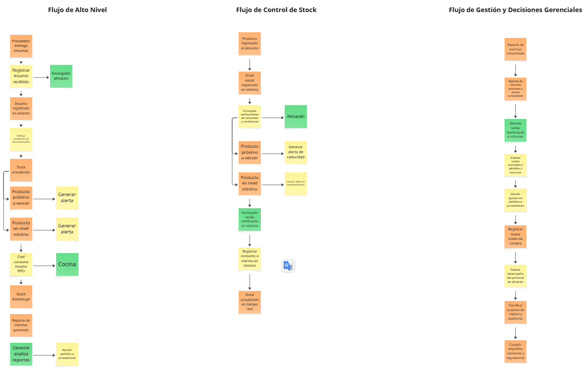

<h3 align="center"> Universidad Peruana de Ciencias Aplicadas </h3>

<h3 align="center"> Ingeniería de Software </h3>
<h3 align="center"> Ciclo 2025 - 2</h3>

 

    </img> 

 

<h1 align="center"> TB1 Report </h1>

<h3 align="center"> Desarrollo de Aplicaciones Open Source </h3>

<h3 align="center"> 1ASI0729-2520-7394 </h3>

<h3 align="center"> Docente: Hugo Allan Mori Paiva </h3>

<h3 align="center"> Startup: InventaTech </h3>

<h3 align="center"> Producto: InventaTrack </h3>

<h3> Team Members: </h3>

|                Nombre                |   Código   |
| :----------------------------------: | :--------: |
| Gonzalo Alonso Carhuancote Dominguez | U202210720 |
|   Juan Carlos Alvarado de la Cruz    | U202216150 |
|    Joan Fernando Teves Samaniego     | U202117303 |
|      Antonio Rodrigo Duran Díaz      | U202215721 |
|     Daiki Oscar Oshiro Yamashita     | U20201f846 |
<h3 align="center">Septiembre, 2025</h3>

## Registro de Versiones del Informe

| Versión | Fecha | Autor | Descripción de modificación |
| :-------: | :---------: | :----------------: | :----------------------:|
|TB1|15/09/25|Gonzalo Carhuancote, Juan Carlos Alvarado, Joan Teves, Antonio Duran, Daiki Oshiro|Para esta primera entrega, realizamos los primeros 5 capítulos del informe y desarrollamos la primera versión del landing page|

## Project Report Collaboration Insights

A continuación, se detallan los repositorios utilizados a lo largo del proyecto:

#### Link del repositorio del Reporte: 

- 

#### Link del repositorio de la Landing Page: 

-

### Entrega TB1:

Durante esta entrega se elaboraron los capítulos 1 al 5 del informe. La redacción fue dividida equitativamente entre los integrantes del equipo, quienes se encargaron de desarrollar sus respectivas secciones de manera paralela. Cada miembro subió sus contribuciones directamente al repositorio de GitHub, asegurando así un seguimiento claro de los avances y la colaboración conjunta.

##### Participación por integrante:

- Gonzalo Alonso Carhuancote Dominguez:

- Juan Carlos Alvarado de la Cruz:

- Joan Fernando Teves Samaniego:

- Antonio Rodrigo Duran Díaz:

- Daiki Oscar Oshiro Yamashita:

# Contenido

## Índice

- [Registro de versiones del informe](#registro-de-versiones-del-informe)

- [Project Report Collaboration Insights](#project-report-collaboration-insights)

- [Contenido](#contenido)

- [Student Outcome](#student-outcome-1)

- [Capítulo I: Introducción](#capitulo-i-introduccion)
    - [1.1. StartUp Profile](#11-startup-profile)
        - [1.1.1. Descripción de la StartUp](#111-descripción-de-la-startup)
        - [1.1.2. Perfiles de Integrantes del equipo](#112-perfiles-de-integrantes-del-equipo)
    - [1.2. Solution Profile](#12-solution-profile)
        - [1.2.1. Antecedentes y Problemática](#121-antecedentes-y-problemática)
        - [1.2.2. Lean UX Process](#122-lean-ux-process)
            - [1.2.2.1. Lean UX Problem Statements](#1221-lean-ux-problem-statements)
            - [1.2.2.2. Lean UX Assumptions](#1222-lean-ux-assumptions)
            - [1.2.2.3. Lean UX Hyphotesis Statements](#1223-lean-ux-hyphotesis-statements)
            - [1.2.2.4. Lean UX Canvas](#1224-lean-ux-canvas)
    - [1.3. Segmentos objetivo](#13-segmentos-objetivo)
- [Capítulo II: Requirements Elicitation & Analysis]()
    - [2.1. Competidores](#21-competidores)
        - [2.1.1. Análisis competitivo](#211-análisis-competitivo)
        - [2.1.2. Estrategias y tácticas frente a competidores](#212-estrategias-y-tácticas-frente-a-competidores)
    - [2.2. Entrevistas](#22-entrevistas)
        - [2.2.1. Diseño de entrevistas](#221-diseño-de-entrevistas)
        - [2.2.2. Registro de entrevistas](#222-registro-de-entrevistas)
        - [2.2.3. Análisis de entrevistas](#223-análisis-de-entrevistas)
    - [2.3. Needfinding](#23-needfinding)
        - [2.3.1. User Persona](#231-user-persona)
        - [2.3.2. User Task Matrix](#232-user-task-matrix)
        - [2.3.3. User Journey Mapping](#233-user-journey-mapping)
        - [2.3.4. Empathy Mapping](#234-empathy-mapping)
    - [2.4 Big Picture Event Storming](#24-big-picture-event-storming)
    - [2.5 Ubiquitous Language](#25-ubiquitous-language)
- [Capítulo III: Requirements Specification]()
    - [3.1. User Stories](#31-user-stories)
    - [3.2. Impact Mapping](#32-impact-mapping)
    - [3.3. Product Backlog](#33-product-backlog)
- [Capítulo IV: Product Design]()
    - [4.1. Style Guidelines](#41-style-guidelines)
        - [4.1.1. General Style Guidelines](#411-general-style-guidelines)
        - [4.1.2. Web Style Guidelines](#412-web-style-guidelines)
    - [4.2. Information Architecture](#42-information-architecture)
        - [4.2.1. Organization Systems](#421-organization-systems)
        - [4.2.2. Labeling Systems](#422-labeling-systems)
        - [4.2.3. SEO Tags and Meta Tags](#423-seo-tags-and-meta-tags)
        - [4.2.4. Searching Systems](#424-searching-systems)
        - [4.2.5. Navigation Systems](#425-navigation-systems)
    - [4.3. Landing Page UI Design](#43-landing-page-ui-design)
        - [4.3.1. Landing Page Wireframe](#431-landing-page-wireframe)
        - [4.3.2. Landing Page Mock-up](#432-landing-page-mock-up)
    - [4.4. Web Applications UX/UI Design](#44-web-applications-uxui-design)
        - [4.4.1. Web Applications Wireframes](#441-web-applications-wireframes)
        - [4.4.2. Web Applications Wireflow Diagrams](#442-web-applications-wireflow-diagrams)
        - [4.4.3. Web Applications Mock-ups](#443-web-applications-mock-ups)
        - [4.4.4. Web Applications User Flow Diagrams](#444-web-applications-user-flow-diagrams)
    - [4.5. Web Applications Prototyping](#45-web-applications-prototyping)
    - [4.6. Domain-Driven Software Architecture](#46-domain-driven-software-architecture)
        - [4.6.1. Design-Level Event Storming](#461-design-level-event-storming)
        - [4.6.2. Software Architecture Context Diagram](#462-software-architecture-context-diagram)
        - [4.6.3. Software Architecture Container Diagrams](#463-software-architecture-container-diagrams)
        - [4.6.4. Software Architecture Components Diagrams](#464-software-architecture-components-diagrams)
    - [4.7. Software Object-Oriented Design](#47-software-object-oriented-design)
        - [4.7.1. Class Diagrams](#471-class-diagrams)
    - [4.8. Database Design](#48-database-design)
        - [4.8.1. Database Diagram](#481-database-diagram)
- [Capítulo V: Product Implementation, Validation & Deployment]()
    - [5.1. Software Configuration Management](#51-software-configuration-management)
        - [5.1.1. Software Development Environment Configuration](#511-software-development-environment-configuration)
        - [5.1.2. Source Code Management](#512-source-code-management)
        - [5.1.3. Source Code Style Guide & Conventions](#513-source-code-style-guide--conventions)
        - [5.1.4. Software Deployment Configuration](#514-software-deployment-configuration)
    - [5.2. Landing Page, Services & Applications Implementation](#52-landing-page-services--applications-implementation)
        - [5.2.1. Sprint 1](#521-sprint-1)
            - [5.2.1.1. Sprint Planning 1](#5211-sprint-planning-1)
            - [5.2.1.3. Sprint Backlog 1](#5213-sprint-backlog-1)
            - [5.2.1.4. Development Evidence for Sprint Review](#5214-development-evidence-for-sprint-review)
            - [5.2.1.5. Execution Evidence for Sprint Review](#5215-execution-evidence-for-sprint-review)
            - [5.2.1.6. Services Documentation Evidence for Sprint Review](#5216-services-documentation-evidence-for-sprint-review)
            - [5.2.1.7. Software Deployment Evidence for Sprint Review](#5217-software-deployment-evidence-for-sprint-review)
            - [5.2.1.8. Team Collaboration Insights during Sprint](#5218-team-collaboration-insights-during-sprint)
    - [5.3. Validation Interviews]()
        - [5.3.1. Diseño de Entrevistas](#531-diseño-de-entrevistas)
        - [5.3.2. Registro de Entrevistas](#532-registro-de-entrevistas)
        - [5.3.3. Evaluaciones según heuristicas](#533-evaluaciones-segun-heuristicas)
    - [5.4. Video About-the-Product](#54-video-about-the-product)
- [Conclusiones](#conclusiones)
    - [Conclusiones y recomendaciones](#conclusiones-y-recomendaciones)
- [Bibliografía](#bibliografía)
- [Anexos](#anexos)

## Student Outcome

Objetivo general, ABET – EAC - Student Outcome 3: Capacidad de comunicarse efectivamente con un rango de audiencias.

| **Criterio específico** | **Acciones realizadas** | **Conclusiones** |
|-------------------------|--------------------------|------------------|
| **Comunica oralmente con efectividad a diferentes rangos de audiencia** | Gonzalo Alonso Carhuancote Dominguez  **TB1**:   Juan Carlos Alvarado de la Cruz  **TB1**:   Joan Fernando Teves Samaniego  **TB1**:   Antonio Rodrigo Duran Díaz  **TB1**:   Daiki Oscar Oshiro Yamashita  **TB1**:   | Gonzalo Alonso Carhuancote Dominguez  **TB1**:   Juan Carlos Alvarado de la Cruz  **TB1**:   Joan Fernando Teves Samaniego  **TB1**:   Antonio Rodrigo Duran Díaz  **TB1**:   Daiki Oscar Oshiro Yamashita  **TB1**:   |
| **Comunica por escrito con efectividad a diferentes rangos de audiencia** | Gonzalo Alonso Carhuancote Dominguez  **TB1**:   Juan Carlos Alvarado de la Cruz  **TB1**:   Joan Fernando Teves Samaniego  **TB1**:   Antonio Rodrigo Duran Díaz  **TB1**:   Daiki Oscar Oshiro Yamashita  **TB1**:   | Gonzalo Alonso Carhuancote Dominguez  **TB1**:   Juan Carlos Alvarado de la Cruz  **TB1**:   Joan Fernando Teves Samaniego  **TB1**:   Antonio Rodrigo Duran Díaz  **TB1**:   Daiki Oscar Oshiro Yamashita  **TB1**:   |

# Capitulo II: Requirements Elicitation & Analysis

## 2.1. Competidores

En esta sección identificamos y describimos los principales competidores directos e indirectos de InventaTrack, que ofrecen soluciones digitales similares para la gestión de inventarios en negocios que manejan alimentos perecederos.

### 2.1.1. Análisis competitivo

El objetivo de este análisis es entender mejor el panorama competitivo y posicionar a InventaTrack frente a las opciones existentes en el mercado. Esto nos permitirá identificar ventajas competitivas, áreas de oportunidad y posibles amenazas.

#### Competitive Analysis Landscape

<table border="1" cellpadding="5" cellspacing="0">
  <tr>
    <th colspan="6"><b>Competitive Analysis Landscape</b></th>
  </tr>
  <tr>
    <td>¿Por qué llevar a cabo este análisis?</td>
    <td colspan="5">Este análisis fue realizado para conocer las fortalezas y debilidades de las plataformas digitales de gestión de inventarios perecederos, con el fin de desarrollar una solución innovadora y competitiva.</td>
  </tr>
  <tr>
    <td colspan="2"></td>
    <td><b>InventaTrack  </b></td>
    <td><b>Toast POS</b>  </td>
    <td><b>MarketMan</b>  </td>
    <td><b>BlueCart</b>  </td>
  </tr>
  <tr>
    <td rowspan="2"><b>Perfil</b></td>
    <td><b>Overview</b></td>
    <td>Plataforma web para gestión de inventarios de alimentos perecederos, con alertas automáticas y reportes para PYMEs.</td>
    <td>Plataforma todo-en-uno para restaurantes con gestión de inventarios, punto de venta y pedidos.</td>
    <td>Software especializado en gestión de inventarios y compras para restaurantes y proveedores.</td>
    <td>Solución para la gestión de inventarios y pedidos para restaurantes, hoteles y supermercados.</td>
  </tr>
  <tr>
    <td><b>Ventaja competitiva ¿Qué valor ofrece a los clientes?</b></td>
    <td>Fácil uso, accesibilidad, reducción de mermas y desperdicios, enfoque PYME.</td>
    <td>Integración completa con punto de venta y operaciones.</td>
    <td>Optimización de compras y control de costos.</td>
    <td>Control móvil y digitalización de pedidos.</td>
  </tr>
  <tr>
    <td rowspan="2"><b>Perfil de Marketing</b></td>
    <td><b>Mercado objetivo</b></td>
    <td>PYMEs de alimentos perecederos: restaurantes, hoteles, supermercados.</td>
    <td>Restaurantes de todos tamaños.</td>
    <td>Restaurantes y proveedores.</td>
    <td>Restaurantes, hoteles y supermercados.</td>
  </tr>
  <tr>
    <td><b>Estrategias de marketing</b></td>
    <td>Marketing digital, demostraciones gratuitas, alianzas con cámaras de comercio.</td>
    <td>Publicidad digital, ferias, soporte dedicado.</td>
    <td>Webinars, marketing directo, alianzas estratégicas.</td>
    <td>Campañas en redes sociales y asesoría personalizada.</td>
  </tr>
  <tr>
    <td rowspan="3"><b>Perfil de Producto</b></td>
    <td><b>Productos y Servicios</b></td>
    <td>Registro digital, alertas de caducidad, reportes de consumo y mermas.</td>
    <td>Gestión de inventarios, ventas y clientes integrada.</td>
    <td>Gestión de inventarios, órdenes y proveedores.</td>
    <td>Control de inventarios, pedidos y alertas en app móvil.</td>
  </tr>
  <tr>
    <td><b>Precios y Costos</b></td>
    <td>Precio accesible para PYMEs, suscripción mensual.</td>
    <td>Modelo SaaS con suscripción mensual según tamaño del negocio.</td>
    <td>Precios personalizados según volumen y características.</td>
    <td>Planes escalables y suscripción flexible.</td>
  </tr>
  <tr>
    <td><b>Canales de distribución (Web y/o móvil)</b></td>
    <td>Plataforma web y app móvil.</td>
    <td>App móvil y plataforma web.</td>
    <td>App móvil y plataforma web.</td>
    <td>App móvil y plataforma web.</td>
  </tr>
  <tr>
    <td rowspan="5"><b>Análisis SWOT</b></td>
    <td colspan="5">Realice esto para su startup y sus competidores. Sus fortalezas deberían apoyar sus oportunidades y contribuir a lo que ustedes definen como su posible ventaja competitiva.</td>
  </tr>
  <tr>
    <td><b>Fortalezas</b></td>
    <td>Facilidad de uso, accesibilidad, enfoque PYME.</td>
    <td>Integración total con operaciones de restaurante.</td>
    <td>Optimización de compras y control de costos.</td>
    <td>Control móvil y digitalización rápida.</td>
  </tr>
  <tr>
    <td><b>Debilidades</b></td>
    <td>Menor alcance, funciones más básicas.</td>
    <td>Precio elevado para PYMEs pequeñas.</td>
    <td>Implementación y curva de aprendizaje.</td>
    <td>Menor penetración en mercados grandes.</td>
  </tr>
  <tr>
    <td><b>Oportunidades</b></td>
    <td>Crecimiento de digitalización en PYMEs alimentarias.</td>
    <td>Expansión en el mercado de restaurantes.</td>
    <td>Demanda creciente de optimización en compras.</td>
    <td>Digitalización en hoteles y restaurantes.</td>
  </tr>
  <tr>
    <td><b>Amenazas</b></td>
    <td>Competencia de grandes softwares integrados.</td>
    <td>Competencia de soluciones emergentes y startups.</td>
    <td>Cambios regulatorios en la industria alimentaria.</td>
    <td>Dependencia de conectividad y adopción tecnológica.</td>
  </tr>
</table>

### 2.1.2. Estrategias y tácticas frente a competidores

A continuación se muestran las tácticas que deberá aplicar nuestra startup para afrontar las fortalezas de la competencia.

###### 1. Aprovechar la Fortaleza: Plataforma Fácil de Usar y Enfoque PYME

**Estrategia**

Diferenciar InventaTrack como la plataforma más accesible y amigable para PYMEs, con un enfoque en reducir desperdicios y simplificar la gestión de inventarios perecederos.

**Tácticas**  

- **Comunicar la facilidad de uso:** Resaltar en campañas y demos que la plataforma requiere poca capacitación, ideal para PYMEs con recursos limitados.  
- **Soporte personalizado:** Implementar asesorías y tutoriales adaptados para cada tipo de negocio pequeño o mediano.  
- **Testimonios y casos de éxito:** Publicar historias reales que evidencien cómo InventaTrack ayudó a reducir mermas y ahorrar costos.

**Valor Añadido**

- Genera confianza y comodidad en usuarios que no son expertos tecnológicos.  
- Incrementa la adopción y permanencia del cliente.

###### 2. Aprovechar la Oportunidad: Crecimiento de Digitalización en PYMEs Alimentarias

**Estrategia**

Posicionar a InventaTrack como la solución clave para que las PYMEs del sector alimentario den el salto a la digitalización de su inventario y control de mermas.

**Tácticas**

- **Campañas educativas y contenido:** Crear webinars, blogs y videos sobre los beneficios de digitalizar la gestión de inventarios y cómo InventaTrack facilita este proceso.  
- **Alianzas estratégicas:** Colaborar con cámaras de comercio, asociaciones de PYMEs y proveedores de alimentos para promover la plataforma.  
- **Incorporar funcionalidades móviles:** Mejorar el acceso y uso en campo para negocios con equipos pequeños o sin oficinas fijas.

**Valor Añadido**  

- Aumenta la visibilidad y aceptación en un mercado en crecimiento.  
- Facilita la adopción tecnológica en negocios tradicionales.

###### 3. Afrontar la Amenaza: Competencia de Grandes Plataformas Integradas y Startups Ágiles

**Estrategia**

Destacar la especialización en PYMEs y el soporte cercano frente a grandes competidores que atienden a empresas más grandes o con soluciones más complejas.

**Tácticas**  
- **Campañas enfocadas en valor diferencial:** Enfatizar la simplicidad y accesibilidad frente a plataformas complejas y costosas.  
- **Modelo flexible y escalable:** Ofrecer planes de suscripción accesibles, con opción a crecimiento según el negocio.  
- **Innovación constante:** Mantener un desarrollo ágil que permita incorporar feedback rápidamente y adaptarse mejor que grandes jugadores lentos.  
- **Atención al cliente personalizada:** Garantizar soporte cercano, que sea una ventaja competitiva frente a soluciones impersonales.

**Valor Añadido**  
- Reduce el riesgo de abandono por complejidad o precio.  
- Fomenta la lealtad y recomendación entre usuarios.

## 2.2. Entrevistas

### 2.2.1. Diseño de entrevistas

##### Preguntas Generales

* ¿Cuál es su nombre?
* ¿Cuántos años tiene usted?
* ¿En qué ciudad y distrito reside?
* ¿A qué se dedica profesionalmente?

##### Preguntas Específicas

###### Segmento 1: Usuarios operativos

1. ¿Cómo gestionan actualmente sus inventarios de alimentos perecederos en su día a día?
2. ¿Con qué frecuencia enfrentan problemas de caducidad o pérdidas por mermas?
3. ¿Qué herramientas utilizan para registrar y controlar el inventario (Excel, software, registros en papel)?
4. ¿Cuáles son las mayores dificultades que enfrentan al planificar las compras de insumos?
5. ¿Qué impacto tienen las mermas en los costos operativos de su área?
6. ¿Les resultaría útil una aplicación que alerte sobre fechas de caducidad y niveles de stock?
7. ¿Qué características consideran más importantes en una herramienta para facilitar su trabajo?
8. ¿Estarían dispuestos a usar una solución digital de bajo costo para mejorar el control de inventarios?

###### Segmento 2: Dueños, gerentes y administradores

1. ¿Cómo gestionan actualmente el inventario de alimentos perecederos en su negocio?
2. ¿Con qué frecuencia observan problemas de caducidad o pérdidas por mermas en general?
3. ¿Qué herramientas o sistemas utilizan para controlar y planificar el inventario?
4. ¿Cuáles son las mayores dificultades que enfrentan al planificar las compras de insumos?
5. ¿Qué impacto tienen las mermas en los costos y rentabilidad del negocio?
6. ¿Consideran útil una aplicación que alerte sobre fechas de caducidad y niveles de stock?
7. ¿Qué características consideran prioritarias en una herramienta de gestión de inventarios para la toma de decisiones?
8. ¿Estarían dispuestos a invertir en una solución digital accesible para mejorar el control de inventarios y reducir pérdidas?

### 2.2.2. Registro de entrevistas

##### Segmento 1: Usuarios operativos

###### Entrevista 1:

Nombre: 
Edad: 
Distrito: 

Resumen de la entrevista:
Link:

###### Entrevista 2:

Nombre: 
Edad: 
Distrito: 

Resumen de la entrevista:
Link:

###### Entrevista 3:

Nombre: 
Edad: 
Distrito: 

Resumen de la entrevista:
Link:

##### Segmento 2: Dueños, gerentes y administradores

###### Entrevista 4:

**Nombre:** Ernesto Ruiz
**Edad:** 24
**Distrito:** Jesús María

**Resumen de la entrevista:** Ernesto (24 años), administrador de un mini market en Jesús María, gestiona actualmente su inventario con hojas de Excel y controles manuales en papel. Los principales problemas que enfrenta son productos cercanos a su fecha de caducidad, lo que genera mermas mensuales incluso aplicando descuentos. La mayor dificultad al planificar compras es calcular con precisión las cantidades necesarias para minimizar pérdidas. Considera muy útil una aplicación que alerte sobre fechas de vencimiento y niveles de stock, siempre que sea sencilla, rápida y accesible. Está dispuesto a invertir en una solución digital si le garantiza un mejor control y reducción de pérdidas.

**Link:** https://upcedupe-my.sharepoint.com/:v:/g/personal/u20201f846_upc_edu_pe/ETKurgiX4bFFv0eXJ1qpPecB0qUSNWXVUEObe7lLg_Jnnw?e=bSr2FT

###### Entrevista 5:

Nombre: 
Edad: 
Distrito: 

Resumen de la entrevista:
Link:

###### Entrevista 6:

Nombre: 
Edad: 
Distrito: 

Resumen de la entrevista:
Link:

### 2.2.3. Análisis de entrevistas

A continuación, se presenta un cuadro resumen donde se registrarán los nombres de los entrevistados junto con sus preferencias y recomendaciones relevantes. Este análisis permitirá identificar patrones y necesidades comunes para orientar el desarrollo y mejora de la solución propuesta.

| **Nombre** | **Preferencias y Recomendaciones** |
|------------|-------------------------------------|
|||
|||
|||
| Ernesto    | Actualmente utiliza Excel y controles manuales para gestionar el inventario, lo que genera dificultades al calcular compras y controlar productos perecederos. Señala que las mermas ocurren mensualmente, especialmente por la caducidad de productos. Considera muy útil una aplicación que agilice el proceso de inventario, emita alertas sobre fechas de vencimiento y niveles de stock, y facilite la toma de decisiones al planificar compras. Recomienda que la herramienta sea sencilla, rápida y accesible en costos. Está dispuesto a invertir en una solución digital siempre que represente beneficios claros y ayude a reducir pérdidas. |
|||
|||

## 2.3. Needfinding

En esta sección se muestra el proceso de análisis de la información recolectada en las entrevistas. Se incluyen los User Personas, User Task Matrix, User Journey Maps, Empathy Mapping y As-Is Scenario Mapping

### 2.3.1. User Persona

Hemos creado User Personas para los segmentos clave del proyecto, lo que nos permitió definir perfiles representativos y comprender mejor a nuestros usuarios. Con ello, podremos diseñar soluciones alineadas a sus necesidades, expectativas y contextos.

###### Segmento 1: Usuarios operativos

###### Segmento 2: Dueños, gerentes y administradores

### 2.3.2. User Task Matrix

La User Task Matrix permite identificar y priorizar las actividades más importantes que realizan los usuarios en su día a día relacionadas con la gestión de inventarios. A través de esta matriz, se analizan las tareas clave, la frecuencia con la que se realizan y su nivel de importancia dentro de las operaciones. Esto permite reconocer cuáles son las acciones críticas que InventaTrack debe apoyar y cuáles tienen menor prioridad. 

###### Segmento 1: Usuarios operativos

| **Actividades**                        | **Frecuencia** | **Importancia** |
|--------------------------------------|---------------|----------------|
| Registrar insumos recibidos           | Diario        | Alta           |
| Verificar fechas de caducidad         | Diario        | Alta           |
| Controlar niveles de stock            | Diario        | Alta           |
| Planificar compras semanales          | Semanal       | Alta           |
| Preparar reportes de mermas           | Semanal       | Media          |
| Coordinar pedidos con proveedores     | Semanal       | Media          |
| Organizar insumos en almacén          | Diario        | Media          |
| Revisar condiciones de almacenamiento | Diario        | Alta           |
| Capacitar al personal en rotación FIFO| Mensual       | Media          |
| Ajustar compras por cambios de demanda| Ocasional     | Media          |

###### Segmento 2: Dueños, gerentes y administradores

| **Actividades**                                  | **Frecuencia** | **Importancia** |
|--------------------------------------------------|----------------|-----------------|
| Registrar insumos recibidos                      | Diario         | Alta            |
| Verificar fechas de caducidad y lotes            | Diario         | Alta            |
| Controlar niveles de stock                       | Diario         | Alta            |
| Generar reportes de pérdidas y consumos          | Semanal        | Alta            |
| Coordinar con equipo de compras                  | Semanal        | Media           |
| Atender auditorías de inventario                 | Mensual        | Alta            |
| Validar cumplimiento de normas sanitarias        | Diario         | Alta            |
| Analizar rotación de productos perecibles        | Semanal        | Alta            |
| Ajustar pedidos según consumo real               | Semanal        | Media           |
| Implementar acciones correctivas por caducidad   | Ocasional      | Alta            |

### 2.3.3. User Journey Mapping

A continuación se muestra el proceso para la realización del User Journey Mapping para los User Persona con el fin de entender las experiencias del usuario sin nuestra solución.

###### Segmento 1: Usuarios operativos

Link del figma: https://www.figma.com/design/KjhrokYcMNv16Ibd7JlHvC/Journey-Map-Template--Community-?node-id=1-1655&t=w5tECbkGMHmrEYRC-1

###### Segmento 2: Dueños, gerentes y administradores

Link del figma: https://www.figma.com/design/eeg41ySFRLcHJUg8ymPwjc/Journey-Map-Template--Community-?node-id=1-1655&t=PFdHO9dsvl9ji90E-1

### 2.3.4. Empathy Mapping

A continuación se muestra el proceso para la realización del Empathy Mapping para los User Persona con el fin de entender lo que piensa, siente, oye, hace y observa.

###### Segmento 1: Usuarios operativos

Link de la plantilla: https://docs.google.com/drawings/d/19VUOlSLdHFSW75wBSkHxSHj5xbP_1_o5ozaGqWur27M/edit?usp=sharing

###### Segmento 2: Dueños, gerentes y administradores

Link de la plantilla: https://docs.google.com/drawings/d/1toVmCa-riAAgx47qLXRZKkHY6I7QcfxlWUELUTDKiho/edit?usp=sharing

## 2.4. Big Picture Event Storming

En esta sección, el equipo presenta el proceso realizado durante la sesión colaborativa de Big Picture Event Storming, una metodología visual y dinámica que nos permitió comprender de manera integral el dominio del negocio de gestión de inventarios de alimentos perecederos.

Link del miro: https://miro.com/app/live-embed/uXjVJHVPc7U=/?moveToViewport=-2475%2C-2549%2C4560%2C2085&embedId=259469102899

## 2.5. Ubiquitous Language

El Lenguaje Ubicuo de InventaTrack define los términos clave que serán utilizados por todo el equipo para garantizar una comunicación clara y sin ambigüedades.

| **Término**              | **Definición**                                                                 |
|---------------------------|---------------------------------------------------------------------------------------------|
| **Insumo**               | Producto alimenticio perecedero utilizado en el negocio
| **Lote**                 | Conjunto de insumos de la misma referencia, recibidos en una fecha específica.              |
| **Fecha de caducidad**   | Día límite hasta el cual un insumo es seguro para consumo.                                   |
| **Inventario**           | Registro total de insumos disponibles en el almacén o cocina.                               |
| **Stock**                | Cantidad disponible de un insumo en un momento determinado.                                 |
| **Stock crítico**        | Nivel mínimo de insumo que al alcanzarse genera una alerta de reabastecimiento.           |
| **Mermas**               | Pérdidas de insumos por caducidad, mal almacenamiento, errores de preparación u otros.      |
| **Reporte de inventario**| Documento o dashboard que muestra estado de insumos, mermas y proyecciones de compra.       |
| **Administrador**        | Usuario encargado de supervisar inventarios y tomar decisiones de compra.                   |
| **Supervisor de alimentos** | Usuario responsable de auditorías, normas sanitarias y reportes en hoteles/supermercados. |
| **Rotación FIFO**        | Método de organización de insumos: “First In, First Out” (lo primero que entra, se consume primero). |
| **Proveedor**            | Persona o empresa que abastece insumos al negocio.                                          |
| **Pedido de compra**     | Solicitud formal de reposición de insumos a un proveedor.                                   |
| **Cadena de frío**       | Proceso de conservación de alimentos perecederos a temperaturas adecuadas.                  |
| **Auditoría de inventario** | Proceso de verificación del estado y control de insumos para fines internos o regulatorios. |
| **Normativa sanitaria**  | Conjunto de reglas y requisitos legales sobre almacenamiento y manipulación de alimentos.   |

# Bibliografía

## Referencias

- Agencia Agraria de Noticias. (2020, 16 de octubre). *[Perú desperdicia 12,8 millones de toneladas de alimentos cada año](https://agraria.pe/noticias/peru-desperdicia-12-8-millones-de-toneladas-de-alimentos-cad-23953)*. Agraria.pe.  

- La República. (2019, 3 de julio). *[Más del 33 % de los alimentos producidos al año se descompone por mal uso de la cadena de frío](https://larepublica.pe/sociedad/2019/07/03/peru-mas-del-33-de-los-alimentos-producidos-al-ano-se-descompone-debido-al-mal-uso-de-la-cadena-de-frio-desnutricion)*. La República.  

- La República. (2024, 5 de abril). *[Costos ocultos pueden generar pérdidas de hasta 15 % en restaurantes en Perú](https://www.larepublica.co/globoeconomia/costos-ocultos-pueden-generar-perdidas-de-hasta-15-en-restaurantes-en-peru-3425480)*. La República.  
