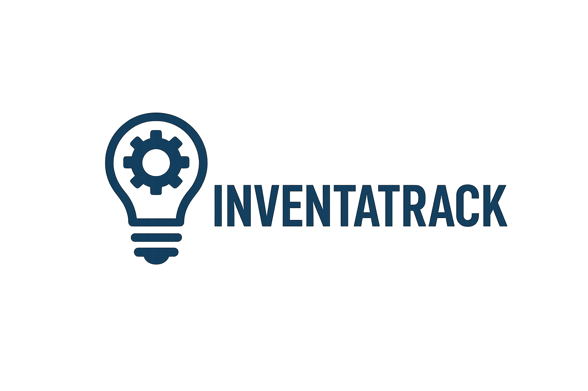
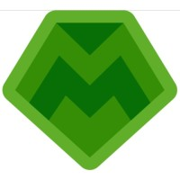

<h3 align="center"> Universidad Peruana de Ciencias Aplicadas </h3>

<h3 align="center"> Ingeniería de Software </h3>
<h3 align="center"> Ciclo 2025 - 2</h3>

 

    </img> 

 

<h1 align="center"> TB1 Report </h1>

<h3 align="center"> Desarrollo de Aplicaciones Open Source </h3>

<h3 align="center"> 1ASI0729-2520-7394 </h3>

<h3 align="center"> Docente: Hugo Allan Mori Paiva </h3>

<h3 align="center"> Startup: InventaTech </h3>

<h3 align="center"> Producto: InventaTrack </h3>

<h3> Team Members: </h3>

|                Nombre                |   Código   |
| :----------------------------------: | :--------: |
| Gonzalo Alonso Carhuancote Dominguez | U202210720 |
|   Juan Carlos Alvarado de la Cruz    | U202216150 |
|    Joan Fernando Teves Samaniego     | U202117303 |
|      Antonio Rodrigo Duran Díaz      | U202215721 |
|     Daiki Oscar Oshiro Yamashita     | U20201f846 |
<h3 align="center">Septiembre, 2025</h3>

## Registro de Versiones del Informe

| Versión | Fecha | Autor | Descripción de modificación |
| :-------: | :---------: | :----------------: | :----------------------:|
|TB1|15/09/25|Gonzalo Carhuancote, Juan Carlos Alvarado, Joan Teves, Antonio Duran, Daiki Oshiro|Para esta primera entrega, realizamos los primeros 5 capítulos del informe y desarrollamos la primera versión del landing page|

## Project Report Collaboration Insights

A continuación, se detallan los repositorios utilizados a lo largo del proyecto:

#### Link del repositorio del Reporte: 

-  https://github.com/1asi0729-2520-7394-InventaTech/inventatrack-report

#### Link del repositorio de la Landing Page: 

-

### Entrega TB1:

Durante esta entrega se elaboraron los capítulos 1 al 5 del informe. La redacción fue dividida equitativamente entre los integrantes del equipo, quienes se encargaron de desarrollar sus respectivas secciones de manera paralela. Cada miembro subió sus contribuciones directamente al repositorio de GitHub, asegurando así un seguimiento claro de los avances y la colaboración conjunta.

##### Participación por integrante:

- Gonzalo Alonso Carhuancote Dominguez:

- Juan Carlos Alvarado de la Cruz:

- Joan Fernando Teves Samaniego:

- Antonio Rodrigo Duran Díaz:

- Daiki Oscar Oshiro Yamashita: Desarrollo de los capítulos 2 y 3, parte del 4 y Sprint 1.

# Contenido

## Índice

- [Registro de versiones del informe](#registro-de-versiones-del-informe)

- [Project Report Collaboration Insights](#project-report-collaboration-insights)

- [Contenido](#contenido)

- [Student Outcome](#student-outcome-1)

- [Capítulo I: Introducción](#capitulo-i-introduccion)
    - [1.1. StartUp Profile](#11-startup-profile)
        - [1.1.1. Descripción de la StartUp](#111-descripción-de-la-startup)
        - [1.1.2. Perfiles de Integrantes del equipo](#112-perfiles-de-integrantes-del-equipo)
    - [1.2. Solution Profile](#12-solution-profile)
        - [1.2.1. Antecedentes y Problemática](#121-antecedentes-y-problemática)
        - [1.2.2. Lean UX Process](#122-lean-ux-process)
            - [1.2.2.1. Lean UX Problem Statements](#1221-lean-ux-problem-statements)
            - [1.2.2.2. Lean UX Assumptions](#1222-lean-ux-assumptions)
            - [1.2.2.3. Lean UX Hyphotesis Statements](#1223-lean-ux-hyphotesis-statements)
            - [1.2.2.4. Lean UX Canvas](#1224-lean-ux-canvas)
    - [1.3. Segmentos objetivo](#13-segmentos-objetivo)
- [Capítulo II: Requirements Elicitation & Analysis]()
    - [2.1. Competidores](#21-competidores)
        - [2.1.1. Análisis competitivo](#211-análisis-competitivo)
        - [2.1.2. Estrategias y tácticas frente a competidores](#212-estrategias-y-tácticas-frente-a-competidores)
    - [2.2. Entrevistas](#22-entrevistas)
        - [2.2.1. Diseño de entrevistas](#221-diseño-de-entrevistas)
        - [2.2.2. Registro de entrevistas](#222-registro-de-entrevistas)
        - [2.2.3. Análisis de entrevistas](#223-análisis-de-entrevistas)
    - [2.3. Needfinding](#23-needfinding)
        - [2.3.1. User Persona](#231-user-persona)
        - [2.3.2. User Task Matrix](#232-user-task-matrix)
        - [2.3.3. User Journey Mapping](#233-user-journey-mapping)
        - [2.3.4. Empathy Mapping](#234-empathy-mapping)
    - [2.4 Big Picture Event Storming](#24-big-picture-event-storming)
    - [2.5 Ubiquitous Language](#25-ubiquitous-language)
- [Capítulo III: Requirements Specification]()
    - [3.1. User Stories](#31-user-stories)
    - [3.2. Impact Mapping](#32-impact-mapping)
    - [3.3. Product Backlog](#33-product-backlog)
- [Capítulo IV: Product Design]()
    - [4.1. Style Guidelines](#41-style-guidelines)
        - [4.1.1. General Style Guidelines](#411-general-style-guidelines)
        - [4.1.2. Web Style Guidelines](#412-web-style-guidelines)
    - [4.2. Information Architecture](#42-information-architecture)
        - [4.2.1. Organization Systems](#421-organization-systems)
        - [4.2.2. Labeling Systems](#422-labeling-systems)
        - [4.2.3. SEO Tags and Meta Tags](#423-seo-tags-and-meta-tags)
        - [4.2.4. Searching Systems](#424-searching-systems)
        - [4.2.5. Navigation Systems](#425-navigation-systems)
    - [4.3. Landing Page UI Design](#43-landing-page-ui-design)
        - [4.3.1. Landing Page Wireframe](#431-landing-page-wireframe)
        - [4.3.2. Landing Page Mock-up](#432-landing-page-mock-up)
    - [4.4. Web Applications UX/UI Design](#44-web-applications-uxui-design)
        - [4.4.1. Web Applications Wireframes](#441-web-applications-wireframes)
        - [4.4.2. Web Applications Wireflow Diagrams](#442-web-applications-wireflow-diagrams)
        - [4.4.3. Web Applications Mock-ups](#443-web-applications-mock-ups)
        - [4.4.4. Web Applications User Flow Diagrams](#444-web-applications-user-flow-diagrams)
    - [4.5. Web Applications Prototyping](#45-web-applications-prototyping)
    - [4.6. Domain-Driven Software Architecture](#46-domain-driven-software-architecture)
        - [4.6.1. Design-Level Event Storming](#461-design-level-event-storming)
        - [4.6.2. Software Architecture Context Diagram](#462-software-architecture-context-diagram)
        - [4.6.3. Software Architecture Container Diagrams](#463-software-architecture-container-diagrams)
        - [4.6.4. Software Architecture Components Diagrams](#464-software-architecture-components-diagrams)
    - [4.7. Software Object-Oriented Design](#47-software-object-oriented-design)
        - [4.7.1. Class Diagrams](#471-class-diagrams)
    - [4.8. Database Design](#48-database-design)
        - [4.8.1. Database Diagram](#481-database-diagram)
- [Capítulo V: Product Implementation, Validation & Deployment]()
    - [5.1. Software Configuration Management](#51-software-configuration-management)
        - [5.1.1. Software Development Environment Configuration](#511-software-development-environment-configuration)
        - [5.1.2. Source Code Management](#512-source-code-management)
        - [5.1.3. Source Code Style Guide & Conventions](#513-source-code-style-guide--conventions)
        - [5.1.4. Software Deployment Configuration](#514-software-deployment-configuration)
    - [5.2. Landing Page, Services & Applications Implementation](#52-landing-page-services--applications-implementation)
        - [5.2.1. Sprint 1](#521-sprint-1)
            - [5.2.1.1. Sprint Planning 1](#5211-sprint-planning-1)
            - [5.2.1.3. Sprint Backlog 1](#5213-sprint-backlog-1)
            - [5.2.1.4. Development Evidence for Sprint Review](#5214-development-evidence-for-sprint-review)
            - [5.2.1.5. Execution Evidence for Sprint Review](#5215-execution-evidence-for-sprint-review)
            - [5.2.1.6. Services Documentation Evidence for Sprint Review](#5216-services-documentation-evidence-for-sprint-review)
            - [5.2.1.7. Software Deployment Evidence for Sprint Review](#5217-software-deployment-evidence-for-sprint-review)
            - [5.2.1.8. Team Collaboration Insights during Sprint](#5218-team-collaboration-insights-during-sprint)
    - [5.3. Validation Interviews]()
        - [5.3.1. Diseño de Entrevistas](#531-diseño-de-entrevistas)
        - [5.3.2. Registro de Entrevistas](#532-registro-de-entrevistas)
        - [5.3.3. Evaluaciones según heuristicas](#533-evaluaciones-segun-heuristicas)
    - [5.4. Video About-the-Product](#54-video-about-the-product)
- [Conclusiones](#conclusiones)
    - [Conclusiones y recomendaciones](#conclusiones-y-recomendaciones)
- [Bibliografía](#bibliografía)
- [Anexos](#anexos)

## Student Outcome

Objetivo general, ABET – EAC - Student Outcome 3: Capacidad de comunicarse efectivamente con un rango de audiencias.

| **Criterio específico** | **Acciones realizadas** | **Conclusiones** |
|-------------------------|--------------------------|------------------|
| **Comunica oralmente con efectividad a diferentes rangos de audiencia** | Gonzalo Alonso Carhuancote Dominguez  **TB1**:   Juan Carlos Alvarado de la Cruz  **TB1**:Expliqué ideas de diseño y navegación del prototipo en Figma de forma clara a mi equipo y adapté el lenguaje técnico en las reuniones con el docente.   Joan Fernando Teves Samaniego  **TB1**:   Antonio Rodrigo Duran Díaz  **TB1**:   Daiki Oscar Oshiro Yamashita  **TB1**: Participé constantemente en las reuniones programadas que realizamos con el fin de coordinar avances e informar el progreso del trabajo.   | Gonzalo Alonso Carhuancote Dominguez  **TB1**:   Juan Carlos Alvarado de la Cruz  **TB1**:Logré transmitir mis aportes de manera comprensible y útil para distintos públicos.   Joan Fernando Teves Samaniego  **TB1**:   Antonio Rodrigo Duran Díaz  **TB1**:   Daiki Oscar Oshiro Yamashita  **TB1**: La efectiva comunicación entre los miembros del equipo facilitó el logro de los objetivos planteados en esta fase inicial.   |
| **Comunica por escrito con efectividad a diferentes rangos de audiencia** | Gonzalo Alonso Carhuancote Dominguez  **TB1**:   Juan Carlos Alvarado de la Cruz  **TB1**:Redacté secciones del informe con un estilo formal y claro, y utilicé mensajes breves en GitHub para la colaboración técnica del equipo.   Joan Fernando Teves Samaniego  **TB1**:   Antonio Rodrigo Duran Díaz  **TB1**:   Daiki Oscar Oshiro Yamashita  **TB1**: Contribuí principalmente al desarrollo de los capítulos 2 y 3, así como a partes de los capítulos 4 y 5.   | Gonzalo Alonso Carhuancote Dominguez  **TB1**:   Juan Carlos Alvarado de la Cruz  **TB1**:Mi comunicación escrita se adaptó exitosamente tanto al entorno académico como al técnico.   Joan Fernando Teves Samaniego  **TB1**:   Antonio Rodrigo Duran Díaz  **TB1**:   Daiki Oscar Oshiro Yamashita  **TB1**: La contribución en la elaboración del texto facilitó un desarrollo significativo en los capítulos correspondientes.   |

# Capitulo I: Introduccion

## 1.1. StartUp Profile

### 1.1.1. Descripción de la StartUp

InventaTrack surge al identificar un problema común en muchos negocios que trabajan diariamente con alimentos perecederos, como restaurantes, cocinas ocultas, hoteles y supermercados. Muchos aún usan métodos manuales o desorganizados para controlar sus productos, lo que genera pérdidas económicas, desperdicio de comida e incluso problemas con normativas sanitarias, afectando la experiencia del cliente final.

Muchos negocios de este sector no pueden o no quieren invertir en sensores, cámaras o sistemas automáticos costosos. Por eso, nuestra solución simple, eficiente y digital es una plataforma web que permite registrar productos, controlar fechas de caducidad, recibir alertas cuando hay poco stock o algún insumo está por vencer, y hacer seguimiento de todo con reportes fáciles de entender.

---
## Misión
Nuestra misión es digitalizar la gestión de inventario alimentario para que cualquier negocio, sin importar su tamaño, pueda reducir pérdidas, evitar desperdicios y tener un mejor control de sus insumos de forma práctica y accesible.

---
## Visión
Queremos que InventaTrack sea la herramienta número uno preferida para la gestión inteligente de inventarios en negocios que trabajan con alimentos. Buscamos que más empresas puedan dejar el papel y Excel, y empiecen a gestionar su stock de forma más moderna, eficiente y segura.

### 1.1.2. Perfiles de integrantes del equipo

|    Nombre Completo del integrante   | Descripcion de Carrera | Fotografía | Conocimientos y Habilidades a apuntar|
| ------------------------------------| ---------------------- | ---------- | ------------------------------------ |
| Gonzalo Alonso Carhuancote Dominguez| Ingenieria de Software  Universiad Peruana de Ciencias Aplicadas |  | Tengo 20 años, estudio la carrera de ingeniería de software en la UPC. En mis tiempos libres estudio, juego videojuegos y me informo del mundo actual y moderno. Me apasiona la tecnología y manejo lenguajes como C++, Java, Typescript y Python. |
| Juan Carlos Alvarado de la Cruz| Ingenieria de Software  Universiad Peruana de Ciencias Aplicadas| |Soy Juan Carlos Alvarado, soy estudiante de la carrera de Ing. de Software. Me gusta resolver problemas y aprender cosas que son de mi interés, tengo experiencia programando en C++ y en Python.
| Joan Fernando Teves Samaniego| Ingenieria de Software  Universiad Peruana de Ciencias Aplicadas |  | Tengo 22 años estoy estudiando actualmente en la Univeridad Peruana de Ciencias Aplicadas. Tengo interes por el mundo de la cibersegurirdad y el primer paso es enteder al derecho y al revez las aplicaciones web , se c++ , javascript , html , css , mongodb ,sql , sqlserver , posgresql,python, soy creativo , responsable , trabajo en equipo , me gusta resolver problemas   me adaptofacilmente y gestiono muy bien mi tiempo.Espero que en este proyecto pueda incrementar mis habilidades y conocimiento sobre las aplicaciones web y demas . |
| Antonio Rodrigo Duran Díaz| Ingenieria de Software  Universiad Peruana de Ciencias Aplicadas |   | Soy estudiante de la carrera de Ingeniería de Software en la Universidad Peruana de Ciencias Aplicadas y tengo 20 años. Estoy avanzando en mi formación académica y reforzando mis conocimientos en los diferentes temas relacionados con la creación de software. Durante mis estudios me ha gustado trabajar con gestores de bases de datos, en especial con SQL Server y MongoDB. En este proyecto espero seguir mejorando mis habilidades y conocimientos, además de lograr un buen desempeño en el trabajo grupal. |
| Daiki Oscar Oshiro Yamashita| Ingenieria de Software  Universiad Peruana de Ciencias Aplicadas |  | Soy estudiante de la carrera de Ingeniería de Software. Tengo interés en obtener nuevos conocimientos relacionados con mi carrera que me sean de utilidad para el futuro. |

## 1.2. Solution Profile

### 1.2.1 Antecedentes y Problemática

En un contexto donde la eficiencia operativa y el control de recursos son clave, muchas empresas del sector alimentario aún enfrentan dificultades para gestionar adecuadamente sus inventarios. Negocios como restaurantes, cocinas ocultas, hoteles y supermercados trabajan con productos perecederos que requieren un manejo cuidadoso, pero siguen utilizando métodos manuales o herramientas poco especializadas que dificultan el control preciso de insumos y fechas de caducidad.

Esta situación provoca pérdidas económicas, desperdicio de alimentos y problemas con el cumplimiento de normativas sanitarias. La falta de sistemas centralizados, accesibles y diseñados específicamente para este tipo de establecimientos limita su capacidad para tomar decisiones a tiempo y mantener un flujo operativo eficiente. A su vez, la inversión en soluciones tecnológicas complejas o automatizadas suele estar fuera del alcance de pequeños y medianos negocios.

###### What (¿Qué?)

- En negocios como restaurantes, cocinas ocultas, hoteles y supermercados, la mala gestión de insumos genera mermas, caducidades, sobrecompras y errores operativos que incrementan los costos. InventaTrack ofrece una solución digital: una plataforma web que permite registrar productos con fechas y lotes, recibir alertas de vencimiento y obtener reportes claros de merma y consumo. Todo esto con una herramienta accesible, sencilla y adaptada a la realidad de las PYMEs.

###### Why (¿Por qué?)

- El problema persiste por el uso de sistemas manuales como papel o Excel, que no emiten alertas ni permiten un control eficiente. No existen protocolos estandarizados como FIFO (primero en entrar, primero en salir), ni herramientas para prever compras según demanda real. Además, muchos establecimientos sufren por fallas en la cadena de frío y no cuentan con soluciones digitales asequibles ni adaptadas a su operación diaria.

###### Where (¿Dónde?)

- Las pérdidas ocurren en áreas clave como cámaras frigoríficas, despensas, estaciones de cocina y zonas de recepción de mercadería. Allí se almacenan y procesan los alimentos, y cualquier error repercute directamente en los costos. La aplicación será accesible desde cualquier dispositivo con conexión a Internet, permitiendo el control en tiempo real dentro del propio establecimiento.

###### When (¿Cuándo?)

- Este problema ocurre a diario, pero se intensifica en momentos de alta demanda como fines de semana, feriados o eventos especiales. También empeora ante imprevistos como cortes de energía o fallas en la refrigeración, donde se pierde gran cantidad de productos si no se actúa con rapidez.

###### Who (¿Quiénes?)

- Los principales afectados son administradores, encargados de cocina y almacén, así como los dueños de los negocios, quienes asumen el impacto económico. Todos ellos también serán usuarios directos de la plataforma, desde la toma de decisiones hasta la operación diaria.

###### How (¿Cómo?)

- Las pérdidas se generan por falta de rotación, exceso de compras, errores en porciones y ausencia de información unificada. InventaTrack ayuda a prevenir estos problemas mediante el registro digital de insumos, generación de alertas automáticas y reportes que permiten tomar decisiones basadas en datos reales y actualizados.

###### How Much (¿Cuánto?)

- En Perú, se desperdician cerca de 12,8 millones de toneladas de alimentos al año, y en el sector gastronómico las pérdidas por mermas y errores alcanzan entre el 10 % y 15 % del costo operativo (La República, 2024). La solución implica una inversión inicial accesible y un costo mensual competitivo para hosting y mantenimiento, con posibilidad de escalar a modelos de suscripción accesibles que aseguren la sostenibilidad del sistema.

### 1.2.2 Lean UX Proces

#### 1.2.2.1 Lean UX Problem Statements 

Los negocios que manejan alimentos perecederos, como restaurantes, cocinas ocultas, hoteles y supermercados, enfrentan grandes dificultades para controlar sus inventarios de manera eficiente. Actualmente, la mayoría utiliza métodos manuales, como registros en papel o Excel, que resultan poco confiables y dificultan la gestión adecuada de insumos. Esta situación genera caducidad de productos, mermas operativas y sobrecostos que afectan directamente la rentabilidad y la calidad del servicio.

El problema central es que administradores y encargados de inventarios carecen de una herramienta digital accesible y adaptada a sus necesidades, que les permita registrar insumos, recibir alertas oportunas sobre fechas de vencimiento y generar reportes claros sobre pérdidas y consumo. La ausencia de esta solución contribuye a pérdidas económicas que representan entre el 10 % y el 15 % de los costos operativos, según datos recientes (La República, 2024).

InventaTrack responde a esta necesidad con una plataforma web intuitiva y asequible, diseñada para digitalizar la gestión de inventarios en PYMEs del sector alimentario. Esto facilita la reducción de desperdicios, mejora el control operativo y apoya la toma de decisiones basada en datos confiables.

#### 1.2.2.2 Lean UX Assumptions 

###### ¿Quién es el usuario?

Los usuarios principales de InventaTrack se dividen en dos grupos: por un lado, los usuarios operativos, como administradores, encargados de almacén y personal de cocina que manejan diariamente el inventario y necesitan una herramienta práctica para registrar y controlar los productos. Por otro lado, los usuarios estratégicos, como dueños, gerentes y administradores, que supervisan la operación, analizan reportes y toman decisiones para mejorar la rentabilidad y eficiencia del negocio.

###### ¿Dónde encaja nuestro producto, en su trabajo o en su vida?

InventaTrack se integra en el día a día laboral de los usuarios, siendo una herramienta clave para controlar el stock, evitar desperdicios y cumplir con normas sanitarias. Facilita la gestión desde el almacenamiento hasta la preparación de alimentos, ayudando a mejorar tanto la operación diaria (usuarios operativos) como la supervisión y planificación estratégica (usuarios gerenciales).

###### ¿Qué problema resuelve nuestro producto?

InventaTrack soluciona la falta de control y visibilidad en la gestión de insumos perecederos. Permite registrar productos con fechas de caducidad, recibir alertas oportunas, evitar sobrecompras y generar reportes que apoyan la toma de decisiones para reducir mermas y desperdicios, aportando valor tanto en la operación diaria como en la gestión estratégica del negocio.

###### ¿Cuándo y cómo se utiliza nuestro producto?

La plataforma se utiliza de manera continua durante las operaciones diarias, especialmente en la recepción de mercadería, almacenamiento y preparación. Los usuarios operativos ingresan la información del stock y reciben notificaciones de vencimientos próximos para actuar rápidamente, mientras que los dueños y gerentes consultan reportes y análisis desde cualquier dispositivo con conexión a Internet, facilitando una gestión ágil y basada en datos.

###### ¿Qué características son importantes?

- Registro digital de productos con lotes y fechas de caducidad.  
- Alertas automáticas sobre productos próximos a vencer o bajo stock.  
- Reportes de merma, consumo y rotación de inventarios.  
- Accesibilidad desde dispositivos móviles y computadoras, sin necesidad de hardware adicional.  
- Interfaz sencilla y amigable que permita a usuarios sin conocimientos técnicos usar la plataforma fácilmente.

###### ¿Cómo debe verse y comportarse nuestro producto?

InventaTrack debe contar con una interfaz clara, intuitiva y profesional que transmita confianza y simplicidad. La navegación debe ser rápida y fácil, con alertas visibles y reportes accesibles. Cada acción debe estar acompañada de mensajes claros que orienten al usuario, minimizando la curva de aprendizaje y facilitando la adopción.

#### 1.2.2.3 Lean UX Hyphotesis Statements

###### Hipótesis 1:

Creemos que al ofrecer una plataforma digital para que los administradores y encargados de cocina registren y monitoreen insumos perecederos, estos podrán reducir significativamente el desperdicio de alimentos y los costos por caducidad y mermas. Esto será posible gracias a alertas automáticas y reportes claros que facilitarán la planificación y control.

**Business Outcome:** Disminución de pérdidas económicas y reducción del 10-15 % en costos operativos relacionados con mermas.  
**Users:** Administradores y encargados de inventarios en restaurantes, cocinas ocultas, hoteles y supermercados.  
**User Outcome:** Mejor control y reducción de desperdicios gracias a información en tiempo real.  
**Feature:** Registro digital de productos, alertas automáticas de vencimiento y reportes de consumo y merma.

###### Hipótesis 2:

Consideramos que si InventaTrack es accesible desde cualquier dispositivo móvil o computadora, sin necesidad de hardware adicional, más PYMEs del sector alimentario adoptarán la plataforma por su facilidad y bajo costo.

**Business Outcome:** Incremento en la cantidad de usuarios activos y mayor penetración en el mercado de PYMEs.  
**Users:** Propietarios y personal operativo de pequeños y medianos negocios alimentarios.  
**User Outcome:** Acceso rápido y sencillo a herramientas digitales para gestión de inventarios.  
**Feature:** Plataforma web responsiva y compatible con diversos dispositivos.

###### Hipótesis 3:

Suponemos que al proporcionar reportes personalizados y fáciles de entender sobre mermas y consumo, los usuarios podrán tomar decisiones basadas en datos, mejorando la eficiencia operativa y optimizando las compras.

**Business Outcome:** Aumento en la precisión de compras y reducción de stock innecesario.  
**Users:** Administradores y encargados de inventarios.  
**User Outcome:** Mejor planificación y reducción de costos.  
**Feature:** Reportes gráficos y exportables sobre consumo y pérdidas.

###### Hipótesis 4:

Creemos que si la interfaz de InventaTrack es intuitiva y fácil de usar, con soporte para usuarios sin experiencia técnica, se incrementará la frecuencia de uso y la satisfacción, asegurando la fidelización y recomendación del producto.

**Business Outcome:** Alta retención de usuarios y crecimiento por recomendaciones.  
**Users:** Usuarios con diversos niveles de habilidades tecnológicas.  
**User Outcome:** Experiencia positiva y adopción rápida de la plataforma.  
**Feature:** Diseño UI/UX sencillo, tutoriales integrados y atención al cliente.

#### 1.2.2.1 Lean UX Canvas 

Enlace para acceder al Lean UX Canvas en Lucid: https://lucid.app/lucidspark/36d6a2ba-61ad-4dd0-8fa3-a39717abc610/edit?viewport_loc=3739%2C-530%2C3453%2C1915%2C0_0&invitationId=inv_0c6eb1f2-8cd0-4635-8ce8-b076390db41e

## 1.3 Segmentos Objetivo

InventaTrack está dirigido a negocios que manejan alimentos perecederos y buscan optimizar la gestión de sus inventarios. Para este proyecto, los usuarios objetivo se agrupan en dos categorías principales, cada una con necesidades y beneficios específicos:

###### Usuarios operativos

Este grupo está compuesto por administradores de almacén, encargados de cocina y personal operativo que utilizan la aplicación diariamente para registrar insumos, monitorear fechas de caducidad y controlar el inventario. Su principal beneficio es la simplificación y agilización de sus tareas, lo que reduce errores y facilita el manejo eficiente del stock.

###### Dueños, gerentes y administradores

Aunque estos usuarios no interactúan diariamente con la plataforma para ingresar datos, acceden regularmente a reportes, análisis y dashboards que les permiten supervisar la operación general. Se benefician al contar con información precisa y actualizada para tomar decisiones estratégicas, controlar costos y mejorar la rentabilidad del negocio.

# Capitulo II: Requirements Elicitation & Analysis

## 2.1. Competidores

En esta sección identificamos y describimos los principales competidores directos e indirectos de InventaTrack, que ofrecen soluciones digitales similares para la gestión de inventarios en negocios que manejan alimentos perecederos.

### 2.1.1. Análisis competitivo

El objetivo de este análisis es entender mejor el panorama competitivo y posicionar a InventaTrack frente a las opciones existentes en el mercado. Esto nos permitirá identificar ventajas competitivas, áreas de oportunidad y posibles amenazas.

#### Competitive Analysis Landscape

<table border="1" cellpadding="5" cellspacing="0">
  <tr>
    <th colspan="6"><b>Competitive Analysis Landscape</b></th>
  </tr>
  <tr>
    <td>¿Por qué llevar a cabo este análisis?</td>
    <td colspan="5">Este análisis fue realizado para conocer las fortalezas y debilidades de las plataformas digitales de gestión de inventarios perecederos, con el fin de desarrollar una solución innovadora y competitiva.</td>
  </tr>
  <tr>
    <td colspan="2"></td>
    <td><b>InventaTrack  </b></td>
    <td><b>Toast POS</b>  </td>
    <td><b>MarketMan</b>  </td>
    <td><b>BlueCart</b>  </td>
  </tr>
  <tr>
    <td rowspan="2"><b>Perfil</b></td>
    <td><b>Overview</b></td>
    <td>Plataforma web para gestión de inventarios de alimentos perecederos, con alertas automáticas y reportes para PYMEs.</td>
    <td>Plataforma todo-en-uno para restaurantes con gestión de inventarios, punto de venta y pedidos.</td>
    <td>Software especializado en gestión de inventarios y compras para restaurantes y proveedores.</td>
    <td>Solución para la gestión de inventarios y pedidos para restaurantes, hoteles y supermercados.</td>
  </tr>
  <tr>
    <td><b>Ventaja competitiva ¿Qué valor ofrece a los clientes?</b></td>
    <td>Fácil uso, accesibilidad, reducción de mermas y desperdicios, enfoque PYME.</td>
    <td>Integración completa con punto de venta y operaciones.</td>
    <td>Optimización de compras y control de costos.</td>
    <td>Control móvil y digitalización de pedidos.</td>
  </tr>
  <tr>
    <td rowspan="2"><b>Perfil de Marketing</b></td>
    <td><b>Mercado objetivo</b></td>
    <td>PYMEs de alimentos perecederos: restaurantes, hoteles, supermercados.</td>
    <td>Restaurantes de todos tamaños.</td>
    <td>Restaurantes y proveedores.</td>
    <td>Restaurantes, hoteles y supermercados.</td>
  </tr>
  <tr>
    <td><b>Estrategias de marketing</b></td>
    <td>Marketing digital, demostraciones gratuitas, alianzas con cámaras de comercio.</td>
    <td>Publicidad digital, ferias, soporte dedicado.</td>
    <td>Webinars, marketing directo, alianzas estratégicas.</td>
    <td>Campañas en redes sociales y asesoría personalizada.</td>
  </tr>
  <tr>
    <td rowspan="3"><b>Perfil de Producto</b></td>
    <td><b>Productos y Servicios</b></td>
    <td>Registro digital, alertas de caducidad, reportes de consumo y mermas.</td>
    <td>Gestión de inventarios, ventas y clientes integrada.</td>
    <td>Gestión de inventarios, órdenes y proveedores.</td>
    <td>Control de inventarios, pedidos y alertas en app móvil.</td>
  </tr>
  <tr>
    <td><b>Precios y Costos</b></td>
    <td>Precio accesible para PYMEs, suscripción mensual.</td>
    <td>Modelo SaaS con suscripción mensual según tamaño del negocio.</td>
    <td>Precios personalizados según volumen y características.</td>
    <td>Planes escalables y suscripción flexible.</td>
  </tr>
  <tr>
    <td><b>Canales de distribución (Web y/o móvil)</b></td>
    <td>Plataforma web y app móvil.</td>
    <td>App móvil y plataforma web.</td>
    <td>App móvil y plataforma web.</td>
    <td>App móvil y plataforma web.</td>
  </tr>
  <tr>
    <td rowspan="5"><b>Análisis SWOT</b></td>
    <td colspan="5">Realice esto para su startup y sus competidores. Sus fortalezas deberían apoyar sus oportunidades y contribuir a lo que ustedes definen como su posible ventaja competitiva.</td>
  </tr>
  <tr>
    <td><b>Fortalezas</b></td>
    <td>Facilidad de uso, accesibilidad, enfoque PYME.</td>
    <td>Integración total con operaciones de restaurante.</td>
    <td>Optimización de compras y control de costos.</td>
    <td>Control móvil y digitalización rápida.</td>
  </tr>
  <tr>
    <td><b>Debilidades</b></td>
    <td>Menor alcance, funciones más básicas.</td>
    <td>Precio elevado para PYMEs pequeñas.</td>
    <td>Implementación y curva de aprendizaje.</td>
    <td>Menor penetración en mercados grandes.</td>
  </tr>
  <tr>
    <td><b>Oportunidades</b></td>
    <td>Crecimiento de digitalización en PYMEs alimentarias.</td>
    <td>Expansión en el mercado de restaurantes.</td>
    <td>Demanda creciente de optimización en compras.</td>
    <td>Digitalización en hoteles y restaurantes.</td>
  </tr>
  <tr>
    <td><b>Amenazas</b></td>
    <td>Competencia de grandes softwares integrados.</td>
    <td>Competencia de soluciones emergentes y startups.</td>
    <td>Cambios regulatorios en la industria alimentaria.</td>
    <td>Dependencia de conectividad y adopción tecnológica.</td>
  </tr>
</table>

### 2.1.2. Estrategias y tácticas frente a competidores

A continuación se muestran las tácticas que deberá aplicar nuestra startup para afrontar las fortalezas de la competencia.

###### 1. Aprovechar la Fortaleza: Plataforma Fácil de Usar y Enfoque PYME

**Estrategia**

Diferenciar InventaTrack como la plataforma más accesible y amigable para PYMEs, con un enfoque en reducir desperdicios y simplificar la gestión de inventarios perecederos.

**Tácticas**  

- **Comunicar la facilidad de uso:** Resaltar en campañas y demos que la plataforma requiere poca capacitación, ideal para PYMEs con recursos limitados.  
- **Soporte personalizado:** Implementar asesorías y tutoriales adaptados para cada tipo de negocio pequeño o mediano.  
- **Testimonios y casos de éxito:** Publicar historias reales que evidencien cómo InventaTrack ayudó a reducir mermas y ahorrar costos.

**Valor Añadido**

- Genera confianza y comodidad en usuarios que no son expertos tecnológicos.  
- Incrementa la adopción y permanencia del cliente.

###### 2. Aprovechar la Oportunidad: Crecimiento de Digitalización en PYMEs Alimentarias

**Estrategia**

Posicionar a InventaTrack como la solución clave para que las PYMEs del sector alimentario den el salto a la digitalización de su inventario y control de mermas.

**Tácticas**

- **Campañas educativas y contenido:** Crear webinars, blogs y videos sobre los beneficios de digitalizar la gestión de inventarios y cómo InventaTrack facilita este proceso.  
- **Alianzas estratégicas:** Colaborar con cámaras de comercio, asociaciones de PYMEs y proveedores de alimentos para promover la plataforma.  
- **Incorporar funcionalidades móviles:** Mejorar el acceso y uso en campo para negocios con equipos pequeños o sin oficinas fijas.

**Valor Añadido**  

- Aumenta la visibilidad y aceptación en un mercado en crecimiento.  
- Facilita la adopción tecnológica en negocios tradicionales.

###### 3. Afrontar la Amenaza: Competencia de Grandes Plataformas Integradas y Startups Ágiles

**Estrategia**

Destacar la especialización en PYMEs y el soporte cercano frente a grandes competidores que atienden a empresas más grandes o con soluciones más complejas.

**Tácticas**  
- **Campañas enfocadas en valor diferencial:** Enfatizar la simplicidad y accesibilidad frente a plataformas complejas y costosas.  
- **Modelo flexible y escalable:** Ofrecer planes de suscripción accesibles, con opción a crecimiento según el negocio.  
- **Innovación constante:** Mantener un desarrollo ágil que permita incorporar feedback rápidamente y adaptarse mejor que grandes jugadores lentos.  
- **Atención al cliente personalizada:** Garantizar soporte cercano, que sea una ventaja competitiva frente a soluciones impersonales.

**Valor Añadido**  
- Reduce el riesgo de abandono por complejidad o precio.  
- Fomenta la lealtad y recomendación entre usuarios.

## 2.2. Entrevistas

### 2.2.1. Diseño de entrevistas

##### Preguntas Generales

* ¿Cuál es su nombre?
* ¿Cuántos años tiene usted?
* ¿En qué ciudad y distrito reside?
* ¿A qué se dedica profesionalmente?

##### Preguntas Específicas

###### Segmento 1: Usuarios operativos

1. ¿Cómo gestionan actualmente sus inventarios de alimentos perecederos en su día a día?
2. ¿Con qué frecuencia enfrentan problemas de caducidad o pérdidas por mermas?
3. ¿Qué herramientas utilizan para registrar y controlar el inventario (Excel, software, registros en papel)?
4. ¿Cuáles son las mayores dificultades que enfrentan al planificar las compras de insumos?
5. ¿Qué impacto tienen las mermas en los costos operativos de su área?
6. ¿Les resultaría útil una aplicación que alerte sobre fechas de caducidad y niveles de stock?
7. ¿Qué características consideran más importantes en una herramienta para facilitar su trabajo?
8. ¿Estarían dispuestos a usar una solución digital de bajo costo para mejorar el control de inventarios?

###### Segmento 2: Dueños, gerentes y administradores

1. ¿Cómo gestionan actualmente el inventario de alimentos perecederos en su negocio?
2. ¿Con qué frecuencia observan problemas de caducidad o pérdidas por mermas en general?
3. ¿Qué herramientas o sistemas utilizan para controlar y planificar el inventario?
4. ¿Cuáles son las mayores dificultades que enfrentan al planificar las compras de insumos?
5. ¿Qué impacto tienen las mermas en los costos y rentabilidad del negocio?
6. ¿Consideran útil una aplicación que alerte sobre fechas de caducidad y niveles de stock?
7. ¿Qué características consideran prioritarias en una herramienta de gestión de inventarios para la toma de decisiones?
8. ¿Estarían dispuestos a invertir en una solución digital accesible para mejorar el control de inventarios y reducir pérdidas?

### 2.2.2. Registro de entrevistas

##### Segmento 1: Usuarios operativos

###### Entrevista 1:

**Nombre:** Juan Ramos
**Edad:** 25
**Distrito:** San Borja

**Resumen de la entrevista:**

Juan Ramos, trabaja en un supermercado, explicó que la gestión de insumos perecibles se apoya en un ERP especializado que controla caducidad, rotación y registros en tiempo real. Aunque el sistema reduce pérdidas, aún enfrentan mermas en frutas, verduras y lácteos debido a la rotación y a la logística de proveedores. Reconoció que las auditorías sanitarias son frecuentes y que la cadena de frío es un punto crítico, especialmente en temporadas de alta demanda.

Señaló que las compras se planifican con datos históricos y proyecciones de consumo, aunque los picos de ventas en campañas festivas complican las estimaciones y generan sobrestock. Estima que las mermas representan entre el 2% y el 3% de los costos totales.

Considera indispensable que una solución digital ofrezca alertas predictivas, reportes en tiempo real y se integre con el ERP actual. Asimismo, resaltó la importancia de la capacitación periódica del personal para mantener estándares de almacenamiento. Confirmó que estaría dispuesto a invertir en una herramienta que reduzca pérdidas y optimice el tiempo administrativo.

**Link:** https://upcedupe-my.sharepoint.com/:v:/g/personal/u202117303_upc_edu_pe/ETRwF1xvTR9Nr-rV4ltMzM8Bz8G7oh0qmFyGFSJrEY06AA?e=JwpG17

###### Entrevista 2:

**Nombre:** Leslie Kasimiro
**Edad:** 27
**Distrito:** Jesús María

**Resumen de la entrevista:**

Leslie Kasimiro, trabaja en un restaurante de mariscos, explicó que el control de insumos aún es manual y depende de Excel, lo que genera pérdidas recurrentes, sobre todo en pescados y mariscos. Reconoció que las auditorías sanitarias señalan mejoras en almacenamiento y que la rotación FIFO no siempre se cumple. Los fines de semana son un reto para mantener el orden en el stock, y gran parte del sobrestock proviene de compras poco planificadas. Estima que las mermas representan hasta el 10% de sus costos. Considera indispensable una aplicación que dé alertas de caducidad y reportes claros, y estaría dispuesta a invertir en ella si demuestra eficiencia.

**Link:** https://upcedupe-my.sharepoint.com/:v:/g/personal/u202117303_upc_edu_pe/EfRQiGPXFhVHsr0R3qoONzkBuGHyGSrPXtAa5w41rQXYXw?e=CYieEb&

##### Segmento 2: Dueños, gerentes y administradores

###### Entrevista 1:

**Nombre:** Ernesto Ruiz
**Edad:** 24
**Distrito:** Jesús María

**Resumen de la entrevista:** Ernesto (24 años), administrador de un mini market en Jesús María, gestiona actualmente su inventario con hojas de Excel y controles manuales en papel. Los principales problemas que enfrenta son productos cercanos a su fecha de caducidad, lo que genera mermas mensuales incluso aplicando descuentos. La mayor dificultad al planificar compras es calcular con precisión las cantidades necesarias para minimizar pérdidas. Considera muy útil una aplicación que alerte sobre fechas de vencimiento y niveles de stock, siempre que sea sencilla, rápida y accesible. Está dispuesto a invertir en una solución digital si le garantiza un mejor control y reducción de pérdidas.

**Link:** https://upcedupe-my.sharepoint.com/:v:/g/personal/u20201f846_upc_edu_pe/ETKurgiX4bFFv0eXJ1qpPecB0qUSNWXVUEObe7lLg_Jnnw?e=bSr2FT

###### Entrevista 2:

**Nombre:** Adriana Diestra
**Edad:** 20
**Distrito:** Rímac

**Resumen de la entrevista:** Adriana (20 años), gerente de un restaurante en el Rímac, controla su inventario con Excel y revisiones visuales, lo que genera errores y dependencia del personal. Las mermas son frecuentes en productos frescos y pueden llegar al 10%, afectando la rentabilidad. La gerente ve útil una aplicación con alertas y reportes claros, y estaría dispuesta a invertir en una solución digital accesible que reduzca pérdidas.

**Link:** https://upcedupe-my.sharepoint.com/:v:/g/personal/u202210720_upc_edu_pe/EYLEOxpEz3FCvphhmvFqP9wBbvv4A8s3OKdXo8g8D8t0FA?e=9OOXEO

###### Entrevista 3:

**Nombre:** Alicia Melgarejo
**Edad:** 53 años
**Distrito:** Jesús María

**Resumen de la entrevista:** 

Alicia Melgarrejo (53 años), es gerenta de supermercado, explica que gestionan perecibles con un sistema de ventas y Excel, lo que genera errores e incidencias semanales en frutas, verduras y lácteos.
Las mermas alcanzan un 5% y afectan la rentabilidad.
El ERP no cuenta con módulo de caducidad, por lo que dependen de reportes manuales.
Las dificultades principales son la falta de datos precisos y quiebres de stock.
Consideran útil e invertirían en una herramienta digital que alerte sobre caducidad y stock mínimo.

**Link:** https://upcedupe-my.sharepoint.com/:v:/g/personal/u202215721_upc_edu_pe/ETNwM-BGyQlOlbGLDjrXZWcBSHanyBuV39Fkpwi30BNqOA?e=N6RxmB&

### 2.2.3. Análisis de entrevistas

A continuación, se presenta un cuadro resumen donde se registrarán los nombres de los entrevistados junto con sus preferencias y recomendaciones relevantes. Este análisis permitirá identificar patrones y necesidades comunes para orientar el desarrollo y mejora de la solución propuesta.

| **Nombre** | **Preferencias y Recomendaciones** |
|------------|-------------------------------------|
| Juan       | Describe una gestión más avanzada con ERP que controla caducidad y rotación, pero aún enfrenta mermas del 2%–3% en frutas, verduras y lácteos, agravadas por la logística de proveedores y picos de demanda. Prefiere una solución digital que se integre con su ERP, con alertas predictivas y reportes en tiempo real. Se recomienda complementar el sistema actual con un módulo inteligente de predicción de demanda y control de cadena de frío, además de capacitación continua al personal, lo que reduciría pérdidas y optimizaría la planificación en temporadas críticas.|
| Leslie     | Indica que la gestión manual con Excel ocasiona pérdidas de hasta un 10% en pescados y mariscos, con problemas en almacenamiento, rotación FIFO y sobrestock por compras desordenadas, especialmente los fines de semana. Su preferencia es una aplicación que genere alertas de caducidad y reportes claros para mejorar el control. Se recomienda implementar una solución digital que automatice el seguimiento de insumos, optimice la planificación de compras y garantice el cumplimiento de normas sanitarias, lo que permitiría reducir mermas y aumentar la eficiencia operativa.|
| Ernesto    | Actualmente utiliza Excel y controles manuales para gestionar el inventario, lo que genera dificultades al calcular compras y controlar productos perecederos. Señala que las mermas ocurren mensualmente, especialmente por la caducidad de productos. Considera muy útil una aplicación que agilice el proceso de inventario, emita alertas sobre fechas de vencimiento y niveles de stock, y facilite la toma de decisiones al planificar compras. Recomienda que la herramienta sea sencilla, rápida y accesible en costos. Está dispuesto a invertir en una solución digital siempre que represente beneficios claros y ayude a reducir pérdidas. |
| Adriana    | Ahora la gestión del inventario en el restaurante es manual y poco confiable, lo que provoca pérdidas frecuentes de productos perecibles como frutas, verduras y lácteos, alcanzando hasta un 10% en temporada baja y afectando seriamente la rentabilidad. Las herramientas actuales, como Excel o el sistema contable, no resuelven problemas de caducidad ni ofrecen alertas de stock, generando ineficiencia en la planificación de compras. La gerente considera de gran valor una aplicación sencilla que brinde alertas automáticas y reportes claros, y afirma que estaría dispuesta a invertir en una solución digital accesible, siempre que ayude a reducir mermas y mejorar la rentabilidad. |
| Alicia     | Señala que el control actual con sistema de ventas y Excel provoca errores, mermas del 5% y quiebres de stock por falta de datos precisos, además de que el ERP no cubre caducidad. Su preferencia es contar con una herramienta digital que alerte sobre vencimientos y mínimos de inventario. Se recomienda implementar un sistema especializado de gestión de perecibles integrado al ERP, con alertas automáticas y reportes en tiempo real, lo que optimizaría la rentabilidad y reduciría pérdidas. |

## 2.3. Needfinding

En esta sección se muestra el proceso de análisis de la información recolectada en las entrevistas. Se incluyen los User Personas, User Task Matrix, User Journey Maps, Empathy Mapping y As-Is Scenario Mapping

### 2.3.1. User Persona

Hemos creado User Personas para los segmentos clave del proyecto, lo que nos permitió definir perfiles representativos y comprender mejor a nuestros usuarios. Con ello, podremos diseñar soluciones alineadas a sus necesidades, expectativas y contextos.

###### Segmento 1: Usuarios operativos

###### Segmento 2: Dueños, gerentes y administradores

### 2.3.2. User Task Matrix

La User Task Matrix permite identificar y priorizar las actividades más importantes que realizan los usuarios en su día a día relacionadas con la gestión de inventarios. A través de esta matriz, se analizan las tareas clave, la frecuencia con la que se realizan y su nivel de importancia dentro de las operaciones. Esto permite reconocer cuáles son las acciones críticas que InventaTrack debe apoyar y cuáles tienen menor prioridad. 

###### Segmento 1: Usuarios operativos

| **Actividades**                        | **Frecuencia** | **Importancia** |
|--------------------------------------|---------------|----------------|
| Registrar insumos recibidos           | Diario        | Alta           |
| Verificar fechas de caducidad         | Diario        | Alta           |
| Controlar niveles de stock            | Diario        | Alta           |
| Planificar compras semanales          | Semanal       | Alta           |
| Preparar reportes de mermas           | Semanal       | Media          |
| Coordinar pedidos con proveedores     | Semanal       | Media          |
| Organizar insumos en almacén          | Diario        | Media          |
| Revisar condiciones de almacenamiento | Diario        | Alta           |
| Capacitar al personal en rotación FIFO| Mensual       | Media          |
| Ajustar compras por cambios de demanda| Ocasional     | Media          |

###### Segmento 2: Dueños, gerentes y administradores

| **Actividades**                                  | **Frecuencia** | **Importancia** |
|--------------------------------------------------|----------------|-----------------|
| Registrar insumos recibidos                      | Diario         | Alta            |
| Verificar fechas de caducidad y lotes            | Diario         | Alta            |
| Controlar niveles de stock                       | Diario         | Alta            |
| Generar reportes de pérdidas y consumos          | Semanal        | Alta            |
| Coordinar con equipo de compras                  | Semanal        | Media           |
| Atender auditorías de inventario                 | Mensual        | Alta            |
| Validar cumplimiento de normas sanitarias        | Diario         | Alta            |
| Analizar rotación de productos perecibles        | Semanal        | Alta            |
| Ajustar pedidos según consumo real               | Semanal        | Media           |
| Implementar acciones correctivas por caducidad   | Ocasional      | Alta            |

### 2.3.3. User Journey Mapping

A continuación se muestra el proceso para la realización del User Journey Mapping para los User Persona con el fin de entender las experiencias del usuario sin nuestra solución.

###### Segmento 1: Usuarios operativos

Link del figma: https://www.figma.com/design/KjhrokYcMNv16Ibd7JlHvC/Journey-Map-Template--Community-?node-id=1-1655&t=w5tECbkGMHmrEYRC-1

###### Segmento 2: Dueños, gerentes y administradores

Link del figma: https://www.figma.com/design/eeg41ySFRLcHJUg8ymPwjc/Journey-Map-Template--Community-?node-id=1-1655&t=PFdHO9dsvl9ji90E-1

### 2.3.4. Empathy Mapping

A continuación se muestra el proceso para la realización del Empathy Mapping para los User Persona con el fin de entender lo que piensa, siente, oye, hace y observa.

###### Segmento 1: Usuarios operativos

Link de la plantilla: https://docs.google.com/drawings/d/19VUOlSLdHFSW75wBSkHxSHj5xbP_1_o5ozaGqWur27M/edit?usp=sharing

###### Segmento 2: Dueños, gerentes y administradores

Link de la plantilla: https://docs.google.com/drawings/d/1toVmCa-riAAgx47qLXRZKkHY6I7QcfxlWUELUTDKiho/edit?usp=sharing

## 2.4. Big Picture Event Storming

En esta sección, el equipo presenta el proceso realizado durante la sesión colaborativa de Big Picture Event Storming, una metodología visual y dinámica que nos permitió comprender de manera integral el dominio del negocio de gestión de inventarios de alimentos perecederos.

Link del miro: https://miro.com/app/live-embed/uXjVJHVPc7U=/?moveToViewport=-2475%2C-2549%2C4560%2C2085&embedId=259469102899

## 2.5. Ubiquitous Language

El Lenguaje Ubicuo de InventaTrack define los términos clave que serán utilizados por todo el equipo para garantizar una comunicación clara y sin ambigüedades.

| **Término**              | **Definición**                                                                 |
|---------------------------|---------------------------------------------------------------------------------------------|
| **Insumo**               | Producto alimenticio perecedero utilizado en el negocio
| **Lote**                 | Conjunto de insumos de la misma referencia, recibidos en una fecha específica.              |
| **Fecha de caducidad**   | Día límite hasta el cual un insumo es seguro para consumo.                                   |
| **Inventario**           | Registro total de insumos disponibles en el almacén o cocina.                               |
| **Stock**                | Cantidad disponible de un insumo en un momento determinado.                                 |
| **Stock crítico**        | Nivel mínimo de insumo que al alcanzarse genera una alerta de reabastecimiento.           |
| **Mermas**               | Pérdidas de insumos por caducidad, mal almacenamiento, errores de preparación u otros.      |
| **Reporte de inventario**| Documento o dashboard que muestra estado de insumos, mermas y proyecciones de compra.       |
| **Administrador**        | Usuario encargado de supervisar inventarios y tomar decisiones de compra.                   |
| **Supervisor de alimentos** | Usuario responsable de auditorías, normas sanitarias y reportes en hoteles/supermercados. |
| **Rotación FIFO**        | Método de organización de insumos: “First In, First Out” (lo primero que entra, se consume primero). |
| **Proveedor**            | Persona o empresa que abastece insumos al negocio.                                          |
| **Pedido de compra**     | Solicitud formal de reposición de insumos a un proveedor.                                   |
| **Cadena de frío**       | Proceso de conservación de alimentos perecederos a temperaturas adecuadas.                  |
| **Auditoría de inventario** | Proceso de verificación del estado y control de insumos para fines internos o regulatorios. |
| **Normativa sanitaria**  | Conjunto de reglas y requisitos legales sobre almacenamiento y manipulación de alimentos.   |

# Bibliografía

## Referencias

- Agencia Agraria de Noticias. (2020, 16 de octubre). *[Perú desperdicia 12,8 millones de toneladas de alimentos cada año](https://agraria.pe/noticias/peru-desperdicia-12-8-millones-de-toneladas-de-alimentos-cad-23953)*. Agraria.pe.  

- La República. (2019, 3 de julio). *[Más del 33 % de los alimentos producidos al año se descompone por mal uso de la cadena de frío](https://larepublica.pe/sociedad/2019/07/03/peru-mas-del-33-de-los-alimentos-producidos-al-ano-se-descompone-debido-al-mal-uso-de-la-cadena-de-frio-desnutricion)*. La República.  

- La República. (2024, 5 de abril). *[Costos ocultos pueden generar pérdidas de hasta 15 % en restaurantes en Perú](https://www.larepublica.co/globoeconomia/costos-ocultos-pueden-generar-perdidas-de-hasta-15-en-restaurantes-en-peru-3425480)*. La República.  
