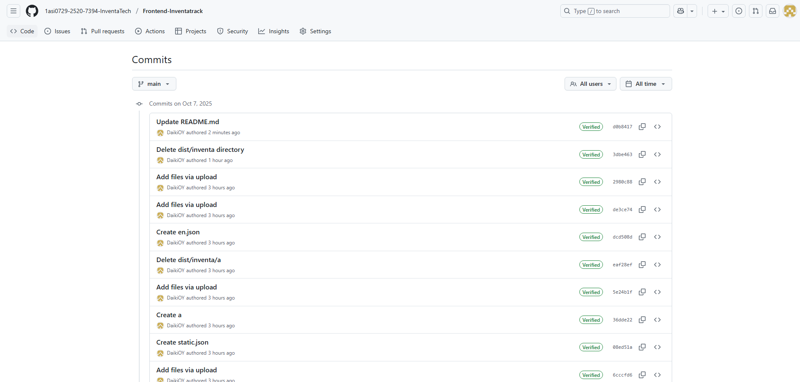
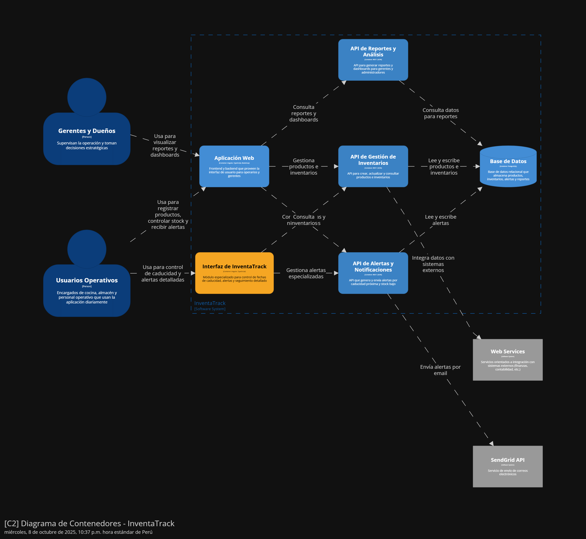
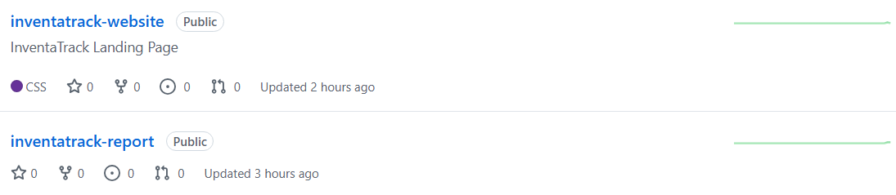
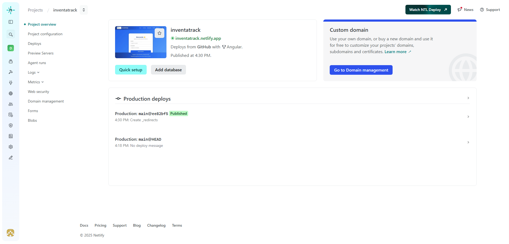

<div align="center"> 

</img><br>
# Universidad Peruana de Ciencias Aplicadas
# Ingeniería de Software
## 2025-20
## 1ASI0729 - Desarrollo de Aplicaciones Open Source
### NRC: 7394
### Nombre del profesor: Hugo Allan Mori Paiva

## "Informe de Trabajo Final"
### Startup: InventaTech
### Producto: InventaTrack

| **Código**   | **Apellidos y Nombres**              |
| :-----------: | :----------------------------------- |
| U202216150    | Alvarado de la Cruz, Juan Carlos     |
| U202210720    | Carhuancote Dominguez, Gonzalo Alonso|
| U202215721    | Duran Diaz, Antonio Rodrigo          |
| U20201f846    | Oshiro Yamashita, Daiki Oscar        |
| U202117303    | Teves Samaniego, Joan Fernando       |

### Noviembre 2025
</div>
<div style="page-break-after: always;"></div>

## Registro de Versiones del Informe

| Versión |  Fecha   |                                       Autor                                        |                                                  Descripción de modificación                                                   |
| :-----: | :------: | :--------------------------------------------------------------------------------: | :----------------------------------------------------------------------------------------------------------------------------: |
|   TB1   | 15/09/25 | Gonzalo Carhuancote, Juan Carlos Alvarado, Joan Teves, Antonio Duran, Daiki Oshiro | Para esta primera entrega, realizamos los primeros 5 capítulos del informe y desarrollamos la primera versión del landing page |
|   TP1   | 05/10/25 | Gonzalo Carhuancote, Juan Carlos Alvarado, Joan Teves, Antonio Duran, Daiki Oshiro | Para esta entrega parcial, realizamos el sprint 2 y se realizaron correcciones generales |
|   TB2   | 02/11/25 | Gonzalo Carhuancote, Juan Carlos Alvarado, Joan Teves, Antonio Duran, Daiki Oshiro | Para esta segunda entrega, realizamos el sprint 3, entrevistas de validación y se realizaron correcciones generales |
## Project Report Collaboration Insights

A continuación, se detallan los repositorios utilizados a lo largo del proyecto:

#### Link del repositorio del Reporte:

- https://github.com/1asi0729-2520-7394-InventaTech/inventatrack-report

#### Link del repositorio de la Landing Page:

- https://github.com/1asi0729-2520-7394-InventaTech/inventatrack-website

#### Link del repositorio del Frontend:

- https://github.com/1asi0729-2520-7394-InventaTech/Frontend-Inventatrack

#### Link del repositorio del Backend:

- https://github.com/1asi0729-2520-7394-InventaTech/Backend-Inventatrack

### **Entrega TB1:**

Durante esta entrega se elaboraron los capítulos 1 al 5 del informe. La redacción fue dividida equitativamente entre los integrantes del equipo, quienes se encargaron de desarrollar sus respectivas secciones de manera paralela. Cada miembro subió sus contribuciones directamente al repositorio de GitHub, asegurando así un seguimiento claro de los avances y la colaboración conjunta.

##### Participación por integrante:

- Gonzalo Alonso Carhuancote Dominguez: Desarrollo de los capitulos 1, 2 y landing page.

- Juan Carlos Alvarado de la Cruz: Desarrollo de los capitulos 1 y 4.

- Joan Fernando Teves Samaniego: Desarrollo de capitulo 2 y 4.

- Antonio Rodrigo Duran Díaz: Desarrollo de los capitulos 1, 2 y 3.

- Daiki Oscar Oshiro Yamashita: Desarrollo de los capítulos 2 y 3, parte del 4 y Sprint 1.


### **Entrega TP1:**

Durante esta entrega se elaboró la primera versión del Frontend correspondiente al Sprint 2 y se realizaron las correcciones del avance previo. El desarrollo de esta fase se distribuyó entre los miembros del equipo con el objetivo de completar las funcionalidades pendientes y mejorar los aspectos identificados en la retroalimentación anterior.

##### Participación por integrante:

- Gonzalo Alonso Carhuancote Dominguez: Correcciones de Landing Page y generales del reporte y ppt.


- Juan Carlos Alvarado de la Cruz: 

- Joan Fernando Teves Samaniego:

- Antonio Rodrigo Duran Díaz: Mejoras al informe.

- Daiki Oscar Oshiro Yamashita: Desarrollo del Frontend, sprint 2 y correcciones generales.




### **Entrega TB2:**

En la tercera entrega, el equipo documentó el comportamiento técnico de cada subdominio y finalizó la estructura del informe.

##### Participación por integrante:

- Gonzalo Alonso Carhuancote Dominguez:

- Juan Carlos Alvarado de la Cruz: 

- Joan Fernando Teves Samaniego:

- Antonio Rodrigo Duran Díaz: Colaborador en validaciones, evaluaciones heurísticas, documentación y revisión de controladores del sistema

- Daiki Oscar Oshiro Yamashita: Desarrollo del Backend y correcciones generales.


<div style="page-break-after: always;"></div>

# Contenido

## Índice

- [Registro de versiones del informe](#registro-de-versiones-del-informe)

- [Project Report Collaboration Insights](#project-report-collaboration-insights)

- [Contenido](#contenido)

- [Student Outcome](#student-outcome-1)

- [Capítulo I: Introducción](#capitulo-i-introduccion)
  - [1.1. StartUp Profile](#11-startup-profile)
    - [1.1.1. Descripción de la StartUp](#111-descripción-de-la-startup)
    - [1.1.2. Perfiles de Integrantes del equipo](#112-perfiles-de-integrantes-del-equipo)
  - [1.2. Solution Profile](#12-solution-profile)
    - [1.2.1. Antecedentes y Problemática](#121-antecedentes-y-problemática)
    - [1.2.2. Lean UX Process](#122-lean-ux-process)
      - [1.2.2.1. Lean UX Problem Statements](#1221-lean-ux-problem-statements)
      - [1.2.2.2. Lean UX Assumptions](#1222-lean-ux-assumptions)
      - [1.2.2.3. Lean UX Hyphotesis Statements](#1223-lean-ux-hyphotesis-statements)
      - [1.2.2.4. Lean UX Canvas](#1224-lean-ux-canvas)
  - [1.3. Segmentos objetivo](#13-segmentos-objetivo)
- [Capítulo II: Requirements Elicitation & Analysis]()
  - [2.1. Competidores](#21-competidores)
    - [2.1.1. Análisis competitivo](#211-análisis-competitivo)
    - [2.1.2. Estrategias y tácticas frente a competidores](#212-estrategias-y-tácticas-frente-a-competidores)
  - [2.2. Entrevistas](#22-entrevistas)
    - [2.2.1. Diseño de entrevistas](#221-diseño-de-entrevistas)
    - [2.2.2. Registro de entrevistas](#222-registro-de-entrevistas)
    - [2.2.3. Análisis de entrevistas](#223-análisis-de-entrevistas)
  - [2.3. Needfinding](#23-needfinding)
    - [2.3.1. User Persona](#231-user-persona)
    - [2.3.2. User Task Matrix](#232-user-task-matrix)
    - [2.3.3. User Journey Mapping](#233-user-journey-mapping)
    - [2.3.4. Empathy Mapping](#234-empathy-mapping)
  - [2.4 Big Picture Event Storming](#24-big-picture-event-storming)
  - [2.5 Ubiquitous Language](#25-ubiquitous-language)
- [Capítulo III: Requirements Specification]()
  - [3.1. User Stories](#31-user-stories)
  - [3.2. Impact Mapping](#32-impact-mapping)
  - [3.3. Product Backlog](#33-product-backlog)
- [Capítulo IV: Product Design]()
  - [4.1. Style Guidelines](#41-style-guidelines)
    - [4.1.1. General Style Guidelines](#411-general-style-guidelines)
    - [4.1.2. Web Style Guidelines](#412-web-style-guidelines)
  - [4.2. Information Architecture](#42-information-architecture)
    - [4.2.1. Organization Systems](#421-organization-systems)
    - [4.2.2. Labeling Systems](#422-labeling-systems)
    - [4.2.3. SEO Tags and Meta Tags](#423-seo-tags-and-meta-tags)
    - [4.2.4. Searching Systems](#424-searching-systems)
    - [4.2.5. Navigation Systems](#425-navigation-systems)
  - [4.3. Landing Page UI Design](#43-landing-page-ui-design)
    - [4.3.1. Landing Page Wireframe](#431-landing-page-wireframe)
    - [4.3.2. Landing Page Mock-up](#432-landing-page-mock-up)
  - [4.4. Web Applications UX/UI Design](#44-web-applications-uxui-design)
    - [4.4.1. Web Applications Wireframes](#441-web-applications-wireframes)
    - [4.4.2. Web Applications Wireflow Diagrams](#442-web-applications-wireflow-diagrams)
    - [4.4.3. Web Applications Mock-ups](#443-web-applications-mock-ups)
    - [4.4.4. Web Applications User Flow Diagrams](#444-web-applications-user-flow-diagrams)
  - [4.5. Web Applications Prototyping](#45-web-applications-prototyping)
  - [4.6. Domain-Driven Software Architecture](#46-domain-driven-software-architecture)
    - [4.6.1. Design-Level Event Storming](#461-design-level-event-storming)
    - [4.6.2. Software Architecture Context Diagram](#462-software-architecture-context-diagram)
    - [4.6.3. Software Architecture Container Diagrams](#463-software-architecture-container-diagrams)
    - [4.6.4. Software Architecture Components Diagrams](#464-software-architecture-components-diagrams)
  - [4.7. Software Object-Oriented Design](#47-software-object-oriented-design)
    - [4.7.1. Class Diagrams](#471-class-diagrams)
  - [4.8. Database Design](#48-database-design)
    - [4.8.1. Database Diagram](#481-database-diagram)
- [Capítulo V: Product Implementation, Validation & Deployment]()
  - [5.1. Software Configuration Management](#51-software-configuration-management)
    - [5.1.1. Software Development Environment Configuration](#511-software-development-environment-configuration)
    - [5.1.2. Source Code Management](#512-source-code-management)
    - [5.1.3. Source Code Style Guide & Conventions](#513-source-code-style-guide--conventions)
    - [5.1.4. Software Deployment Configuration](#514-software-deployment-configuration)
  - [5.2. Landing Page, Services & Applications Implementation](#52-landing-page-services--applications-implementation)
    - [5.2.1. Sprint 1](#521-sprint-1)
      - [5.2.1.1. Sprint Planning 1](#5211-sprint-planning-1)
      - [5.2.1.2. Aspect Leaders and Collaborators](#5212-aspect-leaders-and-collaborators)
      - [5.2.1.3. Sprint Backlog 1](#5213-sprint-backlog-1)
      - [5.2.1.4. Development Evidence for Sprint Review](#5214-development-evidence-for-sprint-review)
      - [5.2.1.5. Execution Evidence for Sprint Review](#5215-execution-evidence-for-sprint-review)
      - [5.2.1.6. Services Documentation Evidence for Sprint Review](#5216-services-documentation-evidence-for-sprint-review)
      - [5.2.1.7. Software Deployment Evidence for Sprint Review](#5217-software-deployment-evidence-for-sprint-review)
      - [5.2.1.8. Team Collaboration Insights during Sprint](#5218-team-collaboration-insights-during-sprint)
    - [5.2.2. Sprint 2](#522-sprint-2)
      - [5.2.2.1. Sprint Planning 2](#5221-sprint-planning-2)
      - [5.2.2.2. Aspect Leaders and Collaborators](#5222-aspect-leaders-and-collaborators)
      - [5.2.2.3. Sprint Backlog 2](#5223-sprint-backlog-2)
      - [5.2.2.4. Development Evidence for Sprint Review](#5224-development-evidence-for-sprint-review)
      - [5.2.2.5. Execution Evidence for Sprint Review](#5225-execution-evidence-for-sprint-review)
      - [5.2.2.6. Services Documentation Evidence for Sprint Review](#5226-services-documentation-evidence-for-sprint-review)
      - [5.2.2.7. Software Deployment Evidence for Sprint Review](#5227-software-deployment-evidence-for-sprint-review)
      - [5.2.2.8. Team Collaboration Insights during Sprint](#5228-team-collaboration-insights-during-sprint)
  - [5.3. Validation Interviews]()
    - [5.3.1. Diseño de Entrevistas](#531-diseño-de-entrevistas)
    - [5.3.2. Registro de Entrevistas](#532-registro-de-entrevistas)
    - [5.3.3. Evaluaciones según heuristicas](#533-evaluaciones-segun-heuristicas)
  - [5.4. Video About-the-Product](#54-video-about-the-product)
- [Conclusiones](#conclusiones)
  - [Conclusiones y recomendaciones](#conclusiones-y-recomendaciones)
- [Bibliografía](#bibliografía)
- [Anexos](#anexos)


<div style="page-break-after: always;"></div>

## Student Outcome

Objetivo general, ABET – EAC - Student Outcome 3: Capacidad de comunicarse efectivamente con un rango de audiencias.

| **Criterio específico**                                                   | **Acciones realizadas**                                                                                                                                                                                                                                                                                                                                                                                                                                                                                                                                                                                                                                                                                                                                                                                                                                                                                                                                                                                                                                                                                                                                                                                                                                                | **Conclusiones**                                                                                                                                                                                                                                                                                                                                                                                                                                                                                                                                                                                                                                                                                                                                                                                                                                                                                                                                                                                                                                                                                                                                                                                  |
| ------------------------------------------------------------------------- |------------------------------------------------------------------------------------------------------------------------------------------------------------------------------------------------------------------------------------------------------------------------------------------------------------------------------------------------------------------------------------------------------------------------------------------------------------------------------------------------------------------------------------------------------------------------------------------------------------------------------------------------------------------------------------------------------------------------------------------------------------------------------------------------------------------------------------------------------------------------------------------------------------------------------------------------------------------------------------------------------------------------------------------------------------------------------------------------------------------------------------------------------------------------------------------------------------------------------------------------------------------------|---------------------------------------------------------------------------------------------------------------------------------------------------------------------------------------------------------------------------------------------------------------------------------------------------------------------------------------------------------------------------------------------------------------------------------------------------------------------------------------------------------------------------------------------------------------------------------------------------------------------------------------------------------------------------------------------------------------------------------------------------------------------------------------------------------------------------------------------------------------------------------------------------------------------------------------------------------------------------------------------------------------------------------------------------------------------------------------------------------------------------------------------------------------------------------------------------|
| **Comunica oralmente con efectividad a diferentes rangos de audiencia**   | Gonzalo Alonso Carhuancote Dominguez <br>**TB1**: Expliqué InventaTrack en reuniones y entrevistas, ajustando el lenguaje según si la audiencia era técnica o de negocio.<br>**TP1**: Comunicación eficaz para organizar respecto a las funcionalidades del proyecto en la capa frontend. <br> Juan Carlos Alvarado de la Cruz <br>**TB1**:Expliqué ideas de diseño y navegación del prototipo en Figma de forma clara a mi equipo y adapté el lenguaje técnico en las reuniones con el docente. <br> Joan Fernando Teves Samaniego <br>**TB1**:Explique el proposito del proyecto para extraer buena información utíl al proyecto <br> Antonio Rodrigo Duran Díaz <br>**TB1**: Participé dando ideas para la creación de Inventatrack asi como adaptar la comunicacion clara en las entrevistas <br>**TP1**: En el TP1 aporté ideas en reuniones y entrevistas, adaptando el mensaje según la audiencia y comunicando con claridad los objetivos, lo que permitió obtener información clave para el desarrollo.<br>**TB2**: En el TB2 participé en reuniones y revisiones, comunicando hallazgos y retroalimentación, adaptando mi mensaje según el contexto y asegurando una comprensión consistente del avance del proyecto.<br><br> Daiki Oscar Oshiro Yamashita <br>**TB1**: Participé constantemente en las reuniones programadas que realizamos con el fin de coordinar avances e informar el progreso del trabajo.<br><br>**TP1**: La comunicación efectiva del análisis del bounded context del sistema de inventario permitió identificar y separar claramente los dominios de gestión de productos, control de existencias, facilitando la planificación y el diseño modular del sistema.<br><br>**TB2**: Expliqué con claridad el diseño de los endpoints, lo cual permitió al equipo comprender la lógica de negocio e integrarla correctamente con otros subdominios.<br> | Gonzalo Alonso Carhuancote Dominguez <br>**TB1**: Logré transmitir las ideas con claridad y generar retroalimentación útil para mejorar el proyecto.<br>**TP1**: Logre la coneccion deseada para lograr comunicar los distintos aspectos a resolver en esta entrega. <br> Juan Carlos Alvarado de la Cruz <br>**TB1**:Logré transmitir mis aportes de manera comprensible y útil para distintos públicos. <br> Joan Fernando Teves Samaniego <br>**TB1**: Expliqué claramente mis ideas y tuve buena comunicaion con los miembros de mi equipo <br> Antonio Rodrigo Duran Díaz <br>**TB1**: Logré una buena comunicacion y explique de manera correcta mis ideas <br>**TP1**: Facilité la comunicación oral y escrita, aportando claridad en reuniones para transmitir con precisión la visión del proyecto<br>**TB2**: La claridad del informe y apoyé la alineación del equipo con intervenciones orales, asegurando una documentación precisa.<br> Daiki Oscar Oshiro Yamashita <br>**TB1**: La efectiva comunicación entre los miembros del equipo facilitó el logro de los objetivos planteados en esta fase inicial.<br><br>**TP1**: Comunicar claramente el bounded context favoreció la alineación del equipo y una planificación más ordenada, asegurando coherencia en el desarrollo del sistema.<br><br>**TB2**: La explicación clara del comportamiento de los endpoints permitió al equipo comprender la lógica de negocio implementada y ayudó a identificar posibles conflictos en la planificación.<br>                                                                                                                                                                    |
| **Comunica por escrito con efectividad a diferentes rangos de audiencia** | Gonzalo Alonso Carhuancote Dominguez <br>**TB1**: Redacté entrevistas, resúmenes y análisis con un estilo adaptado a cada tipo de lector.<br>**TP1**: Realice mejoras al Landing page para que sea acorde a la aplicacion fornted ademas de estar completamente conectadas, ademas de correcciones en el reporte tecnico. <br> Juan Carlos Alvarado de la Cruz <br>**TB1**:Redacté secciones del informe con un estilo formal y claro, y utilicé mensajes breves en GitHub para la colaboración técnica del equipo. <br> Joan Fernando Teves Samaniego <br>**TB1**: Redacte mis entrevistas, resumenes y análisis para ser de ayuda con el proyecto<br> Antonio Rodrigo Duran Díaz <br>**TB1**: Redacté los primero capitulos para tener una base en el avance del proyecto <br>**TP1**: Redacté los capítulos iniciales del informe, estableciendo una base clara y coherente que facilitó la comunicación de objetivos y alcance del proyecto.<br>**TB2**: Apoyé en actividades de validación con usuarios, evaluaciones heurísticas, documentación, y revisión del funcionamiento de los controladores del sistema.<br> Daiki Oscar Oshiro Yamashita <br>**TB1**: Contribuí principalmente al desarrollo de los capítulos 2 y 3, así como a partes de los capítulos 4 y 5.<br><br>**TP1**: Aporté en la elaboración y refinamiento del informe técnico, desarrollando el bounded context del subdominio Inventory, con el objetivo de establecer límites funcionales claros y coherentes con la arquitectura del sistema.<br><br>**TB2**: Documenté todo lo avanzado y actualizado tanto en los sprints pasados como en el resto del documento, facilitando la lectura técnica por parte del equipo.<br>                                                                                 | Gonzalo Alonso Carhuancote Dominguez <br>**TB1**: La escritura clara y precisa facilitó la comprensión del proyecto y fortaleció la confianza en la propuesta.<br>**TP1**: Las designaciones pro escrito de cada participación ayudó a poder desarrollar los objetivos de manera precisa y eficaz. <br> Juan Carlos Alvarado de la Cruz <br>**TB1**:Mi comunicación escrita se adaptó exitosamente tanto al entorno académico como al técnico. <br> Joan Fernando Teves Samaniego <br>**TB1**: Estableci comunicacion clara de manera escrita para el proyecto <br> Antonio Rodrigo Duran Díaz <br>**TB1**: Mi participación fue debidamente útil y de comprensión para el avance del proyecto <br>**TP1**: La documentación inicial dio una base clara y comprensible para revisión académica y técnica. <br>**TB2**: Las mejoras al informe aseguraron coherencia y precisión, aportando evidencia técnica clara para evaluación. <br><br> Daiki Oscar Oshiro Yamashita  <br>**TB1**: La contribución en la elaboración del texto facilitó un desarrollo significativo en los capítulos correspondientes.<br><br>**TP1**: Mi participación en la redacción contribuyó significativamente al desarrollo de los capítulos asignados, adaptando el contenido a los requisitos del proyecto. Además, incluí el análisis del bounded context del subdominio Inventory y realicé mejoras en la estructura y coherencia general del informe.<br><br>**TP1**: Mi contribución escrita permitió mejorar la documentación del backend de forma coherente, organizando la comprensión de los flujos por parte del equipo. <br> |

<div style="page-break-after: always;"></div>

<div style="page-break-after: always;"></div>

# Capitulo I: Introducción

## 1.1. StartUp Profile

### 1.1.1. Descripción de la StartUp

InventaTrack surge al identificar un problema común en muchos negocios que trabajan diariamente con alimentos perecederos, como restaurantes, cocinas ocultas, hoteles y supermercados. Muchos aún usan métodos manuales o desorganizados para controlar sus productos, lo que genera pérdidas económicas, desperdicio de comida e incluso problemas con normativas sanitarias, afectando la experiencia del cliente final.

Muchos negocios de este sector no pueden o no quieren invertir en sensores, cámaras o sistemas automáticos costosos. Por eso, nuestra solución simple, eficiente y digital es una plataforma web que permite registrar productos, controlar fechas de caducidad, recibir alertas cuando hay poco stock o algún insumo está por vencer, y hacer seguimiento de todo con reportes fáciles de entender.

---

## Misión

Nuestra misión es digitalizar la gestión de inventario alimentario para que cualquier negocio, sin importar su tamaño, pueda reducir pérdidas, evitar desperdicios y tener un mejor control de sus insumos de forma práctica y accesible.

---

## Visión

Queremos que InventaTrack sea la herramienta número uno preferida para la gestión inteligente de inventarios en negocios que trabajan con alimentos. Buscamos que más empresas puedan dejar el papel y Excel, y empiecen a gestionar su stock de forma más moderna, eficiente y segura.

### 1.1.2. Perfiles de integrantes del equipo

| Nombre Completo del integrante       | Descripcion de Carrera                                              | Fotografía                                                        | Conocimientos y Habilidades a apuntar                                                                                                                                                                                                                                                                                                                                                                                                                                                                                                                 |
| ------------------------------------ | ------------------------------------------------------------------- | ----------------------------------------------------------------- | ----------------------------------------------------------------------------------------------------------------------------------------------------------------------------------------------------------------------------------------------------------------------------------------------------------------------------------------------------------------------------------------------------------------------------------------------------------------------------------------------------------------------------------------------------- |
| Gonzalo Alonso Carhuancote Dominguez | Ingenieria de Software <br>Universiad Peruana de Ciencias Aplicadas |                     | Tengo 20 años, estudio la carrera de ingeniería de software en la UPC. En mis tiempos libres estudio, juego videojuegos y me informo del mundo actual y moderno. Me apasiona la tecnología y manejo lenguajes como C++, javascript, Typescript y Python.                                                                                                                                                                                                                                                                                                    |
| Juan Carlos Alvarado de la Cruz      | Ingenieria de Software <br>Universiad Peruana de Ciencias Aplicadas |                             | Soy Juan Carlos Alvarado, soy estudiante de la carrera de Ing. de Software. Me gusta resolver problemas y aprender cosas que son de mi interés, tengo experiencia programando en C++ y en Python.                                                                                                                                                                                                                                                                                                                                                     |
| Joan Fernando Teves Samaniego        | Ingenieria de Software <br>Universiad Peruana de Ciencias Aplicadas |                         | Tengo 22 años estoy estudiando actualmente en la Univeridad Peruana de Ciencias Aplicadas. Tengo interes por el mundo de la cibersegurirdad y el primer paso es enteder al derecho y al revez las aplicaciones web , se c++ , javascript , html , css , mongodb ,sql , sqlserver , posgresql,python, soy creativo , responsable , trabajo en equipo , me gusta resolver problemas me adaptofacilmente y gestiono muy bien mi tiempo.Espero que en este proyecto pueda incrementar mis habilidades y conocimiento sobre las aplicaciones web y demas . |
| Antonio Rodrigo Duran Díaz           | Ingenieria de Software <br>Universiad Peruana de Ciencias Aplicadas |                    | Soy estudiante de la carrera de Ingeniería de Software en la Universidad Peruana de Ciencias Aplicadas y tengo 20 años. Estoy avanzando en mi formación académica y reforzando mis conocimientos en los diferentes temas relacionados con la creación de software. Durante mis estudios me ha gustado trabajar con gestores de bases de datos, en especial con SQL Server y MongoDB. En este proyecto espero seguir mejorando mis habilidades y conocimientos, además de lograr un buen desempeño en el trabajo grupal.                               |
| Daiki Oscar Oshiro Yamashita         | Ingenieria de Software <br>Universiad Peruana de Ciencias Aplicadas |  | Soy estudiante de la carrera de Ingeniería de Software. Tengo interés en obtener nuevos conocimientos relacionados con mi carrera que me sean de utilidad para el futuro.                                                                                                                                                                                                                                                                                                                                                                             |

## 1.2. Solution Profile

### 1.2.1 Antecedentes y Problemática

En un contexto donde la eficiencia operativa y el control de recursos son clave, muchas empresas del sector alimentario aún enfrentan dificultades para gestionar adecuadamente sus inventarios. Negocios como restaurantes, cocinas ocultas, hoteles y supermercados trabajan con productos perecederos que requieren un manejo cuidadoso, pero siguen utilizando métodos manuales o herramientas poco especializadas que dificultan el control preciso de insumos y fechas de caducidad.

Esta situación provoca pérdidas económicas, desperdicio de alimentos y problemas con el cumplimiento de normativas sanitarias. La falta de sistemas centralizados, accesibles y diseñados específicamente para este tipo de establecimientos limita su capacidad para tomar decisiones a tiempo y mantener un flujo operativo eficiente. A su vez, la inversión en soluciones tecnológicas complejas o automatizadas suele estar fuera del alcance de pequeños y medianos negocios.

###### What (¿Qué?)

- En negocios como restaurantes, cocinas ocultas, hoteles y supermercados, la mala gestión de insumos genera mermas, caducidades, sobrecompras y errores operativos que incrementan los costos. InventaTrack ofrece una solución digital: una plataforma web que permite registrar productos con fechas y lotes, recibir alertas de vencimiento y obtener reportes claros de merma y consumo. Todo esto con una herramienta accesible, sencilla y adaptada a la realidad de las PYMEs.

###### Why (¿Por qué?)

- El problema persiste por el uso de sistemas manuales como papel o Excel, que no emiten alertas ni permiten un control eficiente. No existen protocolos estandarizados como FIFO (primero en entrar, primero en salir), ni herramientas para prever compras según demanda real. Además, muchos establecimientos sufren por fallas en la cadena de frío y no cuentan con soluciones digitales asequibles ni adaptadas a su operación diaria.

###### Where (¿Dónde?)

- Las pérdidas ocurren en áreas clave como cámaras frigoríficas, despensas, estaciones de cocina y zonas de recepción de mercadería. Allí se almacenan y procesan los alimentos, y cualquier error repercute directamente en los costos. La aplicación será accesible desde cualquier dispositivo con conexión a Internet, permitiendo el control en tiempo real dentro del propio establecimiento.

###### When (¿Cuándo?)

- Este problema ocurre a diario, pero se intensifica en momentos de alta demanda como fines de semana, feriados o eventos especiales. También empeora ante imprevistos como cortes de energía o fallas en la refrigeración, donde se pierde gran cantidad de productos si no se actúa con rapidez.

###### Who (¿Quiénes?)

- Los principales afectados son administradores, encargados de cocina y almacén, así como los dueños de los negocios, quienes asumen el impacto económico. Todos ellos también serán usuarios directos de la plataforma, desde la toma de decisiones hasta la operación diaria.

###### How (¿Cómo?)

- Las pérdidas se generan por falta de rotación, exceso de compras, errores en porciones y ausencia de información unificada. InventaTrack ayuda a prevenir estos problemas mediante el registro digital de insumos, generación de alertas automáticas y reportes que permiten tomar decisiones basadas en datos reales y actualizados.

###### How Much (¿Cuánto?)

- En Perú, se desperdician cerca de 12,8 millones de toneladas de alimentos al año, y en el sector gastronómico las pérdidas por mermas y errores alcanzan entre el 10 % y 15 % del costo operativo (La República, 2024). La solución implica una inversión inicial accesible y un costo mensual competitivo para hosting y mantenimiento, con posibilidad de escalar a modelos de suscripción accesibles que aseguren la sostenibilidad del sistema.

### 1.2.2 Lean UX Process

#### 1.2.2.1 Lean UX Problem Statements

Los negocios que manejan alimentos perecederos, como restaurantes, cocinas ocultas, hoteles y supermercados, enfrentan grandes dificultades para controlar sus inventarios de manera eficiente. Actualmente, la mayoría utiliza métodos manuales, como registros en papel o Excel, que resultan poco confiables y dificultan la gestión adecuada de insumos. Esta situación genera caducidad de productos, mermas operativas y sobrecostos que afectan directamente la rentabilidad y la calidad del servicio.

El problema central es que administradores y encargados de inventarios carecen de una herramienta digital accesible y adaptada a sus necesidades, que les permita registrar insumos, recibir alertas oportunas sobre fechas de vencimiento y generar reportes claros sobre pérdidas y consumo. La ausencia de esta solución contribuye a pérdidas económicas que representan entre el 10 % y el 15 % de los costos operativos, según datos recientes (La República, 2024).

InventaTrack responde a esta necesidad con una plataforma web intuitiva y asequible, diseñada para digitalizar la gestión de inventarios en PYMEs del sector alimentario. Esto facilita la reducción de desperdicios, mejora el control operativo y apoya la toma de decisiones basada en datos confiables.

#### 1.2.2.2 Lean UX Assumptions

###### ¿Quién es el usuario?

Los usuarios principales de InventaTrack se dividen en dos grupos: por un lado, los usuarios operativos, como administradores, encargados de almacén y personal de cocina que manejan diariamente el inventario y necesitan una herramienta práctica para registrar y controlar los productos. Por otro lado, los usuarios estratégicos, como dueños, gerentes y administradores, que supervisan la operación, analizan reportes y toman decisiones para mejorar la rentabilidad y eficiencia del negocio.

###### ¿Dónde encaja nuestro producto, en su trabajo o en su vida?

InventaTrack se integra en el día a día laboral de los usuarios, siendo una herramienta clave para controlar el stock, evitar desperdicios y cumplir con normas sanitarias. Facilita la gestión desde el almacenamiento hasta la preparación de alimentos, ayudando a mejorar tanto la operación diaria (usuarios operativos) como la supervisión y planificación estratégica (usuarios gerenciales).

###### ¿Qué problema resuelve nuestro producto?

InventaTrack soluciona la falta de control y visibilidad en la gestión de insumos perecederos. Permite registrar productos con fechas de caducidad, recibir alertas oportunas, evitar sobrecompras y generar reportes que apoyan la toma de decisiones para reducir mermas y desperdicios, aportando valor tanto en la operación diaria como en la gestión estratégica del negocio.

###### ¿Cuándo y cómo se utiliza nuestro producto?

La plataforma se utiliza de manera continua durante las operaciones diarias, especialmente en la recepción de mercadería, almacenamiento y preparación. Los usuarios operativos ingresan la información del stock y reciben notificaciones de vencimientos próximos para actuar rápidamente, mientras que los dueños y gerentes consultan reportes y análisis desde cualquier dispositivo con conexión a Internet, facilitando una gestión ágil y basada en datos.

###### ¿Qué características son importantes?

- Registro digital de productos con lotes y fechas de caducidad.
- Alertas automáticas sobre productos próximos a vencer o bajo stock.
- Reportes de merma, consumo y rotación de inventarios.
- Accesibilidad desde dispositivos móviles y computadoras, sin necesidad de hardware adicional.
- Interfaz sencilla y amigable que permita a usuarios sin conocimientos técnicos usar la plataforma fácilmente.

###### ¿Cómo debe verse y comportarse nuestro producto?

InventaTrack debe contar con una interfaz clara, intuitiva y profesional que transmita confianza y simplicidad. La navegación debe ser rápida y fácil, con alertas visibles y reportes accesibles. Cada acción debe estar acompañada de mensajes claros que orienten al usuario, minimizando la curva de aprendizaje y facilitando la adopción.

#### 1.2.2.3 Lean UX Hyphotesis Statements

###### Hipótesis 1:

Creemos que al ofrecer una plataforma digital para que los administradores y encargados de cocina registren y monitoreen insumos perecederos, estos podrán reducir significativamente el desperdicio de alimentos y los costos por caducidad y mermas. Esto será posible gracias a alertas automáticas y reportes claros que facilitarán la planificación y control.

**Business Outcome:** Disminución de pérdidas económicas y reducción del 10-15 % en costos operativos relacionados con mermas.  
**Users:** Administradores y encargados de inventarios en restaurantes, cocinas ocultas, hoteles y supermercados.  
**User Outcome:** Mejor control y reducción de desperdicios gracias a información en tiempo real.  
**Feature:** Registro digital de productos, alertas automáticas de vencimiento y reportes de consumo y merma.

###### Hipótesis 2:

Consideramos que si InventaTrack es accesible desde cualquier dispositivo móvil o computadora, sin necesidad de hardware adicional, más PYMEs del sector alimentario adoptarán la plataforma por su facilidad y bajo costo.

**Business Outcome:** Incremento en la cantidad de usuarios activos y mayor penetración en el mercado de PYMEs.  
**Users:** Propietarios y personal operativo de pequeños y medianos negocios alimentarios.  
**User Outcome:** Acceso rápido y sencillo a herramientas digitales para gestión de inventarios.  
**Feature:** Plataforma web responsiva y compatible con diversos dispositivos.

###### Hipótesis 3:

Suponemos que al proporcionar reportes personalizados y fáciles de entender sobre mermas y consumo, los usuarios podrán tomar decisiones basadas en datos, mejorando la eficiencia operativa y optimizando las compras.

**Business Outcome:** Aumento en la precisión de compras y reducción de stock innecesario.  
**Users:** Administradores y encargados de inventarios.  
**User Outcome:** Mejor planificación y reducción de costos.  
**Feature:** Reportes gráficos y exportables sobre consumo y pérdidas.

###### Hipótesis 4:

Creemos que si la interfaz de InventaTrack es intuitiva y fácil de usar, con soporte para usuarios sin experiencia técnica, se incrementará la frecuencia de uso y la satisfacción, asegurando la fidelización y recomendación del producto.

**Business Outcome:** Alta retención de usuarios y crecimiento por recomendaciones.  
**Users:** Usuarios con diversos niveles de habilidades tecnológicas.  
**User Outcome:** Experiencia positiva y adopción rápida de la plataforma.  
**Feature:** Diseño UI/UX sencillo, tutoriales integrados y atención al cliente.

#### 1.2.2.1 Lean UX Canvas


Enlace para acceder al Lean UX Canvas en Lucid: https://lucid.app/lucidspark/36d6a2ba-61ad-4dd0-8fa3-a39717abc610/edit?viewport_loc=3739%2C-530%2C3453%2C1915%2C0_0&invitationId=inv_0c6eb1f2-8cd0-4635-8ce8-b076390db41e

## 1.3 Segmentos Objetivo

InventaTrack está dirigido a negocios que manejan alimentos perecederos y buscan optimizar la gestión de sus inventarios. Para este proyecto, los usuarios objetivo se agrupan en dos categorías principales, cada una con necesidades y beneficios específicos:

###### Usuarios operativos

Este grupo está compuesto por administradores de almacén, encargados de cocina y personal operativo que utilizan la aplicación diariamente para registrar insumos, monitorear fechas de caducidad y controlar el inventario. Su principal beneficio es la simplificación y agilización de sus tareas, lo que reduce errores y facilita el manejo eficiente del stock.

###### Dueños, gerentes y administradores

Aunque estos usuarios no interactúan diariamente con la plataforma para ingresar datos, acceden regularmente a reportes, análisis y dashboards que les permiten supervisar la operación general. Se benefician al contar con información precisa y actualizada para tomar decisiones estratégicas, controlar costos y mejorar la rentabilidad del negocio.

# Capitulo II: Requirements Elicitation & Analysis

## 2.1. Competidores

En esta sección identificamos y describimos los principales competidores directos e indirectos de InventaTrack, que ofrecen soluciones digitales similares para la gestión de inventarios en negocios que manejan alimentos perecederos.

### 2.1.1. Análisis competitivo

El objetivo de este análisis es entender mejor el panorama competitivo y posicionar a InventaTrack frente a las opciones existentes en el mercado. Esto nos permitirá identificar ventajas competitivas, áreas de oportunidad y posibles amenazas.

#### Competitive Analysis Landscape

<table border="1" cellpadding="5" cellspacing="0">
  <tr>
    <th colspan="6"><b>Competitive Analysis Landscape</b></th>
  </tr>
  <tr>
    <td>¿Por qué llevar a cabo este análisis?</td>
    <td colspan="5">Este análisis fue realizado para conocer las fortalezas y debilidades de las plataformas digitales de gestión de inventarios perecederos, con el fin de desarrollar una solución innovadora y competitiva.</td>
  </tr>
  <tr>
    <td colspan="2">Nombre y logo de competidor</td>
    <td><b>InventaTrack  </b></td>
    <td><b>Toast POS</b>  </td>
    <td><b>MarketMan</b>  </td>
    <td><b>BlueCart</b>  </td>
  </tr>
  <tr>
    <td rowspan="2"><b>Perfil</b></td>
    <td><b>Overview</b></td>
    <td>Plataforma web para gestión de inventarios de alimentos perecederos, con alertas automáticas y reportes para PYMEs.</td>
    <td>Plataforma todo-en-uno para restaurantes con gestión de inventarios, punto de venta y pedidos.</td>
    <td>Software especializado en gestión de inventarios y compras para restaurantes y proveedores.</td>
    <td>Solución para la gestión de inventarios y pedidos para restaurantes, hoteles y supermercados.</td>
  </tr>
  <tr>
    <td><b>Ventaja competitiva ¿Qué valor ofrece a los clientes?</b></td>
    <td>Fácil uso, accesibilidad, reducción de mermas y desperdicios, enfoque PYME.</td>
    <td>Integración completa con punto de venta y operaciones.</td>
    <td>Optimización de compras y control de costos.</td>
    <td>Control móvil y digitalización de pedidos.</td>
  </tr>
  <tr>
    <td rowspan="2"><b>Perfil de Marketing</b></td>
    <td><b>Mercado objetivo</b></td>
    <td>PYMEs de alimentos perecederos: restaurantes, hoteles, supermercados.</td>
    <td>Restaurantes de todos tamaños.</td>
    <td>Restaurantes y proveedores.</td>
    <td>Restaurantes, hoteles y supermercados.</td>
  </tr>
  <tr>
    <td><b>Estrategias de marketing</b></td>
    <td>Marketing digital, demostraciones gratuitas, alianzas con cámaras de comercio.</td>
    <td>Publicidad digital, ferias, soporte dedicado.</td>
    <td>Webinars, marketing directo, alianzas estratégicas.</td>
    <td>Campañas en redes sociales y asesoría personalizada.</td>
  </tr>
  <tr>
    <td rowspan="3"><b>Perfil de Producto</b></td>
    <td><b>Productos y Servicios</b></td>
    <td>Registro digital, alertas de caducidad, reportes de consumo y mermas.</td>
    <td>Gestión de inventarios, ventas y clientes integrada.</td>
    <td>Gestión de inventarios, órdenes y proveedores.</td>
    <td>Control de inventarios, pedidos y alertas en app móvil.</td>
  </tr>
  <tr>
    <td><b>Precios y Costos</b></td>
    <td>Precio accesible para PYMEs, suscripción mensual.</td>
    <td>Modelo SaaS con suscripción mensual según tamaño del negocio.</td>
    <td>Precios personalizados según volumen y características.</td>
    <td>Planes escalables y suscripción flexible.</td>
  </tr>
  <tr>
    <td><b>Canales de distribución (Web y/o móvil)</b></td>
    <td>Plataforma web y app móvil.</td>
    <td>App móvil y plataforma web.</td>
    <td>App móvil y plataforma web.</td>
    <td>App móvil y plataforma web.</td>
  </tr>
  <tr>
    <td rowspan="5"><b>Análisis SWOT</b></td>
    <td colspan="5">Realice esto para su startup y sus competidores. Sus fortalezas deberían apoyar sus oportunidades y contribuir a lo que ustedes definen como su posible ventaja competitiva.</td>
  </tr>
  <tr>
    <td><b>Fortalezas</b></td>
    <td>Facilidad de uso, accesibilidad, enfoque PYME.</td>
    <td>Integración total con operaciones de restaurante.</td>
    <td>Optimización de compras y control de costos.</td>
    <td>Control móvil y digitalización rápida.</td>
  </tr>
  <tr>
    <td><b>Debilidades</b></td>
    <td>Menor alcance, funciones más básicas.</td>
    <td>Precio elevado para PYMEs pequeñas.</td>
    <td>Implementación y curva de aprendizaje.</td>
    <td>Menor penetración en mercados grandes.</td>
  </tr>
  <tr>
    <td><b>Oportunidades</b></td>
    <td>Crecimiento de digitalización en PYMEs alimentarias.</td>
    <td>Expansión en el mercado de restaurantes.</td>
    <td>Demanda creciente de optimización en compras.</td>
    <td>Digitalización en hoteles y restaurantes.</td>
  </tr>
  <tr>
    <td><b>Amenazas</b></td>
    <td>Competencia de grandes softwares integrados.</td>
    <td>Competencia de soluciones emergentes y startups.</td>
    <td>Cambios regulatorios en la industria alimentaria.</td>
    <td>Dependencia de conectividad y adopción tecnológica.</td>
  </tr>
</table>

### 2.1.2. Estrategias y tácticas frente a competidores

A continuación se muestran las tácticas que deberá aplicar nuestra startup para afrontar las fortalezas de la competencia.

###### 1. Aprovechar la Fortaleza: Plataforma Fácil de Usar y Enfoque PYME

**Estrategia**

Diferenciar InventaTrack como la plataforma más accesible y amigable para PYMEs, con un enfoque en reducir desperdicios y simplificar la gestión de inventarios perecederos.

**Tácticas**

- **Comunicar la facilidad de uso:** Resaltar en campañas y demos que la plataforma requiere poca capacitación, ideal para PYMEs con recursos limitados.
- **Soporte personalizado:** Implementar asesorías y tutoriales adaptados para cada tipo de negocio pequeño o mediano.
- **Testimonios y casos de éxito:** Publicar historias reales que evidencien cómo InventaTrack ayudó a reducir mermas y ahorrar costos.

**Valor Añadido**

- Genera confianza y comodidad en usuarios que no son expertos tecnológicos.
- Incrementa la adopción y permanencia del cliente.

###### 2. Aprovechar la Oportunidad: Crecimiento de Digitalización en PYMEs Alimentarias

**Estrategia**

Posicionar a InventaTrack como la solución clave para que las PYMEs del sector alimentario den el salto a la digitalización de su inventario y control de mermas.

**Tácticas**

- **Campañas educativas y contenido:** Crear webinars, blogs y videos sobre los beneficios de digitalizar la gestión de inventarios y cómo InventaTrack facilita este proceso.
- **Alianzas estratégicas:** Colaborar con cámaras de comercio, asociaciones de PYMEs y proveedores de alimentos para promover la plataforma.
- **Incorporar funcionalidades móviles:** Mejorar el acceso y uso en campo para negocios con equipos pequeños o sin oficinas fijas.

**Valor Añadido**

- Aumenta la visibilidad y aceptación en un mercado en crecimiento.
- Facilita la adopción tecnológica en negocios tradicionales.

###### 3. Afrontar la Amenaza: Competencia de Grandes Plataformas Integradas y Startups Ágiles

**Estrategia**

Destacar la especialización en PYMEs y el soporte cercano frente a grandes competidores que atienden a empresas más grandes o con soluciones más complejas.

**Tácticas**

- **Campañas enfocadas en valor diferencial:** Enfatizar la simplicidad y accesibilidad frente a plataformas complejas y costosas.
- **Modelo flexible y escalable:** Ofrecer planes de suscripción accesibles, con opción a crecimiento según el negocio.
- **Innovación constante:** Mantener un desarrollo ágil que permita incorporar feedback rápidamente y adaptarse mejor que grandes jugadores lentos.
- **Atención al cliente personalizada:** Garantizar soporte cercano, que sea una ventaja competitiva frente a soluciones impersonales.

**Valor Añadido**

- Reduce el riesgo de abandono por complejidad o precio.
- Fomenta la lealtad y recomendación entre usuarios.

## 2.2. Entrevistas

### 2.2.1. Diseño de entrevistas

##### Preguntas Generales

- ¿Cuál es su nombre?
- ¿Cuántos años tiene usted?
- ¿En qué ciudad y distrito reside?
- ¿A qué se dedica profesionalmente?

##### Preguntas Específicas

###### Segmento 1: Usuarios operativos

1. ¿Cómo gestionan actualmente sus inventarios de alimentos perecederos en su día a día?
2. ¿Con qué frecuencia enfrentan problemas de caducidad o pérdidas por mermas?
3. ¿Qué herramientas utilizan para registrar y controlar el inventario (Excel, software, registros en papel)?
4. ¿Cuáles son las mayores dificultades que enfrentan al planificar las compras de insumos?
5. ¿Qué impacto tienen las mermas en los costos operativos de su área?
6. ¿Les resultaría útil una aplicación que alerte sobre fechas de caducidad y niveles de stock?
7. ¿Qué características consideran más importantes en una herramienta para facilitar su trabajo?
8. ¿Estarían dispuestos a usar una solución digital de bajo costo para mejorar el control de inventarios?

###### Segmento 2: Dueños, gerentes y administradores

1. ¿Cómo gestionan actualmente el inventario de alimentos perecederos en su negocio?
2. ¿Con qué frecuencia observan problemas de caducidad o pérdidas por mermas en general?
3. ¿Qué herramientas o sistemas utilizan para controlar y planificar el inventario?
4. ¿Cuáles son las mayores dificultades que enfrentan al planificar las compras de insumos?
5. ¿Qué impacto tienen las mermas en los costos y rentabilidad del negocio?
6. ¿Consideran útil una aplicación que alerte sobre fechas de caducidad y niveles de stock?
7. ¿Qué características consideran prioritarias en una herramienta de gestión de inventarios para la toma de decisiones?
8. ¿Estarían dispuestos a invertir en una solución digital accesible para mejorar el control de inventarios y reducir pérdidas?

### 2.2.2. Registro de entrevistas

##### Segmento 1: Usuarios operativos

###### Entrevista 1:

**Nombre:** Juan Ramos
**Edad:** 25
**Distrito:** San Borja


**Resumen de la entrevista:**

Juan Ramos, trabaja en un supermercado, explicó que la gestión de insumos perecibles se apoya en un ERP especializado que controla caducidad, rotación y registros en tiempo real. Aunque el sistema reduce pérdidas, aún enfrentan mermas en frutas, verduras y lácteos debido a la rotación y a la logística de proveedores. Reconoció que las auditorías sanitarias son frecuentes y que la cadena de frío es un punto crítico, especialmente en temporadas de alta demanda.

Señaló que las compras se planifican con datos históricos y proyecciones de consumo, aunque los picos de ventas en campañas festivas complican las estimaciones y generan sobrestock. Estima que las mermas representan entre el 2% y el 3% de los costos totales.

Considera indispensable que una solución digital ofrezca alertas predictivas, reportes en tiempo real y se integre con el ERP actual. Asimismo, resaltó la importancia de la capacitación periódica del personal para mantener estándares de almacenamiento. Confirmó que estaría dispuesto a invertir en una herramienta que reduzca pérdidas y optimice el tiempo administrativo.

**Link:** https://upcedupe-my.sharepoint.com/:v:/g/personal/u202117303_upc_edu_pe/ETRwF1xvTR9Nr-rV4ltMzM8Bz8G7oh0qmFyGFSJrEY06AA?e=JwpG17

###### Entrevista 2:

**Nombre:** Leslie Kasimiro
**Edad:** 27
**Distrito:** Jesús María


**Resumen de la entrevista:**

Leslie Kasimiro, trabaja en un restaurante de mariscos, explicó que el control de insumos aún es manual y depende de Excel, lo que genera pérdidas recurrentes, sobre todo en pescados y mariscos. Reconoció que las auditorías sanitarias señalan mejoras en almacenamiento y que la rotación FIFO no siempre se cumple. Los fines de semana son un reto para mantener el orden en el stock, y gran parte del sobrestock proviene de compras poco planificadas. Estima que las mermas representan hasta el 10% de sus costos. Considera indispensable una aplicación que dé alertas de caducidad y reportes claros, y estaría dispuesta a invertir en ella si demuestra eficiencia.

**Link:** https://upcedupe-my.sharepoint.com/:v:/g/personal/u202117303_upc_edu_pe/EfRQiGPXFhVHsr0R3qoONzkBuGHyGSrPXtAa5w41rQXYXw?e=CYieEb&

##### Segmento 2: Dueños, gerentes y administradores

###### Entrevista 1:

**Nombre:** Ernesto Ruiz
**Edad:** 24
**Distrito:** Jesús María


**Resumen de la entrevista:** Ernesto (24 años), administrador de un mini market en Jesús María, gestiona actualmente su inventario con hojas de Excel y controles manuales en papel. Los principales problemas que enfrenta son productos cercanos a su fecha de caducidad, lo que genera mermas mensuales incluso aplicando descuentos. La mayor dificultad al planificar compras es calcular con precisión las cantidades necesarias para minimizar pérdidas. Considera muy útil una aplicación que alerte sobre fechas de vencimiento y niveles de stock, siempre que sea sencilla, rápida y accesible. Está dispuesto a invertir en una solución digital si le garantiza un mejor control y reducción de pérdidas.

**Link:** https://upcedupe-my.sharepoint.com/:v:/g/personal/u20201f846_upc_edu_pe/IQAyrq4Il-GxRb9HlydaqT3nAdKlEjVl1VBDm3u5S4PyZ58?nav=eyJyZWZlcnJhbEluZm8iOnsicmVmZXJyYWxBcHAiOiJPbmVEcml2ZUZvckJ1c2luZXNzIiwicmVmZXJyYWxBcHBQbGF0Zm9ybSI6IldlYiIsInJlZmVycmFsTW9kZSI6InZpZXciLCJyZWZlcnJhbFZpZXciOiJNeUZpbGVzTGlua0NvcHkifX0&e=2Q8JYW

###### Entrevista 2:

**Nombre:** Adriana Diestra
**Edad:** 20
**Distrito:** Rímac


**Resumen de la entrevista:** Adriana (20 años), gerente de un restaurante en el Rímac, controla su inventario con Excel y revisiones visuales, lo que genera errores y dependencia del personal. Las mermas son frecuentes en productos frescos y pueden llegar al 10%, afectando la rentabilidad. La gerente ve útil una aplicación con alertas y reportes claros, y estaría dispuesta a invertir en una solución digital accesible que reduzca pérdidas.

**Link:** https://upcedupe-my.sharepoint.com/:v:/g/personal/u202210720_upc_edu_pe/EYLEOxpEz3FCvphhmvFqP9wBbvv4A8s3OKdXo8g8D8t0FA?e=9OOXEO

###### Entrevista 3:

**Nombre:** Alicia Melgarejo
**Edad:** 53 años
**Distrito:** Jesús María


**Resumen de la entrevista:**

Alicia Melgarrejo (53 años), es gerenta de supermercado, explica que gestionan perecibles con un sistema de ventas y Excel, lo que genera errores e incidencias semanales en frutas, verduras y lácteos.
Las mermas alcanzan un 5% y afectan la rentabilidad.
El ERP no cuenta con módulo de caducidad, por lo que dependen de reportes manuales.
Las dificultades principales son la falta de datos precisos y quiebres de stock.
Consideran útil e invertirían en una herramienta digital que alerte sobre caducidad y stock mínimo.

**Link:** https://upcedupe-my.sharepoint.com/:v:/g/personal/u202215721_upc_edu_pe/ETNwM-BGyQlOlbGLDjrXZWcBSHanyBuV39Fkpwi30BNqOA?e=N6RxmB&

### 2.2.3. Análisis de entrevistas

A continuación, se presenta un cuadro resumen donde se registrarán los nombres de los entrevistados junto con sus preferencias y recomendaciones relevantes. Este análisis permitirá identificar patrones y necesidades comunes para orientar el desarrollo y mejora de la solución propuesta.

| **Nombre** | **Preferencias y Recomendaciones**                                                                                                                                                                                                                                                                                                                                                                                                                                                                                                                                                                                                                                                                       |
| ---------- | -------------------------------------------------------------------------------------------------------------------------------------------------------------------------------------------------------------------------------------------------------------------------------------------------------------------------------------------------------------------------------------------------------------------------------------------------------------------------------------------------------------------------------------------------------------------------------------------------------------------------------------------------------------------------------------------------------- |
| Juan       | Describe una gestión más avanzada con ERP que controla caducidad y rotación, pero aún enfrenta mermas del 2%–3% en frutas, verduras y lácteos, agravadas por la logística de proveedores y picos de demanda. Prefiere una solución digital que se integre con su ERP, con alertas predictivas y reportes en tiempo real. Se recomienda complementar el sistema actual con un módulo inteligente de predicción de demanda y control de cadena de frío, además de capacitación continua al personal, lo que reduciría pérdidas y optimizaría la planificación en temporadas críticas.                                                                                                                      |
| Leslie     | Indica que la gestión manual con Excel ocasiona pérdidas de hasta un 10% en pescados y mariscos, con problemas en almacenamiento, rotación FIFO y sobrestock por compras desordenadas, especialmente los fines de semana. Su preferencia es una aplicación que genere alertas de caducidad y reportes claros para mejorar el control. Se recomienda implementar una solución digital que automatice el seguimiento de insumos, optimice la planificación de compras y garantice el cumplimiento de normas sanitarias, lo que permitiría reducir mermas y aumentar la eficiencia operativa.                                                                                                               |
| Ernesto    | Actualmente utiliza Excel y controles manuales para gestionar el inventario, lo que genera dificultades al calcular compras y controlar productos perecederos. Señala que las mermas ocurren mensualmente, especialmente por la caducidad de productos. Considera muy útil una aplicación que agilice el proceso de inventario, emita alertas sobre fechas de vencimiento y niveles de stock, y facilite la toma de decisiones al planificar compras. Recomienda que la herramienta sea sencilla, rápida y accesible en costos. Está dispuesto a invertir en una solución digital siempre que represente beneficios claros y ayude a reducir pérdidas.                                                   |
| Adriana    | Ahora la gestión del inventario en el restaurante es manual y poco confiable, lo que provoca pérdidas frecuentes de productos perecibles como frutas, verduras y lácteos, alcanzando hasta un 10% en temporada baja y afectando seriamente la rentabilidad. Las herramientas actuales, como Excel o el sistema contable, no resuelven problemas de caducidad ni ofrecen alertas de stock, generando ineficiencia en la planificación de compras. La gerente considera de gran valor una aplicación sencilla que brinde alertas automáticas y reportes claros, y afirma que estaría dispuesta a invertir en una solución digital accesible, siempre que ayude a reducir mermas y mejorar la rentabilidad. |
| Alicia     | Señala que el control actual con sistema de ventas y Excel provoca errores, mermas del 5% y quiebres de stock por falta de datos precisos, además de que el ERP no cubre caducidad. Su preferencia es contar con una herramienta digital que alerte sobre vencimientos y mínimos de inventario. Se recomienda implementar un sistema especializado de gestión de perecibles integrado al ERP, con alertas automáticas y reportes en tiempo real, lo que optimizaría la rentabilidad y reduciría pérdidas.                                                                                                                                                                                                |

## 2.3. Needfinding

En esta sección se muestra el proceso de análisis de la información recolectada en las entrevistas. Se incluyen los User Personas, User Task Matrix, User Journey Maps, Empathy Mapping y As-Is Scenario Mapping

### 2.3.1. User Persona

Hemos creado User Personas para los segmentos clave del proyecto, lo que nos permitió definir perfiles representativos y comprender mejor a nuestros usuarios. Con ello, podremos diseñar soluciones alineadas a sus necesidades, expectativas y contextos.

###### Segmento 1: Usuarios operativos


###### Segmento 2: Dueños, gerentes y administradores


### 2.3.2. User Task Matrix

La User Task Matrix permite identificar y priorizar las actividades más importantes que realizan los usuarios en su día a día relacionadas con la gestión de inventarios. A través de esta matriz, se analizan las tareas clave, la frecuencia con la que se realizan y su nivel de importancia dentro de las operaciones. Esto permite reconocer cuáles son las acciones críticas que InventaTrack debe apoyar y cuáles tienen menor prioridad.

###### Segmento 1: Usuarios operativos

| **Actividades**                        | **Frecuencia** | **Importancia** |
| -------------------------------------- | -------------- | --------------- |
| Registrar insumos recibidos            | Diario         | Alta            |
| Verificar fechas de caducidad          | Diario         | Alta            |
| Controlar niveles de stock             | Diario         | Alta            |
| Planificar compras semanales           | Semanal        | Alta            |
| Preparar reportes de mermas            | Semanal        | Media           |
| Coordinar pedidos con proveedores      | Semanal        | Media           |
| Organizar insumos en almacén           | Diario         | Media           |
| Revisar condiciones de almacenamiento  | Diario         | Alta            |
| Capacitar al personal en rotación FIFO | Mensual        | Media           |
| Ajustar compras por cambios de demanda | Ocasional      | Media           |

###### Segmento 2: Dueños, gerentes y administradores

| **Actividades**                                | **Frecuencia** | **Importancia** |
| ---------------------------------------------- | -------------- | --------------- |
| Registrar insumos recibidos                    | Diario         | Alta            |
| Verificar fechas de caducidad y lotes          | Diario         | Alta            |
| Controlar niveles de stock                     | Diario         | Alta            |
| Generar reportes de pérdidas y consumos        | Semanal        | Alta            |
| Coordinar con equipo de compras                | Semanal        | Media           |
| Atender auditorías de inventario               | Mensual        | Alta            |
| Validar cumplimiento de normas sanitarias      | Diario         | Alta            |
| Analizar rotación de productos perecibles      | Semanal        | Alta            |
| Ajustar pedidos según consumo real             | Semanal        | Media           |
| Implementar acciones correctivas por caducidad | Ocasional      | Alta            |

### 2.3.3. User Journey Mapping

A continuación se muestra el proceso para la realización del User Journey Mapping para los User Persona con el fin de entender las experiencias del usuario sin nuestra solución.

###### Segmento 1: Usuarios operativos


Link del figma: https://www.figma.com/design/KjhrokYcMNv16Ibd7JlHvC/Journey-Map-Template--Community-?node-id=1-1655&t=w5tECbkGMHmrEYRC-1

###### Segmento 2: Dueños, gerentes y administradores


Link del figma: https://www.figma.com/design/eeg41ySFRLcHJUg8ymPwjc/Journey-Map-Template--Community-?node-id=1-1655&t=PFdHO9dsvl9ji90E-1

### 2.3.4. Empathy Mapping

A continuación se muestra el proceso para la realización del Empathy Mapping para los User Persona con el fin de entender lo que piensa, siente, oye, hace y observa.

###### Segmento 1: Usuarios operativos


Link de la plantilla: https://docs.google.com/drawings/d/19VUOlSLdHFSW75wBSkHxSHj5xbP_1_o5ozaGqWur27M/edit?usp=sharing

###### Segmento 2: Dueños, gerentes y administradores


Link de la plantilla: https://docs.google.com/drawings/d/1toVmCa-riAAgx47qLXRZKkHY6I7QcfxlWUELUTDKiho/edit?usp=sharing

## 2.4. Big Picture Event Storming

En esta sección, el equipo presenta el proceso realizado durante la sesión colaborativa de Big Picture Event Storming, una metodología visual y dinámica que nos permitió comprender de manera integral el dominio del negocio de gestión de inventarios de alimentos perecederos.


Link del miro: https://miro.com/app/live-embed/uXjVJHVPc7U=/?moveToViewport=-2475%2C-2549%2C4560%2C2085&embedId=259469102899

## 2.5. Ubiquitous Language

El Lenguaje Ubicuo de InventaTrack define los términos clave que serán utilizados por todo el equipo para garantizar una comunicación clara y sin ambigüedades.

| **Término**                 | **Definición**                                                                                       |
| --------------------------- | ---------------------------------------------------------------------------------------------------- |
| **Insumo**                  | Producto alimenticio perecedero utilizado en el negocio                                              |
| **Lote**                    | Conjunto de insumos de la misma referencia, recibidos en una fecha específica.                       |
| **Fecha de caducidad**      | Día límite hasta el cual un insumo es seguro para consumo.                                           |
| **Inventario**              | Registro total de insumos disponibles en el almacén o cocina.                                        |
| **Stock**                   | Cantidad disponible de un insumo en un momento determinado.                                          |
| **Stock crítico**           | Nivel mínimo de insumo que al alcanzarse genera una alerta de reabastecimiento.                      |
| **Mermas**                  | Pérdidas de insumos por caducidad, mal almacenamiento, errores de preparación u otros.               |
| **Reporte de inventario**   | Documento o dashboard que muestra estado de insumos, mermas y proyecciones de compra.                |
| **Administrador**           | Usuario encargado de supervisar inventarios y tomar decisiones de compra.                            |
| **Supervisor de alimentos** | Usuario responsable de auditorías, normas sanitarias y reportes en hoteles/supermercados.            |
| **Rotación FIFO**           | Método de organización de insumos: “First In, First Out” (lo primero que entra, se consume primero). |
| **Proveedor**               | Persona o empresa que abastece insumos al negocio.                                                   |
| **Pedido de compra**        | Solicitud formal de reposición de insumos a un proveedor.                                            |
| **Cadena de frío**          | Proceso de conservación de alimentos perecederos a temperaturas adecuadas.                           |
| **Auditoría de inventario** | Proceso de verificación del estado y control de insumos para fines internos o regulatorios.          |
| **Normativa sanitaria**     | Conjunto de reglas y requisitos legales sobre almacenamiento y manipulación de alimentos.            |

# Capitulo III: Requirements Specification

# 3.1 User Stories

| Epic/Story ID | Título                           | Descripción                                                                                                                                 | Criterios de Aceptación                                                                                                                                                                                                                                                                                                                                                                                           | Relacionado con (Epic ID) |
| --------------- | -------------------------------- | ------------------------------------------------------------------------------------------------------------------------------------------- | ----------------------------------------------------------------------------------------------------------------------------------------------------------------------------------------------------------------------------------------------------------------------------------------------------------------------------------------------------------------------------------------------------------------- | ------------------------- |
| **EP01**        | Registro y Autenticación         | Permitir a los usuarios operativos y gerenciales acceder de forma segura a la plataforma.                                                   | -                                                                                                                                                                                                                                                                                                                                                                                                                 | -                         |
| US01            | Registro de usuarios operativos  | **Como** administrador de almacén, **Quiero** registrarme en la plataforma, **Para** poder gestionar insumos y stock.                       | Escenario 01: Registro exitoso. **Dado** que ingreso todos los campos obligatorios, **Cuando** envío el formulario, **Entonces** el sistema confirma el registro y muestra mensaje de bienvenida. <br> Escenario 02: Datos inválidos. **Dado** que dejo campos vacíos o con valores no válidos, **Cuando** intento enviar el formulario, **Entonces** el sistema muestra mensajes de error y no guarda los datos. | EP01                      |
| US02            | Registro de usuarios gerenciales | **Como** gerente, **Quiero** registrar mi cuenta, **Para** acceder a reportes y dashboards.                                                 | Escenario 01: Registro exitoso. **Dado** que completo correctamente el formulario, **Cuando** lo envío, **Entonces** el sistema me notifica que la cuenta fue creada. <br> Escenario 02: Correo duplicado. **Dado** que ingreso un correo ya registrado, **Cuando** intento crear la cuenta, **Entonces** el sistema me alerta que ya existe y sugiere iniciar sesión.                                            | EP01                      |
| US03            | Inicio de sesión seguro          | **Como** usuario, **Quiero** iniciar sesión con mis credenciales, **Para** acceder a mis funciones según mi rol.                            | Escenario 01: Acceso válido. **Dado** que ingreso correo y contraseña correctos, **Cuando** presiono iniciar sesión, **Entonces** accedo al panel correspondiente a mi rol. <br> Escenario 02: Acceso fallido. **Dado** que ingreso datos incorrectos, **Cuando** intento iniciar sesión, **Entonces** el sistema muestra error de credenciales.                                                                  | EP01                      |
| US04            | Recuperación de contraseña       | **Como** usuario, **Quiero** recuperar mi contraseña olvidada, **Para** ingresar de nuevo a la plataforma.                                  | Escenario 01: Recuperación exitosa. **Dado** que solicito recuperar contraseña, **Cuando** ingreso mi correo válido, **Entonces** recibo un enlace de restablecimiento. <br> Escenario 02: Correo inexistente. **Dado** que escribo un correo no registrado, **Cuando** lo envío, **Entonces** el sistema muestra error indicando que no existe.                                                                  | EP01                      |
| **EP02**        | Control de Stock                 | Permitir a los usuarios operativos registrar y monitorear insumos.                                                                          | -                                                                                                                                                                                                                                                                                                                                                                                                                 | -                         |
| US05            | Registrar insumos                | **Como** encargado de cocina, **Quiero** registrar nuevos insumos, **Para** llevar un control de lo que entra al inventario.                | Escenario 01: Registro válido. **Dado** que completo los campos requeridos, **Cuando** registro un insumo, **Entonces** este aparece en el listado con fecha y cantidad. <br> Escenario 02: Campos incompletos. **Dado** que dejo campos obligatorios vacíos, **Cuando** intento registrar, **Entonces** el sistema me alerta y no guarda.                                                                        | EP02                      |
| US06            | Editar insumos                   | **Como** administrador de almacén, **Quiero** editar información de un insumo, **Para** mantener actualizados los datos.                    | Escenario 01: Edición válida. **Dado** que selecciono un insumo, **Cuando** modifico sus datos y guardo, **Entonces** el sistema actualiza la información. <br> Escenario 02: Datos inválidos. **Dado** que ingreso valores negativos o vacíos, **Cuando** intento guardar, **Entonces** el sistema rechaza la edición y muestra advertencia.                                                                     | EP02                      |
| US07            | Visualizar stock                 | **Como** usuario operativo, **Quiero** ver el listado actualizado de insumos, **Para** conocer el estado del inventario.                    | Escenario 01: Stock visible. **Dado** que accedo a la sección de inventario, **Cuando** consulto la lista, **Entonces** se muestran cantidades, fechas y estado de cada insumo.                                                                                                                                                                                                                                   | EP02                      |
| US08            | Alertas de caducidad             | **Como** encargado de cocina, **Quiero** recibir alertas de insumos próximos a caducar, **Para** evitar desperdicios.                       | Escenario 01: Notificación previa. **Dado** que un insumo está a 5 días de caducar, **Cuando** accedo a la plataforma, **Entonces** recibo un aviso. <br> Escenario 02: Insumo vencido. **Dado** que un insumo supera la fecha de caducidad, **Cuando** consulto el stock, **Entonces** aparece marcado como vencido.                                                                                             | EP02                      |
| **EP03**        | Movimientos de Inventario        | Gestionar entradas, salidas y devoluciones de insumos.                                                                                      | -                                                                                                                                                                                                                                                                                                                                                                                                                 | -                         |
| US09            | Registrar entradas de insumos    | **Como** administrador de almacén, **Quiero** registrar la entrada de insumos, **Para** mantener actualizado el inventario.                 | Escenario 01: Entrada válida. **Dado** que registro una entrada, **Cuando** guardo la información, **Entonces** el stock aumenta en la cantidad indicada.                                                                                                                                                                                                                                                         | EP03                      |
| US10            | Registrar salidas de insumos     | **Como** encargado de cocina, **Quiero** registrar el consumo de insumos, **Para** reflejar el uso en la operación diaria.                  | Escenario 01: Salida válida. **Dado** que consumo un insumo, **Cuando** lo registro, **Entonces** el stock disminuye. <br> Escenario 02: Stock insuficiente. **Dado** que intento registrar una salida mayor al stock disponible, **Cuando** lo confirmo, **Entonces** el sistema muestra un error.                                                                                                               | EP03                      |
| US11            | Registrar devoluciones           | **Como** usuario operativo, **Quiero** registrar devoluciones de insumos, **Para** mantener consistencia en el inventario.                  | Escenario 01: Devolución exitosa. **Dado** que registro una devolución, **Cuando** guardo el movimiento, **Entonces** el stock se incrementa correctamente.                                                                                                                                                                                                                                                       | EP03                      |
| US12            | Historial de movimientos         | **Como** administrador de almacén, **Quiero** consultar el historial de entradas y salidas, **Para** auditar y rastrear cambios.            | Escenario 01: Consulta de historial. **Dado** que accedo a la sección de movimientos, **Cuando** aplico filtros de fecha, **Entonces** visualizo los registros con usuario, fecha y cantidad.                                                                                                                                                                                                                     | EP03                      |
| **EP04**        | Reportes y Dashboard Gerencial   | Brindar información a los dueños y gerentes para la toma de decisiones.                                                                     | -                                                                                                                                                                                                                                                                                                                                                                                                                 | -                         |
| US13            | Visualizar reportes de consumo   | **Como** gerente, **Quiero** ver reportes de consumo de insumos, **Para** controlar costos y detectar excesos.                              | Escenario 01: Reporte generado. **Dado** que selecciono un rango de fechas, **Cuando** genero el reporte, **Entonces** obtengo un resumen detallado.                                                                                                                                                                                                                                                              | EP04                      |
| US14            | Dashboard de stock crítico       | **Como** gerente, **Quiero** ver un dashboard con insumos críticos, **Para** tomar decisiones de compra.                                    | Escenario 01: Insumos críticos resaltados. **Dado** que el stock de un insumo es bajo, **Cuando** abro el dashboard, **Entonces** aparece destacado en rojo.                                                                                                                                                                                                                                                      | EP04                      |
| US15            | Exportar reportes                | **Como** administrador, **Quiero** exportar reportes en PDF o Excel, **Para** analizarlos fuera de la plataforma.                           | Escenario 01: Exportación válida. **Dado** que selecciono un formato, **Cuando** presiono exportar, **Entonces** se genera el archivo correspondiente.                                                                                                                                                                                                                                                            | EP04                      |
| US16            | Comparar periodos de consumo     | **Como** gerente, **Quiero** comparar consumo de diferentes periodos, **Para** identificar tendencias.                                      | Escenario 01: Comparación exitosa. **Dado** que selecciono dos periodos, **Cuando** confirmo la acción, **Entonces** obtengo gráficos comparativos.                                                                                                                                                                                                                                                               | EP04                      |
| **EP05**        | Comunicación y Notificaciones    | Mantener informados a los usuarios sobre eventos importantes.                                                                               | -                                                                                                                                                                                                                                                                                                                                                                                                                 | -                         |
| US17            | Notificaciones de stock bajo     | **Como** usuario operativo, **Quiero** recibir notificaciones de stock bajo, **Para** reabastecer a tiempo.                                 | Escenario 01: Stock mínimo alcanzado. **Dado** que un insumo llega al mínimo configurado, **Cuando** se actualiza el inventario, **Entonces** recibo una notificación.                                                                                                                                                                                                                                            | EP05                      |
| US18            | Notificación de caducidad        | **Como** gerente, **Quiero** recibir alertas de insumos próximos a vencer, **Para** supervisar acciones correctivas.                        | Escenario 01: Notificación anticipada. **Dado** que un insumo caduca en breve, **Cuando** reviso mi panel, **Entonces** aparece la alerta.                                                                                                                                                                                                                                                                        | EP05                      |
| US19            | Mensajes internos                | **Como** usuario operativo, **Quiero** enviar mensajes a otro usuario del almacén, **Para** coordinar tareas.                               | Escenario 01: Envío de mensaje. **Dado** que redacto un mensaje, **Cuando** lo envío, **Entonces** el otro usuario lo recibe con confirmación.                                                                                                                                                                                                                                                                    | EP05                      |
| US20            | Resumen diario automático        | **Como** gerente, **Quiero** recibir un resumen diario de stock y movimientos, **Para** mantenerme informado sin ingresar siempre a la app. | Escenario 01: Envío diario. **Dado** que llega fin de jornada, **Cuando** el sistema genera el resumen, **Entonces** recibo el informe en mi correo o panel.                                                                                                                                                                                                                                                      | EP05                      |

| ID    | Título                           | Descripción                                                                                                     | Criterios de Aceptación                                                                                                                                                                                                                                                                                                                                                                                            |
| ----- | -------------------------------- | --------------------------------------------------------------------------------------------------------------- | ------------------------------------------------------------------------------------------------------------------------------------------------------------------------------------------------------------------------------------------------------------------------------------------------------------------------------------------------------------------------------------------------------------------ |
| TS101 | Registro de usuarios operativos  | Como Developer, quiero exponer un endpoint para registrar usuarios operativos, para que puedan gestionar stock. | **Escenario 01:** Registro exitoso<br>Dado que se envía un `POST` con datos válidos,<br>Cuando el sistema procesa la solicitud,<br>Entonces responde `201 Created` con el objeto del usuario.<br><br>**Escenario 02:** Datos inválidos<br>Dado que se envía un `POST` con campos incompletos o inválidos,<br>Cuando el sistema procesa la solicitud,<br>Entonces responde `400 Bad Request` con detalle del error. |
| TS102 | Registro de usuarios gerenciales | Como Developer, quiero exponer un endpoint para registrar cuentas gerenciales, para que accedan a reportes.     | **Escenario 01:** Registro exitoso<br>Dado que se envía un `POST` con rol "gerente" y datos válidos,<br>Cuando la solicitud se procesa,<br>Entonces responde `201 Created` y el objeto de usuario.<br><br>**Escenario 02:** Correo duplicado<br>Dado que se envía un correo ya existente,<br>Cuando se intenta registrar,<br>Entonces responde `409 Conflict` con mensaje "correo en uso".                         |
| TS103 | Inicio de sesión                 | Como Developer, quiero un endpoint de login para validar credenciales y otorgar acceso según rol.               | **Escenario 01:** Acceso válido<br>Dado que se envía un `POST` con credenciales correctas,<br>Cuando el sistema valida,<br>Entonces responde `200 OK` con token y rol.<br><br>**Escenario 02:** Credenciales incorrectas<br>Dado que se envían datos inválidos,<br>Cuando el sistema procesa,<br>Entonces responde `401 Unauthorized`.                                                                             |
| TS104 | Recuperación de contraseña       | Como Developer, quiero un endpoint para recuperar contraseñas, para que usuarios restablezcan su acceso.        | **Escenario 01:** Solicitud válida<br>Dado que se envía un `POST` con correo válido,<br>Cuando el sistema procesa,<br>Entonces responde `200 OK` y envía enlace.<br><br>**Escenario 02:** Correo no registrado<br>Dado que se envía un correo inexistente,<br>Cuando se procesa,<br>Entonces responde `404 Not Found`.                                                                                             |
| TS201 | Registrar insumos                | Como Developer, quiero un endpoint para registrar insumos en inventario.                                        | **Escenario 01:** Registro válido<br>Dado que se envía un `POST` con datos correctos,<br>Cuando se procesa,<br>Entonces responde `201 Created` con el insumo guardado.<br><br>**Escenario 02:** Campos incompletos<br>Dado que falta un campo obligatorio,<br>Cuando se procesa,<br>Entonces responde `400 Bad Request`.                                                                                           |
| TS202 | Editar insumos                   | Como Developer, quiero un endpoint para editar información de insumos registrados.                              | **Escenario 01:** Edición válida<br>Dado que se envía un `PUT` con datos válidos,<br>Cuando se procesa,<br>Entonces responde `200 OK` y devuelve datos actualizados.<br><br>**Escenario 02:** Datos inválidos<br>Dado que se envía un valor negativo en cantidad,<br>Cuando se procesa,<br>Entonces responde `400 Bad Request`.                                                                                    |
| TS203 | Visualizar stock                 | Como Developer, quiero un endpoint para consultar el listado de insumos con cantidades y fechas.                | **Escenario 01:** Consulta exitosa<br>Dado que se envía un `GET`,<br>Cuando el sistema responde,<br>Entonces retorna `200 OK` con lista de insumos.<br><br>**Escenario 02:** Inventario vacío<br>Dado que no hay insumos,<br>Cuando se consulta,<br>Entonces responde `200 OK` con lista vacía.                                                                                                                    |
| TS204 | Alertas de caducidad             | Como Developer, quiero un endpoint que devuelva insumos próximos a caducar.                                     | **Escenario 01: Insumos próximos a vencer**<br>Dado que se consulta `GET`,<br>Cuando hay insumos a menos de 5 días,<br>Entonces responde `200 OK` con listado.<br><br>**Escenario 02:** Sin insumos próximos a vencer<br>Dado que se consulta y no hay casos,<br>Entonces responde `200 OK` con lista vacía.                                                                                                       |
| TS301 | Registrar entradas de insumos    | Como Developer, quiero un endpoint para registrar entradas de insumos al inventario.                            | **Escenario 01:** Entrada válida<br>Dado que se envía un `POST` con datos correctos,<br>Cuando se procesa,<br>Entonces el stock aumenta y responde `201 Created`.<br><br>**Escenario 02:** Datos incompletos<br>Dado que falta información,<br>Cuando se procesa,<br>Entonces responde `400 Bad Request`.                                                                                                          |
| TS302 | Registrar salidas de insumos     | Como Developer, quiero un endpoint para registrar salidas de insumos.                                           | **Escenario 01:** Salida válida<br>Dado que se envía un `POST` con datos correctos,<br>Cuando se procesa,<br>Entonces el stock disminuye y responde `201 Created`.<br><br>**Escenario 02:** Stock insuficiente<br>Dado que la cantidad supera al stock,<br>Cuando se procesa,<br>Entonces responde `409 Conflict`.                                                                                                 |
| TS303 | Registrar devoluciones           | Como Developer, quiero un endpoint para registrar devoluciones de insumos.                                      | **Escenario 01:** Devolución válida<br>Dado que se envía un `POST` con datos correctos,<br>Cuando se procesa,<br>Entonces el stock aumenta y responde `201 Created`.                                                                                                                                                                                                                                               |
| TS304 | Historial de movimientos         | Como Developer, quiero un endpoint para consultar historial de entradas y salidas.                              | **Escenario 01:** Consulta con filtros<br>Dado que se envía un `GET`,<br>Cuando se procesa,<br>Entonces responde `200 OK` con movimientos filtrados.<br><br>**Escenario 02:** Sin resultados<br>Dado que no hay movimientos,<br>Entonces responde `200 OK` con lista vacía.                                                                                                                                        |
| TS401 | Reportes de consumo              | Como Developer, quiero un endpoint para generar reportes de consumo.                                            | **Escenario 01:** Reporte válido<br>Dado que se envía un `GET`,<br>Cuando se procesa,<br>Entonces responde `200 OK` con resumen.<br><br>**Escenario 02:** Fechas inválidas<br>Dado que las fechas son incorrectas,<br>Entonces responde `400 Bad Request`.                                                                                                                                                         |
| TS402 | Dashboard de stock crítico       | Como Developer, quiero un endpoint para listar insumos en nivel crítico.                                        | **Escenario 01:** Stock bajo<br>Dado que se consulta `GET`,<br>Cuando hay insumos en nivel mínimo,<br>Entonces responde `200 OK` con listado.<br><br>**Escenario 02:** Sin insumos críticos<br>Entonces responde `200 OK` con lista vacía.                                                                                                                                                                         |
| TS403 | Exportación de reportes          | Como Developer, quiero un endpoint para exportar reportes en PDF o Excel.                                       | **Escenario 01:** Exportación válida<br>Dado que se solicita `GET`,<br>Cuando se procesa,<br>Entonces responde `200 OK` con archivo.<br><br>**Escenario 02:** Formato inválido<br>Dado que el formato no existe,<br>Entonces responde `400 Bad Request`.                                                                                                                                                           |
| TS404 | Comparar periodos de consumo     | Como Developer, quiero un endpoint para comparar consumo entre periodos.                                        | **Escenario 01:** Comparación válida<br>Dado que se envía `GET`,<br>Cuando se procesa,<br>Entonces responde `200 OK` con gráfico comparativo.<br><br>**Escenario 02:** Periodos inválidos<br>Dado que se envían fechas incorrectas,<br>Entonces responde `400 Bad Request`.                                                                                                                                        |
| TS501 | Notificaciones de stock bajo     | Como Developer, quiero un endpoint para generar notificaciones cuando stock llega a mínimo.                     | **Escenario 01:** Stock bajo detectado<br>Dado que se procesa `POST`,<br>Cuando un insumo llega a nivel mínimo,<br>Entonces responde `201 Created` y notifica.                                                                                                                                                                                                                                                     |
| TS502 | Notificaciones de caducidad      | Como Developer, quiero un endpoint para generar notificaciones de caducidad.                                    | **Escenario 01:** Insumo próximo a vencer<br>Dado que se consulta `GET`,<br>Cuando hay insumos próximos a vencer,<br>Entonces responde `200 OK` con la lista.                                                                                                                                                                                                                                                      |
| TS503 | Mensajes internos                | Como Developer, quiero un endpoint para enviar mensajes entre usuarios.                                         | **Escenario 01:** Mensaje enviado<br>Dado que se envía un `POST` con remitente, destinatario y texto,<br>Cuando se procesa,<br>Entonces responde `201 Created` y el mensaje queda registrado.                                                                                                                                                                                                                      |
| TS504 | Resumen diario automático        | Como Developer, quiero un endpoint que genere un resumen diario de stock y movimientos.                         | **Escenario 01:** Generación diaria<br>Dado que llega fin de jornada,<br>Cuando se ejecuta `GET`,<br>Entonces responde `200 OK` con el informe del día.                                                                                                                                                                                                                                                            |

# 3.2 Impact Mapping

Impact map de nuestros segmentos objetivos:


Link del miro: https://miro.com/app/board/uXjVJGsSlMY=/?share_link_id=506673032577

# 3.3 Product Backlog

Utilizamos la escala de Fibonacci para la estimación de los Story Points.

| Orden | User Story ID | Título                           | Descripción                                                                                                         | Story Points |
| ----- | ------------- | -------------------------------- | ------------------------------------------------------------------------------------------------------------------- | ------------ |
| 1     | TS101         | Registro de usuarios operativos  | Como usuario operativo, deseo registrarme para poder gestionar el inventario.                                       | 3            |
| 2     | TS102         | Registro de usuarios gerenciales | Como gerente, deseo registrarme para acceder a reportes y dashboards.                                               | 3            |
| 3     | TS103         | Inicio de sesión                 | Como usuario, deseo iniciar sesión para acceder a mis funcionalidades según mi rol.                                 | 3            |
| 4     | TS104         | Recuperación de contraseña       | Como usuario, deseo recuperar mi contraseña para restablecer mi acceso.                                             | 2            |
| 5     | TS201         | Registrar insumos                | Como usuario operativo, deseo registrar nuevos insumos para mantener el inventario actualizado.                     | 3            |
| 6     | TS202         | Editar insumos                   | Como usuario operativo, deseo editar información de insumos registrados para mantener los datos correctos.          | 2            |
| 7     | TS203         | Visualizar stock                 | Como usuario operativo, deseo consultar el listado de insumos con cantidades y fechas para controlar el inventario. | 2            |
| 8     | TS204         | Alertas de caducidad             | Como usuario operativo, deseo recibir alertas cuando los insumos estén próximos a caducar.                          | 3            |
| 9     | TS301         | Registrar entradas de insumos    | Como usuario operativo, deseo registrar entradas de insumos para aumentar el stock.                                 | 3            |
| 10    | TS302         | Registrar salidas de insumos     | Como usuario operativo, deseo registrar salidas de insumos para disminuir el stock.                                 | 3            |
| 11    | TS303         | Registrar devoluciones           | Como usuario operativo, deseo registrar devoluciones de insumos para ajustar el stock.                              | 2            |
| 12    | TS304         | Historial de movimientos         | Como usuario operativo, deseo consultar el historial de entradas y salidas para verificar movimientos.              | 3            |
| 13    | TS401         | Reportes de consumo              | Como gerente, deseo generar reportes de consumo para analizar el uso de insumos.                                    | 5            |
| 14    | TS402         | Dashboard de stock crítico       | Como gerente, deseo visualizar un dashboard con insumos en nivel crítico para tomar decisiones.                     | 3            |
| 15    | TS403         | Exportación de reportes          | Como gerente, deseo exportar reportes en PDF o Excel para compartirlos.                                             | 5            |
| 16    | TS404         | Comparar periodos de consumo     | Como gerente, deseo comparar consumo entre periodos para identificar tendencias.                                    | 5            |
| 17    | TS501         | Notificaciones de stock bajo     | Como usuario operativo, deseo recibir notificaciones cuando un insumo llegue a nivel mínimo.                        | 3            |
| 18    | TS502         | Notificaciones de caducidad      | Como usuario operativo, deseo recibir notificaciones automáticas de insumos próximos a vencer.                      | 3            |
| 19    | TS503         | Mensajes internos                | Como usuario, deseo enviar mensajes internos para coordinar tareas con otros usuarios.                              | 3            |
| 20    | TS504         | Resumen diario automático        | Como gerente, deseo recibir un resumen diario automático de stock y movimientos.                                    | 5            |

# Capítulo IV: Product Design

## 4.1 Style Guidelines

Las guías de estilo son fundamentales para asegurar una comunicación clara, coherente y profesional en todos los aspectos del proyecto. En esta sección, definiremos las pautas que el equipo utilizará para diseñar la aplicación InventaTech. Estas directrices abarcan aspectos como la selección de colores, tipografía y la estructura general del diseño.

A continuación, se detallan los aspectos clave de este enfoque de diseño.

## 4.1.1 General Style Guidelines

**Branding:**  
El branding de **InventaTrack** busca transmitir modernidad, confiabilidad y eficiencia en la gestión de inventarios de alimentos. La identidad visual combina colores frescos y contrastantes que reflejan **tecnología** (azules), **sostenibilidad** (verdes) y **alerta ante riesgos** (amarillos/naranjas). Su propósito es generar confianza en usuarios operativos y gerenciales, asegurando una comunicación clara y profesional en cada punto de contacto.

**Brand Name:**  
**InventaTrack** – El nombre combina “Inventario” y “Track” (seguimiento), resaltando el objetivo principal del producto: **control y trazabilidad de insumos de manera ágil y digital**.

**Typography:**  
La tipografía organiza el lenguaje visual de las plataformas, garantizando legibilidad y mejorando la experiencia del usuario. Por ello, se eligieron familias tipográficas modernas, sans-serif, ampliamente utilizadas en interfaces digitales y compatibles con navegadores.

**Head:**  
**Poppins Bold / 24–32 px / #2563eb (Primary)**

- Usado en títulos, encabezados de secciones y nombres de páginas.
- Transmite claridad y jerarquía, resaltando lo más importante en la interfaz.

**Body:**  
**Roboto Regular / 14–16 px / #1f2937 (Text Dark)**

- Usado en párrafos, formularios, descripciones y tablas.
- Priorizamos la legibilidad en pantallas largas y reportes.

**Colors:**

| Rol              |       HEX | Uso                                   |
| ---------------- | --------: | ------------------------------------- |
| Primary          | `#2563eb` | Títulos, enlaces y elementos de marca |
| Primary Dark     | `#1e40af` | Gradientes y fondos de énfasis        |
| Secondary        | `#10b981` | Indicadores (éxito, progreso)         |
| Accent           | `#f59e0b` | Llamadas de atención / acentos        |
| Text Dark        | `#1f2937` | Texto principal                       |
| Text Light       | `#6b7280` | Texto secundario                      |
| Background Light | `#f8fafc` | Fondos generales                      |
| White            | `#ffffff` | Fondos de tarjetas / botones claros   |

**Spacing:**

## 4.1.2 Web Style Guidelines

En esta sección se establecen los estándares visuales y de interacción aplicados a las interfaces web de InventaTech, asegurando consistencia, accesibilidad y una experiencia de usuario óptima en cualquier dispositivo.

**Elementos Visuales (Imágenes)**

Las imágenes juegan un papel fundamental dentro de la interfaz, ya sea como íconos funcionales, fotografías de perfil o ilustraciones. Los íconos funcionales se emplean en menús, botones y notificaciones, y deben ser minimalistas, lineales y adaptados a tamaños de entre 20px y 32px según el contexto. Las fotografías de perfil de los usuarios deben tener un formato cuadrado o circular, con resolución mínima de 300x300px, optimizadas para carga rápida sin perder calidad. Las imágenes ilustrativas se utilizarán en landing pages, pantallas de onboarding y secciones de ayuda, buscando transmitir confianza, modernidad y profesionalismo, siempre respetando la paleta de colores definida para la marca. Todas las imágenes deberán estar optimizadas, preferiblemente en formato WebP, y su peso no debe superar los 200kb cuando sea posible.

**Botones**

Los botones son elementos clave para la interacción del usuario y deben ser fácilmente reconocibles en cualquier pantalla. Se diferencian principalmente en tres tipos: botones primarios para acciones principales como “Guardar” o “Enviar”, botones secundarios para acciones complementarias como “Cancelar” o “Volver” y botones de acento para llamadas de atención específicas como “Reintentar”. Cada botón debe incluir estados visuales claramente definidos, incluyendo el estado por defecto, hover, activo y deshabilitado, siempre respetando el contraste y la accesibilidad.

**Formularios**

Los formularios se implementarán en diferentes secciones de la aplicación, como inicio de sesión, registro de usuarios, inventario y reportes. El diseño de los formularios debe priorizar la claridad, mostrando etiquetas visibles sobre los campos, validación en tiempo real y mensajes de error y éxito diferenciados con colores específicos. La consistencia visual se mantiene mediante bordes suaves, espaciado interno uniforme y tipografía legible. Además, los formularios deben ser accesibles mediante teclado y contener placeholders claros que guíen al usuario. Se considerará el perfil de usuario para la adaptación del formulario: los usuarios operativos tendrán formularios breves y rápidos de llenar, mientras que los usuarios gerenciales dispondrán de formularios más completos con filtros y opciones avanzadas para generar reportes y análisis.

## 4.2. Information Architecture

### 4.2.1. Organization Systems

En InventaTech, la información se organiza estratégicamente para facilitar la operación de los usuarios operativos y la supervisión de gerentes y administradores. Se aplican distintos tipos de organización visual y categorización según el tipo de contenido y el perfil del usuario:

- **Por categorías de insumos:** Alimentos, bebidas, material de limpieza, utensilios, ingredientes especiales. Esto permite a los usuarios operativos localizar rápidamente los productos y generar reportes específicos.
- **Por tipo de movimiento:** Entradas, salidas y devoluciones. La organización secuencial garantiza consistencia en los registros y facilidad en la auditoría de procesos.
- **Por estado del stock:** Crítico, medio o suficiente. La estructura jerárquica permite resaltar insumos que requieren atención inmediata en dashboards y reportes gerenciales.
- **Por información temporal:** Fecha de ingreso, fecha de caducidad y última actualización. La organización cronológica facilita priorizar insumos próximos a vencer y auditar el historial de movimientos.
- **Por usuario responsable:** Encargados de cocina o administradores de almacén. La categorización matricial permite filtrar registros según quién realizó cada acción, útil para trazabilidad y seguimiento.
- **Por alertas y notificaciones:** Stock bajo, caducidad próxima, movimientos pendientes. Se combinan jerarquía y organización matricial para asegurar que la información crítica sea visible y accesible.
- **Por prioridad de gestión:** Urgentes, regulares y de baja rotación. La organización jerárquica ayuda a planificar eficientemente las tareas diarias y proporciona información estratégica para la toma de decisiones.

Con esta estructura, InventaTech asegura que la información sea accesible, eficiente y útil tanto para la operación diaria como para la supervisión estratégica.

### 4.2.2. Labeling Systems

En InventaTech, los íconos y etiquetas se diseñan para ofrecer a los usuarios una navegación intuitiva y rápida comprensión de las funciones disponibles. Cada ícono representa un conjunto de información o acción clave dentro de la plataforma.

| Ícono | Nombre                        | Descripción                                                                                                                                                                   |
| ----- | ----------------------------- | ----------------------------------------------------------------------------------------------------------------------------------------------------------------------------- |
| 👤    | Mi Perfil                     | Permite a los usuarios (operativos o gerenciales) acceder y modificar su información personal, consultar historial de movimientos de insumos y revisar su actividad reciente. |
| 📦    | Inventario / Áreas de insumos | Menú desplegable que organiza los insumos por categoría, tipo de producto o ubicación en almacén, facilitando la consulta rápida y eficiente.                                 |
| 🔍    | Buscar insumo                 | Permite localizar insumos específicos dentro del inventario, con filtros por nombre, cantidad disponible, fecha de caducidad o proveedor.                                     |
| ⚠️    | Alertas de caducidad          | Notifica a los usuarios sobre insumos próximos a vencer o vencidos, para tomar acciones preventivas y evitar desperdicios.                                                    |
| 📈    | Reportes de consumo           | Acceso a reportes detallados sobre consumo de insumos, permitiendo a gerentes tomar decisiones estratégicas sobre compras y control de costos.                                |
| 📊    | Dashboard de stock crítico    | Visualiza los insumos con nivel crítico, alertando sobre cantidades bajas y ayudando en la planificación de reabastecimiento.                                                 |
| ⚙️    | Configuración                 | Permite a los usuarios modificar ajustes de la cuenta, preferencias de notificación, roles y permisos dentro de la plataforma.                                                |
| 🏠    | Inicio / Home                 | Lleva al usuario a la página principal del panel, mostrando resumen de stock, alertas y accesos rápidos a funciones frecuentes.                                               |
| 🔔    | Notificaciones                | Muestra alertas importantes sobre stock bajo, movimientos recientes, mensajes recibidos o acciones pendientes.                                                                |
| 📝    | Registrar insumo              | Acceso rápido a la funcionalidad para agregar nuevos insumos al inventario, completando información como cantidad, fecha y categoría.                                         |
| ✏️    | Editar insumo                 | Permite actualizar información de insumos existentes, como cantidad, fecha de caducidad o ubicación en almacén.                                                               |
| ➕    | Registrar entradas            | Funcionalidad para registrar entradas de insumos al inventario, aumentando las cantidades disponibles.                                                                        |
| ➖    | Registrar salidas             | Permite registrar el consumo o salida de insumos, disminuyendo el stock disponible y actualizando registros.                                                                  |
| 🔄    | Registrar devoluciones        | Función para registrar devoluciones de insumos al inventario, asegurando la consistencia de los datos.                                                                        |
| 📜    | Historial de movimientos      | Permite consultar el historial completo de entradas, salidas y devoluciones, con filtros por fecha y usuario responsable.                                                     |
| 📤    | Exportar reportes             | Función para descargar reportes en PDF o Excel, facilitando análisis fuera de la plataforma.                                                                                  |
| 🔁    | Comparar periodos de consumo  | Permite generar comparaciones entre diferentes periodos para identificar tendencias y patrones de consumo.                                                                    |
| 📉    | Notificaciones de stock bajo  | Alertas automáticas cuando los insumos llegan a su nivel mínimo configurado, para prevenir faltantes.                                                                         |
| ⏰    | Resumen diario automático     | Envía un resumen diario de stock y movimientos al correo o panel del gerente, manteniéndolo informado sin necesidad de ingresar manualmente.                                  |

### 4.2.3. SEO Tags and Meta Tags

Para garantizar la visibilidad del producto en motores de búsqueda y mejorar la experiencia en redes sociales, se implementaron etiquetas **SEO (Search Engine Optimization)** y **meta tags** en el archivo `index.html`.

#### Meta tags básicas

```html
<meta charset="UTF-8" />
<meta name="viewport" content="width=device-width, initial-scale=1.0" />
<title>InventaTrack - Smart Food Inventory Management</title>
<meta
  name="description"
  content="Gestiona inventarios y fechas de caducidad fácilmente con InventaTrack, la solución digital para negocios alimentarios."
/>
<meta
  name="keywords"
  content="inventarios, alimentos perecederos, control de stock, alertas de caducidad, gestión digital"
/>
<meta name="author" content="InventaTrack" />
```

#### Open Graph y redes sociales

```html
<meta property="og:title" content="InventaTrack" />
<meta
  property="og:description"
  content="Gestiona inventarios y fechas de caducidad fácilmente."
/>
<meta property="og:image" content="https://inventaTrack.com/og-image.jpg" />

<meta name="twitter:card" content="summary_large_image" />
<meta name="twitter:title" content="InventaTrack" />
<meta
  name="twitter:description"
  content="Gestiona inventarios y fechas de caducidad fácilmente."
/>
<meta
  name="twitter:image"
  content="https://inventaTrack.com/twitter-image.jpg"
/>
```

### 4.2.4 Searching Systems

En esta sección se describen los medios de ayuda que se brindarán al usuario para la búsqueda eficiente de datos dentro del producto digital. El objetivo principal es evitar que los usuarios se sientan abrumados o perdidos ante un gran volumen de información, facilitando el acceso rápido y preciso a los datos relevantes.

###### Opciones de búsqueda

- **Búsqueda por texto libre:** Los usuarios podrán ingresar palabras clave o términos relacionados para localizar rápidamente productos, insumos o reportes dentro de la plataforma.

- **Búsqueda avanzada:** Se ofrecerá una búsqueda con filtros específicos que permiten acotar resultados según parámetros relevantes.

###### Filtros disponibles

Dependiendo del contexto y sección, los usuarios podrán filtrar los resultados por:

- Nombre del producto o insumo
- Categoría o tipo de alimento
- Fecha de caducidad
- Estado del stock
- Fecha de ingreso o última actualización

### 4.2.5 Navigation Systems

A continuación, se mostrarán los sistemas de navegación que le permitirán a nuestros usuarios moverse a través de las distintas piezas de contenido o información.

- **Menú principal (Header):**  
  Ubicado en la parte superior, contiene enlaces ancla hacia las secciones _Features_, _Industries_ y _Contact_. Incluye además un botón para cambiar de idioma (`language-switcher`).

- **Menú móvil (Hamburger menu):**  
  Para dispositivos con pantallas pequeñas, se implementa un botón tipo hamburguesa que despliega los enlaces en columna (`.nav-links.active`).

- **Botones de acción (Call to Action - CTA) claros y visibles:**
  “Agregar producto”, “Editar insumo”, “Generar alerta” y “Ver reporte”. Esto facilita que el usuario realice sus tareas de manera rápida e intuitiva.

- **Footer:**  
  Contiene enlaces secundarios agrupados en cuatro columnas: _Product_, _Support_, _Company_ y _Brand description_.

- **Interactividad:**  
  El archivo `main.js` implementa un **scroll suave** al hacer clic en los enlaces, mejorando la experiencia de navegación.  
  Además, el header cambia de estilo visual al desplazarse la página (`window.scroll` event).

## 4.3. Landing Page UI Design

### 4.3.1. Landing Page Wireframe

El wireframe define la estructura básica de la landing page en bloques principales:


### 4.3.1. Landing Page Mock-ups


## 4.4. Web Applications UX/UI Design

### 4.4.1. Web Applications Wireframes

#### Desktop Browser:

##### Inicio de sesión y registro:


### 4.4.2. Web Applications Wireflow Diagrams

##### Usuario ingresa a la aplicación iniciando sesión o registrándose:


##### Usuario desea realizar un inventario:


##### Usuario desea ver el reporte del inventario:


### 4.4.3. Web Applications Mock-ups

##### Inicio de sesión y registro:


##### Vista de inventarios:


#### Vista de reportes:


### 4.4.4. Web Applications User Flow Diagrams

##### User Goal 1: Acceder a la aplicación ya sea con registro o inicio de sesión.

**Descripción:**  
El usuario necesita entrar al sistema para gestionar inventario o visualizar reportes.

**Flujo principal (Happy Path):**  
Inicio → Pantalla de Login → Usuario ingresa correo y contraseña → Click en _Iniciar sesión_ → Accede al Dashboard.

**Flujos alternativos parciales:**

- Usuario no tiene cuenta → Click en _Regístrate aquí_ → Completa formulario de registro → Accede al Dashboard.
- Usuario olvida contraseña → Click en _¿Olvidaste tu contraseña?_ → Recupera acceso vía correo → Accede al Dashboard.

---

##### User Goal 2: Registrar un inventario

**Descripción:**  
El usuario desea registrar la entrada/salida de insumos en el inventario.

**Flujo principal (Happy Path):**  
Dashboard → Menú Inventario → Click en _Registrar entrada/salida_ → Completa formulario → Click en _Guardar_ → Inventario actualizado.

**Flujos alternativos parciales:**

- Usuario cancela → Click en _Cancelar_ → Vuelve al listado de inventario.
- Datos inválidos → Sistema muestra mensaje de error → Usuario corrige → Guarda con éxito.

---

##### User Goal 3: Visualizar un reporte de inventario

**Descripción:**  
El usuario busca analizar el estado del inventario mediante gráficos y reportes exportables.

**Flujo principal (Happy Path):**  
Dashboard → Menú Reportes → Selecciona rango de fechas + categoría → Click en _Generar reporte_ → Visualiza gráficos (barras, pie chart) y tabla → Puede exportar a PDF/Excel.

**Flujos alternativos parciales:**

- Usuario no selecciona filtros → Sistema muestra mensaje de advertencia → Usuario selecciona y genera reporte.
- Usuario intenta exportar sin conexión → Sistema muestra error y sugiere reintentar.

## 4.5. Web Applications Prototyping

- Link del video:
  https://upcedupe-my.sharepoint.com/:v:/g/personal/u202216150_upc_edu_pe/EV7-KC3nN7NDp6pfHqdMvyUBgYPQGFivb42UTauogrb-1A?nav=eyJyZWZlcnJhbEluZm8iOnsicmVmZXJyYWxBcHAiOiJPbmVEcml2ZUZvckJ1c2luZXNzIiwicmVmZXJyYWxBcHBQbGF0Zm9ybSI6IldlYiIsInJlZmVycmFsTW9kZSI6InZpZXciLCJyZWZlcnJhbFZpZXciOiJNeUZpbGVzTGlua0NvcHkifX0&e=QqlCJJ

## 4.6. Domain-Driven Software Architecture

### 4.6.1 Design-Level Event Storming

En esta sección se presenta el resultado de la sesión de Design-Level EventStorming realizada para InventaTrack. Esta técnica colaborativa permitió mapear los eventos clave, comandos, actores y subdominios del sistema, facilitando la comprensión detallada del dominio y la definición de los bounded contexts. A continuación, se muestra una captura del tablero digital donde se registraron y organizaron estos elementos durante la sesión.


Link del miro: https://miro.com/app/board/uXjVJGeS0Kc=/?share_link_id=913695019646

### 4.6.2 Software Architecture Context Diagram


### 4.6.3 Software Architecture Container Diagrams



### 4.6.4 Software Architecture Components Diagrams


## 4.7 Software Object-Oriented Design

### 4.7.1 Class Diagrams


Link del diagrama: https://drive.google.com/file/d/1jcCJUNHeWBzlNkrEl9jwdaP_kr-qJreI/view?usp=sharing

## 4.8 Database Design

### 4.8.1 Database Diagrams


# Capítulo V: Product Implementation, Validation & Deployment.

# 5.1. Software Configuration Management

## 5.1.1. Software Development Enviroment Configuration

###### Requirements Management

En esta categoría se incluyen las herramientas que el equipo de InventaTrack emplea para identificar, documentar y representar de forma visual los requisitos del sistema, asegurando claridad y entendimiento común entre todos los miembros del proyecto.

- **Miro**: Se utiliza para la creación de diagramas de flujo, mapas mentales y esquemas de procesos que permiten analizar los requisitos funcionales y no funcionales de la aplicación. [https://miro.com](https://miro.com)

- **Canva**: Permite diseñar presentaciones visuales e infografías que resumen los requisitos y necesidades detectadas en las entrevistas con los usuarios y stakeholders. [https://www.canva.com](https://www.canva.com)

- **Figma**: Es fundamental para el prototipado y diseño de interfaces, transformando los requisitos en wireframes y mockups interactivos que sirven como guía para el desarrollo. [https://www.figma.com](https://www.figma.com)

###### Software Development

En esta categoría se consideran las herramientas y lenguajes utilizados para la programación de InventaTrack, permitiendo implementar las funcionalidades definidas en los requisitos y plasmadas en los prototipos de diseño.

- **JetBrains WebStorm**: Entorno de desarrollo integrado (IDE) especializado en tecnologías web, que facilita la codificación, depuración y pruebas del proyecto gracias a su conjunto de herramientas inteligentes. [https://www.jetbrains.com/webstorm/](https://www.jetbrains.com/webstorm/)

- **HTML**: Lenguaje de marcado empleado para estructurar el contenido de las páginas de la aplicación, sirviendo como la base para la interfaz del usuario. [https://developer.mozilla.org/es/docs/Web/HTML](https://developer.mozilla.org/es/docs/Web/HTML)

- **CSS**: Lenguaje de estilos que define la apariencia visual de la aplicación, garantizando un diseño atractivo, coherente y adaptado a distintos dispositivos. [https://developer.mozilla.org/es/docs/Web/CSS](https://developer.mozilla.org/es/docs/Web/CSS)

###### Software Deployment

En esta categoría se incluyen las herramientas que permiten publicar y poner en funcionamiento la aplicación InventaTrack, asegurando su disponibilidad para los usuarios finales y manteniendo un flujo de entrega ágil y controlado.

- **GitHub Pages**: Servicio de hosting que facilita el despliegue de aplicaciones web estáticas directamente desde los repositorios de GitHub, simplificando la publicación de versiones iniciales y prototipos. [https://pages.github.com/](https://pages.github.com/)

- **Netlify**: Plataforma que automatiza el proceso de despliegue, ofreciendo integración continua, previsualización de cambios y optimización de recursos para mejorar el rendimiento de la aplicación. [https://www.netlify.com/](https://www.netlify.com/)

- **Vercel**: Herramienta enfocada en proyectos web que permite desplegar aplicaciones rápidamente con soporte para flujos de trabajo en equipo, facilitando escalabilidad y pruebas en diferentes entornos. [https://vercel.com/](https://vercel.com/)

###### Software Documentation and Project Management

En esta categoría se incluyen las herramientas que el equipo de InventaTrack emplea para la documentación técnica, control de versiones y la gestión de tareas dentro del ciclo de vida del proyecto.

- **GitHub**: Herramienta esencial para el control de versiones del código, permitiendo a los miembros del equipo colaborar de manera simultánea, gestionar ramas, registrar cambios y mantener la documentación técnica del proyecto en repositorios centralizados. [https://github.com](https://github.com)
- **Trello**: Se utiliza para la gestión del backlog y la organización de las tareas del equipo. Permite planificar los sprints, asignar responsables, establecer prioridades y dar un seguimiento visual al progreso mediante tableros Kanban. [https://trello.com](https://trello.com)

## 5.1.2. Source Code Management

El proyecto adopta las convenciones del modelo GitFlow como flujo de trabajo principal para el control de versiones, garantizando una adecuada organización de ramas y facilitando la integración continua. Como plataforma central, se utiliza GitHub, donde se gestionan los repositorios oficiales del proyecto.

En esta etapa, se comparten los enlaces a los repositorios asociados al desarrollo del proyecto, asegurando la trazabilidad y transparencia. Este mismo enfoque será aplicado de manera consistente en los demás productos que conforman el proyecto, con el objetivo de mantener un estándar unificado de gestión de código y colaboración entre los miembros del equipo.

###### Repositorio de GitHub:

- **URL para acceder a nuestro reporte en GitHub:** https://github.com/1asi0729-2520-7394-InventaTech/inventatrack-report
- **URL para acceder nuestro repositorio de Landing Page:** https://github.com/1asi0729-2520-7394-InventaTech/inventatrack-website

## 5.1.3. Source Code Style Guide & Conventions

#### HTML5

En InventaTrack, el uso de HTML5 constituye la base para estructurar el contenido de la Landing Page y las vistas del sistema de inventario. Para mantener un código ordenado y accesible se aplican las siguientes prácticas:

- Usar etiquetas en minúsculas para mantener uniformidad y facilitar la lectura.
- Cerrar correctamente todas las etiquetas, garantizando compatibilidad entre navegadores.
- Documentar con comentarios breves y claros cada sección del código.
- Mantener un formato limpio evitando líneas demasiado extensas o espacios innecesarios.
- Incluir elementos esenciales como `<title>`, `<html>`, `<head>` y `<body>`.
- Definir el idioma del contenido con el atributo `lang` en la etiqueta `<html>`.
- Añadir atributos como `alt`, `width` y `height` en imágenes para mejorar la accesibilidad y la experiencia de usuario.
- Usar la metaetiqueta `<meta name="viewport">` para asegurar la correcta visualización en dispositivos móviles.

#### CSS

CSS en InventaTrack se utiliza para dar un diseño moderno y profesional, priorizando la usabilidad y la experiencia del usuario. Las convenciones aplicadas incluyen:

- Nomenclatura clara y coherente para clases e identificadores, lo que facilita la colaboración.
- Indentación uniforme y uso de espacios adecuados para mantener un código legible.
- Comentarios que expliquen la lógica de bloques de estilos o secciones clave.
- Agrupar propiedades relacionadas para mantener orden en las hojas de estilo.
- Evitar selectores demasiado específicos que dificulten la escalabilidad del proyecto.
- Probar los estilos en distintos navegadores y dispositivos para asegurar consistencia visual.
- Optimizar el código reduciendo duplicidades y validarlo con herramientas como el validador de W3C.

#### Gherkin

Para las pruebas de comportamiento de InventaTrack, se utiliza el lenguaje Gherkin, asegurando que los escenarios sean claros y entendibles por todo el equipo:

- Redactar escenarios simples y legibles, alineados con los requisitos del negocio.
- Mantener la estructura estandarizada con palabras clave como `Feature`, `Scenario`, `Given`, `When`, `Then` y `And`.
- Especificar claramente el estado inicial, las acciones y los resultados esperados.
- Reutilizar pasos comunes con `And` para evitar redundancias.
- Mantener escenarios enfocados en una funcionalidad concreta.
- Usar comentarios solo cuando sea necesario para añadir contexto adicional.
- Revisar escenarios en equipo para validar su alineación con los objetivos de InventaTrack.

## 5.1.4. Software Deployment Configuration

Para la publicación en línea de InventaTrack, se implementó un proceso de despliegue moderno y automatizado utilizando Netlify como plataforma principal de hosting y GitHub como gestor central del código fuente. Esta configuración permite mantener un flujo de integración y entrega continua (CI/CD) que asegura la disponibilidad y actualización constante de los productos digitales del proyecto.

#### Proceso de Despliegue

1. **Integración con Repositorios Git**  
   Los repositorios de InventaTrack están alojados en GitHub. Netlify se enlaza directamente con estos repositorios, lo que permite que, cada vez que se registra un nuevo commit o se actualiza una rama, se inicie automáticamente el proceso de construcción del sitio.

2. **Compilación Automatizada**  
   Durante el proceso de build, Netlify transforma el código fuente (HTML, CSS, TypeScript) en una versión optimizada y lista para producción. Este proceso incluye:

   - Minificación de archivos.
   - Optimización de recursos estáticos (imágenes, fuentes).
   - Generación de un sitio seguro y compatible con múltiples navegadores.

3. **Despliegue en Red CDN**  
   Una vez completada la compilación, el contenido de InventaTrack se despliega en una red global de entrega de contenido (CDN), lo que garantiza tiempos de carga rápidos y disponibilidad del sistema en cualquier parte del mundo.

4. **Vistas Previas por Rama**  
   Netlify genera automáticamente una versión previa del sitio para cada rama o Pull Request, lo que facilita al equipo revisar los cambios antes de su integración. Esto mejora el trabajo colaborativo y permite detectar errores en etapas tempranas.

5. **Despliegue Continuo**  
   Cuando una rama es fusionada con la rama principal (`main`), Netlify actualiza el entorno productivo de forma automática. De esta manera, los usuarios siempre interactúan con la versión más reciente y estable del sistema.

#### Productos Desplegados

- **Landing Page de InventaTrack**: desplegada mediante GitHub Pages, integrada directamente con el repositorio en GitHub, lo que permite actualizaciones automáticas y una publicación sencilla del sitio.

# 5.2. Landing Page, Services & Applications Implementation

## 5.2.1 Sprint 1

### 5.2.1.1 Sprint planning 1

<table align="center" border="1" width="90%" style="text-align:center;">
    <tr align="left">
        <td>
            <b>Sprint #</b>
        </td>
        <td>
            <b>Sprint 1</b>           
        </td>
    </tr>
    <tr align="left">
        <td colspan="2">
            <b>Sprint Planning Background</b>
        </td>
    </tr>
    <tr align="left">
        <td>
            <b>Date</b>
        </td>
        <td>
            19/09/25         
        </td>
    </tr>
    <tr align="left">
        <td>
            <b>Time</b>
        </td>
        <td>
            10:00         
        </td>
    </tr>
    <tr align="left">
        <td>
            <b>Location</b>
        </td>
        <td>
            Modalidad Remota por Discord
        </td>
    </tr>
    <tr align="left">
        <td>
            <b>Prepared By</b>
        </td>
        <td>
            Equipo InventaTech    
        </td>
    </tr>
    <tr align="left">
        <td>
            <b>Attendees (to planning meeting)</b>
        </td>
        <td>
            - Gonzalo Carhuancote <br>
            - Juan Carlos Alvarado <br>
            - Joan Teves <br>
            - Antonio Duran <br>
            - Daiki Oshiro <br>
        </td>
    </tr>
    <tr align="left">
        <td>
            <b>Sprint n - 1</b> <br>
            <b>Review Summary</b>
        </td>
        <td>
            No existe un sprint anterior para realizar el review, siendo este el primer sprint a desarrollar para InventaTrack.  
        </td>
    </tr>
    <tr align="left">
        <td>
            <b>Sprint n - 1</b> <br>
            <b>Retrospective Summary</b>
        </td>
        <td>
            No existe un sprint anterior para realizar una retrospectiva. Sin embargo, basándonos en lo avanzado, debemos priorizar la correcta definición y desarrollo de las User Stories y una planificación eficiente del Product Backlog.
        </td>
    </tr>
    <tr align="left">
        <td>
            <b>Sprint 1 Goal</b>
        </td>
        <td>
            El objetivo del sprint es desarrollar la landing page de InventaTrack con un diseño moderno, claro e intuitivo, que comunique eficazmente la propuesta de valor de la plataforma: facilitar la gestión digital de inventarios de alimentos perecederos para negocios, mejorando el control, reduciendo pérdidas y optimizando la operación diaria.
        </td>
    </tr>
    <tr align="left">
        <td>
            <b>Sprint 1 Velocity</b>
        </td>
        <td>
            8
        </td>
    </tr>
    <tr align="left">
        <td>
            <b>Sum of Story Points</b>
        </td>
        <td>
            8
        </td>
    </tr>
</table>

### 5.2.1.2. Aspect Leaders and Collaborators

Durante el Sprint 1, el equipo de InventaTrack asignó líderes (L) y colaboradores (C) para aspectos esenciales como diseño de interfaz, desarrollo de la landing page, planificación de sprints, pruebas iniciales y documentación. Esta distribución permitió un trabajo equilibrado y un avance organizado del proyecto.

| Miembro del Equipo   | GitHub Username       | UI/UX | Landing Page | Sprint Planning | Testing | Documentación |
| -------------------- | --------------------- | ----- | ------------ | --------------- | ------- | ------------- |
| Gonzalo Carhuancote  | Gonzalo251104         | L     | C            | C               | C       | C             |
| Juan Carlos Alvarado | JuanCarlosAlvarado900 | C     | C            | L               | C       | C             |
| Joan Teves           | JoanTeves             | C     | L            | C               | C       | C             |
| Antonio Duran        | Sltcrd                | C     | C            | C               | L       | C             |
| Daiki Oshiro         | DaikiOY               | C     | C            | C               | C       | L             |

#### 5.2.1.3. Sprint Backlog 1

El objetivo principal del Sprint 1 fue establecer la base del proyecto InventaTrack, centrando los esfuerzos en el diseño de la interfaz (UI/UX), la construcción inicial de la landing page, la definición de los Sprints en la herramienta de gestión y el desarrollo de documentación base. También se incluyeron tareas generales como configuración de repositorios y organización del equipo.

A continuación se presenta un screenshot del Board de Sprint 1 en Trello, junto con el enlace público correspondiente:

https://trello.com/invite/b/68392dfb34795737cb55ab57/ATTI12319d8d47e238a19380ca29a0b7cdb4904CD423/sprint1


<table align="center" border="1" width="95%" style="text-align:center">
  <tr>
    <td colspan="1"><b>Sprint #</b></td>
    <td colspan="8"><b>Sprint 1</b></td>
  </tr>
  <tr>
    <td colspan="2"><b>User Story</b></td>
    <td colspan="7"><b>Work-Item / Task</b></td>
  </tr>
  <tr>
    <td><b>Id</b></td>
    <td><b>Title</b></td>
    <td><b>Id</b></td>
    <td><b>Title</b></td>
    <td><b>Description</b></td>
    <td><b>Estimation (Hours)</b></td>
    <td><b>Assigned To</b></td>
    <td><b>Student Code</b></td>
    <td><b>Status</b></td>
  </tr>

  <!-- US11 -->
  <tr>
    <td rowspan="2">US11</td>
    <td rowspan="2">Visualizar página informativa</td>
    <td>T01</td>
    <td>Maquetación HTML inicial</td>
    <td>Diseñar la estructura base en HTML para la landing page.</td>
    <td>4</td>
    <td>Gonzalo Carhuancote</td>
    <td>U202210720</td>
    <td>Done</td>
  </tr>
  <tr>
    <td>T02</td>
    <td>Estilización general</td>
    <td>Aplicar estilos CSS para definir la apariencia general.</td>
    <td>4</td>
    <td>Juan Carlos Alvarado</td>
    <td>U202216150</td>
    <td>Done</td>
  </tr>

  <!-- US12 -->
  <tr>
    <td rowspan="2">US12</td>
    <td rowspan="2">Landing Page intuitiva</td>
    <td>T01</td>
    <td>Diseño de navegación</td>
    <td>Crear menú de navegación con enlaces funcionales.</td>
    <td>4</td>
    <td>Joan Teves</td>
    <td>U202117303</td>
    <td>Done</td>
  </tr>
  <tr>
    <td>T02</td>
    <td>Personalización del Navbar</td>
    <td>Aplicar diseño e identidad visual al menú de navegación.</td>
    <td>4</td>
    <td>Antonio Duran</td>
    <td>U202215721</td>
    <td>Done</td>
  </tr>

  <!-- US14 -->
  <tr>
    <td rowspan="2">US14</td>
    <td rowspan="2">Landing Page responsiva</td>
    <td>T01</td>
    <td>Adaptar contenido principal</td>
    <td>Aplicar media queries para que el contenido se adapte a distintos dispositivos.</td>
    <td>4</td>
    <td>Daiki Oshiro</td>
    <td>U20201F846</td>
    <td>Done</td>
  </tr>
  <tr>
    <td>T02</td>
    <td>Navbar adaptable</td>
    <td>Hacer que el menú de navegación funcione correctamente en pantallas móviles.</td>
    <td>4</td>
    <td>Gonzalo Carhuancote</td>
    <td>U202210720</td>
    <td>Done</td>
  </tr>
</table>

#### 5.2.1.4. Development Evidence for Sprint Review

En el presente sprint se logró desarrollar la primera versión del Landing Page de InventaTrack, la cual presenta de manera clara el propósito de la plataforma y las problemáticas que busca resolver en la gestión de inventarios. La información mostrada fue organizada de forma comprensible y acompañada de elementos visuales que refuerzan el mensaje. Asimismo, se consideró un diseño atractivo e intuitivo que busca captar la atención de los usuarios y transmitir confianza en la solución propuesta.

Link de commits del repositorio del landing page: https://github.com/1asi0729-2520-7394-InventaTech/inventatrack-website/commits/main/

Principales avances en implementación con relación al Sprint:

| Repository   | Branch | Commit Id | Commit Message            | Commit Message Body               | Commited on (Date) |
| ------------ | ------ | --------- | ------------------------- | --------------------------------- | ------------------ |
| Landing Page | main   | c9beceb   | Initial commit            | create the README.md              | 17/09/2025         |
|              | main   | 46bc680   | Create index.html         | create the index.html             | 17/09/2025         |
|              | main   | 46bc680   | feat: added Section Home  | added content in the section Home | 17/09/2025         |
|              | main   | 09a0384   | feat: added assets carpet | create the assets carpet          | 18/09/2025         |
|              | main   | 09a0384   | feat: added css carpet    | create the css carpet             | 18/09/2025         |
|              | main   | f3ec60e   | feat: added i18n.js file  | create the i18n.js file           | 19/09/2025         |

#### 5.2.1.5. Execution Evidence for Sprint Review

Durante el primer sprint, se lograron varios hitos importantes en el desarrollo de la landing page para InventaTrack. A continuación, se presenta un resumen de los logros alcanzados:

- **Establecimiento de repositorios:** Se crearon y configuraron repositorios en GitHub para gestionar el código y las pruebas, asegurando una correcta organización y control de versiones.



- **Implementación del Landing Page:** Se diseñó y desarrolló la landing page de InventaTrack, implementando funcionalidades clave y asegurando que cumpla con los requisitos definidos en el proyecto.

- **Imágenes del Landing Page:**
  - **Inicio:**


- **Sección Características:**


  
  * **Planes de subscripción:**

  
  
  * **Preguntas Frecuentes:**

  
 
#### 5.2.1.6. Services Documentation Evidence for Sprint Review

Durante el primer sprint, se desarrolló el Landing Page del proyecto como una primera entrega visual. Esta implementación se centró únicamente en la estructura y diseño, sin integrar aún servicios web ni funcionalidades conectadas a sistemas externos.

#### 5.2.1.7. Software Deployment Evidence for Sprint Review

Durante este Sprint se llevaron a cabo las siguientes actividades relacionadas con el despliegue de la Landing Page.

#### Creación de Repositorios y Configuración en GitHub

- Se crearon repositorios en GitHub para gestionar el código fuente y realizar el seguimiento de cambios, incluyendo la Landing Page y otros componentes del proyecto.
- Los repositorios fueron configurados para habilitar el despliegue mediante GitHub Pages.
- GitHub Pages: Se configuró GitHub Pages para desplegar la Landing Page, ofreciendo una solución sencilla de alojamiento directamente desde el repositorio en GitHub.


#### Proceso de Despliegue

- Despliegue de la Landing Page:
  - Se subió el código de la Landing Page al repositorio correspondiente en GitHub.
  - Se configuró GitHub Pages para publicar el sitio en línea, incluyendo la personalización de la página de inicio.


- Verificación del Despliegue:
  - Se realizó una revisión exhaustiva del sitio publicado en GitHub Pages para asegurar que todos los elementos funcionaran correctamente.
  - Se ejecutaron pruebas de funcionalidad para verificar la correcta carga del sitio y la ausencia de errores en el contenido desplegado.


El proceso de despliegue realizado durante este Sprint 1 permitió establecer una base sólida para la gestión y publicación del proyecto. La configuración de GitHub Pages optimizó el despliegue y garantizó una integración continua efectiva, facilitando futuras actualizaciones de la aplicación web.

Link del Landing Page: https://1asi0729-2520-7394-inventatech.github.io/inventatrack-website/

#### 5.2.1.8. Team Collaboration Insights during Sprint

Durante este Sprint, el equipo llevó a cabo un trabajo colaborativo enfocado en el diseño y la implementación de la Landing Page de InventaTrack. Las actividades se distribuyeron entre los integrantes, asegurando que la landing page cumpliera con los objetivos planteados para esta fase. Asimismo, se registraron avances en la gestión del repositorio de GitHub, evidenciados en los commits y métricas de colaboración que reflejan la participación activa de cada miembro del equipo.

| Author              | Task completed                                      |
| ------------------- | --------------------------------------------------- |
| Gonzalo Carhuancote | Integration of landing page sections and deployment |
| Daiki Oshiro        | Report development                                  |
| Juan Alvarado       | Design and development of mockups and wireframes    |
| Joan Teves          | Development of Toolbar and Footer                   |
| Antonio Duran       | Development of Subscription Features                |

Captura de Analíticos de Colaboración en GitHub en el repositorio de la Landing Page:

- **Link de commits del repositorio del reporte:** https://github.com/1asi0729-2520-7394-InventaTech/inventatrack-report/commits/main/

- **Link de commits del repositorio del landing page:** https://github.com/1asi0729-2520-7394-InventaTech/inventatrack-website/commits/main/


## 5.2.2 Sprint 2

### 5.2.2.1 Sprint planning 2

<table align="center" border="1" width="90%" style="text-align:center;">
    <tr align="left">
        <td>
            <b>Sprint #</b>
        </td>
        <td>
            <b>Sprint 2</b>           
        </td>
    </tr>
    <tr align="left">
        <td colspan="2">
            <b>Sprint Planning Background</b>
        </td>
    </tr>
    <tr align="left">
        <td>
            <b>Date</b>
        </td>
        <td>
            04/10/25         
        </td>
    </tr>
    <tr align="left">
        <td>
            <b>Time</b>
        </td>
        <td>
            11:00         
        </td>
    </tr>
    <tr align="left">
        <td>
            <b>Location</b>
        </td>
        <td>
            Modalidad Remota por Discord
        </td>
    </tr>
    <tr align="left">
        <td>
            <b>Prepared By</b>
        </td>
        <td>
            Equipo InventaTech    
        </td>
    </tr>
    <tr align="left">
        <td>
            <b>Attendees (to planning meeting)</b>
        </td>
        <td>
            - Gonzalo Carhuancote <br>
            - Juan Carlos Alvarado <br>
            - Joan Teves <br>
            - Antonio Duran <br>
            - Daiki Oshiro <br>
        </td>
    </tr>
    <tr align="left">
        <td>
            <b>Sprint 1</b> <br>
            <b>Review Summary</b>
        </td>
        <td>
            En el Sprint 1 se desarrolló la landing page de la aplicación InventaTrack. Se implementó la estructura base en HTML, la estilización general mediante CSS, la navegación funcional y un menú de navegación completamente responsive. La página se adapta a distintos dispositivos, garantizando una experiencia de usuario fluida e intuitiva. Todas las tareas fueron completadas con éxito, entregando una página informativa atractiva y visualmente alineada con la identidad y los objetivos del proyecto InventaTrack.
        </td>
    </tr>
    <tr align="left">
        <td>
            <b>Sprint 1</b> <br>
            <b>Retrospective Summary</b>
        </td>
        <td>
            El Sprint 1 fue exitoso en la entrega de la landing page de InventaTrack, cumpliendo los objetivos planificados. Se identificaron áreas de mejora en la definición de algunos componentes y su implementación. El equipo mostró buena comunicación y adaptabilidad. En el siguiente sprint se enfocará en optimizar la planificación de tareas, mejorar el código y realizar pruebas tempranas de usabilidad para fortalecer la experiencia del usuario.
        </td>
    </tr>
    <tr align="left">
        <td>
            <b>Sprint 2 Goal</b>
        </td>
        <td>
            Desarrollar el Frontend de la aplicación web de InventaTrack, enfocándose en la implementación de los bounded contexts de registro e inicio de sesión, inventario con su funcionaliad de búsqueda por fechas y artículo, reportes, añadir producto y perfil.
        </td>
    </tr>
    <tr align="left">
        <td>
            <b>Sprint 2 Velocity</b>
        </td>
        <td>
            8
        </td>
    </tr>
    <tr align="left">
        <td>
            <b>Sum of Story Points</b>
        </td>
        <td>
            22
        </td>
    </tr>
</table>

### 5.2.2.2. Aspect Leaders and Collaborators

Durante el Sprint 2, el equipo de InventaTrack asignó líderes (L) y colaboradores (C) para aspectos esenciales como diseño de interfaz, desarrollo de la landing page, planificación de sprints, pruebas iniciales y documentación. Esta distribución permitió un trabajo equilibrado y un avance organizado del proyecto.

| Miembro del Equipo   | GitHub Username       | Landing Page | Login/Register | Inventory | Reports | Profile |
| -------------------- | --------------------- | ----- | ------------ | --------------- | ------- | ------------- |
| Gonzalo Carhuancote  | Gonzalo251104         | L     | C            | C               | C       | C             |
| Juan Carlos Alvarado | JuanCarlosAlvarado900 | C     | C            | C               | C       | L             |
| Joan Teves           | JoanTeves             | C     | L            | C               | C       | C             |
| Antonio Duran        | Sltcrd                | C     | C            | C               | L       | C             |
| Daiki Oshiro         | DaikiOY               | C     | C            | L               | C       | C             |

#### 5.2.2.3. Sprint Backlog 2

El objetivo principal del Sprint 2 fue establecer el inicio del Frontend del proyecto InventaTrack, centrando los esfuerzos en el diseño de la interfaz y desarrollo de los bounded context principales de login, register, inventory, reports y profile. También se incluyeron tareas generales como configuración de repositorios y organización del equipo.

A continuación se presenta un screenshot del Board de Sprint 2 en Trello, junto con el enlace público correspondiente:

https://trello.com/invite/b/68e593ebd894d7fa7c2c206f/ATTIb351ba477f7ec5c6a5ea3986a5bec4d3AD187ACD/sprint2


<table align="center" border="1" width="95%" style="text-align:center">
  <tr>
    <td><b>Sprint #</b></td>
    <td colspan="8"><b>Sprint 2</b></td>
  </tr>
  <tr>
    <td colspan="2"><b>User Story</b></td>
    <td colspan="7"><b>Work-Item / Task</b></td>
  </tr>
  <tr>
    <td><b>Id</b></td>
    <td><b>Title</b></td>
    <td><b>Id</b></td>
    <td><b>Title</b></td>
    <td><b>Description</b></td>
    <td><b>Estimation (Hours)</b></td>
    <td><b>Assigned To</b></td>
    <td><b>Student Code</b></td>
    <td><b>Status</b></td>
  </tr>

  <!-- US03 - Inicio de sesión -->
  <tr>
    <td rowspan="2">US03</td>
    <td rowspan="2">Inicio de sesión</td>
    <td>T01</td>
    <td>Formulario de login</td>
    <td>Permitir ingresar con correo y contraseña.</td>
    <td>4</td>
    <td>Gonzalo Carhuancote</td>
    <td>U202210720</td>
    <td>Done</td>
  </tr>
  <tr>
    <td>T02</td>
    <td>Validación de credenciales</td>
    <td>Verificar datos ingresados y mostrar mensaje de error si es incorrecto.</td>
    <td>4</td>
    <td>Gonzalo Carhuancote</td>
    <td>U202210720</td>
    <td>Done</td>
  </tr>

  <!-- US01 - Perfil -->
  <tr>
    <td rowspan="2">US01</td>
    <td rowspan="2">Gestión de perfil</td>
    <td>T01</td>
    <td>Visualización de perfil</td>
    <td>Mostrar datos del usuario como nombre, correo.</td>
    <td>4</td>
    <td>Juan Carlos Alvarado</td>
    <td>U202216150</td>
    <td>Done</td>
  </tr>
  <tr>
    <td>T02</td>
    <td>Edición de perfil</td>
    <td>Permitir actualizar información personal y cambiar contraseña.</td>
    <td>4</td>
    <td>Juan Carlos Alvarado</td>
    <td>U202216150</td>
    <td>Done</td>
  </tr>

  <!-- US07 - Inventario -->
  <tr>
    <td rowspan="2">US07</td>
    <td rowspan="2">Inventario</td>
    <td>T01</td>
    <td>Listado de productos</td>
    <td>Mostrar todos los productos con cantidad, fecha de ingreso y caducidad.</td>
    <td>5</td>
    <td>Daiki Oshiro</td>
    <td>U20201F846</td>
    <td>Done</td>
  </tr>
  <tr>
    <td>T02</td>
    <td>Filtros de búsqueda</td>
    <td>Permitir buscar productos por nombre y filtrar por fechas.</td>
    <td>5</td>
    <td>Daiki Oshiro</td>
    <td>U20201F846</td>
    <td>Done</td>
  </tr>

  <!-- US14 - Reportes -->
  <tr>
    <td rowspan="2">US14</td>
    <td rowspan="2">Reportes</td>
    <td>T01</td>
    <td>Insumos críticos</td>
    <td>Visualizar productos próximos a vencer o con baja cantidad.</td>
    <td>4</td>
    <td>Antonio Duran</td>
    <td>U202215721</td>
    <td>Done</td>
  </tr>
  <tr>
    <td>T02</td>
    <td>Generación de reportes</td>
    <td>Exportar reportes con resumen de stock y fechas de caducidad.</td>
    <td>4</td>
    <td>Gonzalo Carhuancote</td>
    <td>U202210720</td>
    <td>Done</td>
  </tr>

  <!-- US05 - Añadir producto -->
  <tr>
    <td rowspan="2">US05</td>
    <td rowspan="2">Añadir producto</td>
    <td>T01</td>
    <td>Formulario de nuevo producto</td>
    <td>Ingresar nombre, cantidad, fecha de ingreso y caducidad.</td>
    <td>4</td>
    <td>Juan Carlos Alvarado</td>
    <td>U202216150</td>
    <td>Done</td>
  </tr>
  <tr>
    <td>T02</td>
    <td>Validación de datos</td>
    <td>Verificar que todos los campos estén completos y correctos antes de guardar.</td>
    <td>4</td>
    <td>Juan Carlos Alvarado</td>
    <td>U202216150</td>
    <td>Done</td>
  </tr>
</table>

#### 5.2.2.4. Development Evidence for Sprint Review

En el presente sprint se logró desarrollar la primera versión del Frontend de InventaTrack. La interfaz implementada busca reflejar de manera clara y funcional los objetivos de la plataforma, facilitando la interacción del usuario con las funcionalidades principales, como inicio de sesión, gestión de perfiles, control de inventario, búsqueda de productos, reportes y registro de nuevos insumos. Se priorizó una experiencia intuitiva, acompañada de un diseño coherente con la identidad visual de InventaTrack y de elementos visuales que complementan y enriquecen la navegación, con el fin de ofrecer una plataforma atractiva, accesible y alineada con las necesidades de los usuarios.

Link de commits del repositorio del Frontend: https://github.com/1asi0729-2520-7394-InventaTech/Frontend-Inventatrack/commits/main/

Link de commits del repositorio del fake API: https://github.com/DaikiOY/fake-inventory-api/commits/main/

Principales avances en implementación con relación al Sprint:

| Repository   | Branch | Commit Id | Commit Message            | Commit Message Body               | Commited on (Date) |
| ------------ | ------ | --------- | ------------------------- | --------------------------------- | ------------------ |
| Frontend     | main   | de6f665   | Initial commit            | create the README.md              | 07/10/2025         |
|              | main   | c3592b2   | Create en.json            | create the en.json                | 07/10/2025         |
|              | main   | c149ab3   | Create es.json            | create the es.json                | 07/10/2025         |
|              | main   | 43ff9ad   | Create base-api.ts        | create the base-api.ts            | 07/10/2025         |
|              | main   | 846000e   | Create footer-content.css | create the footer-content.css     | 07/10/2025         |
|              | main   | 3b0fb26   | Create language-switcher.css | create the language-switcher.css | 07/10/2025       |
|              | main   | 08ed51a   | Create static.json        | create the static.json            | 07/10/2025         |
| fake-inventory-api | main   | 9b98769   | Initial commit | create the README.md                   | 07/10/2025         |
|                    | main   | c2f49fa   | Create db.json | create the db.json                     | 07/10/2025         |
|                    | main   | c88c1e5   | Create server.js | create the server.js                 | 07/10/2025         |
|                    | main   | b5bed01   | Create package.json | create the package.json           | 07/10/2025         |


#### 5.2.2.5. Execution Evidence for Sprint Review

Durante el segundo sprint, se lograron varios hitos importantes en el desarrollo del Frontend para InventaTrack. A continuación, se presenta un resumen de los logros alcanzados:

Establecimiento de Repositorios: Se crearon y configuraron repositorios en GitHub para gestionar el código y las pruebas.


###### Login & Register:


###### Home:


###### Inventory:


###### Add product:


###### Profile:


###### Reports:


###### db.json:


#### 5.2.2.6. Services Documentation Evidence for Sprint Review

Durante este sprint, se desarrolló y desplegó la primera versión de la aplicación web de InventaTrack, la cual permite gestionar inventarios y registrar insumos, así como consultar reportes de stock crítico y próximos a vencer. Para pruebas de funcionalidad, se utilizó un archivo db.json como fuente de datos simulada, exponiendo endpoints falsos mediante JSON Server que permitieron validar flujos clave como inicio de sesión, gestión de perfiles, inventarios, filtros de búsqueda y registro de nuevos productos.

A continuación, se resumen los endpoints simulados con JSON Server indicando su funcionalidad, método HTTP y parámetros principales:

<table align="center" border="1" width="95%" style="text-align:center">
  <tr>
    <td><b>Endpoint</b></td>
    <td><b>Acción / Descripción</b></td>
    <td><b>Método HTTP</b></td>
    <td><b>Sintaxis de llamada</b></td>
    <td><b>Parámetros Principales</b></td>
    <td><b>URL Swagger</b></td>
  </tr>
  <tr>
    <td>/login</td>
    <td>Iniciar sesión de usuario operativo o gerencial. Valida credenciales y devuelve token de sesión.</td>
    <td>POST</td>
    <td>POST /login</td>
    <td>email, password</td>
    <td>/swagger/login</td>
  </tr>
  <tr>
    <td>/users/{id}</td>
    <td>Obtener información de perfil de un usuario específico. Permite mostrar datos del perfil en la interfaz.</td>
    <td>GET</td>
    <td>GET /users/{id}</td>
    <td>idUsuario</td>
    <td>/swagger/users</td>
  </tr>
  <tr>
    <td>/inventory</td>
    <td>Listar inventarios. Permite filtrar productos por nombre, fecha de registro o fecha de caducidad.</td>
    <td>GET</td>
    <td>GET /inventory?nombre=&fechaDesde=&fechaHasta=</td>
    <td>nombreProducto (opcional), fechaDesde, fechaHasta</td>
    <td>/swagger/inventory</td>
  </tr>
  <tr>
    <td>/inventory</td>
    <td>Registrar un nuevo producto en el inventario. Se valida que los campos obligatorios estén completos.</td>
    <td>POST</td>
    <td>POST /inventory</td>
    <td>nombreProducto, cantidad, fechaCaducidad, proveedor</td>
    <td>/swagger/inventory</td>
  </tr>
  <tr>
    <td>/inventory/{id}</td>
    <td>Actualizar información de un producto existente. Incluye modificación de cantidad, nombre o fecha de caducidad.</td>
    <td>PUT</td>
    <td>PUT /inventory/{id}</td>
    <td>idProducto, nombreProducto, cantidad, fechaCaducidad, proveedor</td>
    <td>/swagger/inventory</td>
  </tr>
  <tr>
    <td>/reports/stock</td>
    <td>Generar reportes de stock crítico, indicando productos con baja cantidad para priorizar compras.</td>
    <td>GET</td>
    <td>GET /reports/stock?fechaDesde=&fechaHasta=</td>
    <td>fechaDesde, fechaHasta</td>
    <td>/swagger/reports/stock</td>
  </tr>
  <tr>
    <td>/reports/expiration</td>
    <td>Generar reportes de productos próximos a vencer, permitiendo acciones preventivas para evitar pérdidas.</td>
    <td>GET</td>
    <td>GET /reports/expiration?diasPrevios=5</td>
    <td>diasPrevios (cantidad de días antes de la caducidad para generar alerta)</td>
    <td>/swagger/reports/expiration</td>
  </tr>
  <tr>
    <td>/inventory/search</td>
    <td>Búsqueda avanzada de productos por nombre, fechas de ingreso o caducidad, y proveedor.</td>
    <td>GET</td>
    <td>GET /inventory/search?nombre=&fechaDesde=&fechaHasta=&proveedor=</td>
    <td>nombreProducto, fechaDesde, fechaHasta, proveedor (opcional)</td>
    <td>/swagger/inventory/search</td>
  </tr>
</table>

#### 5.2.2.7. Software Deployment Evidence for Sprint Review

Durante este Sprint, se realizaron actividades clave para el despliegue del Frontend de InventaTrack, asegurando que la aplicación web estuviera disponible y funcional para pruebas y validaciones. Esto permitió a los miembros del equipo y stakeholders interactuar con el sistema y verificar las funcionalidades implementadas.

###### Creación de Repositorios y Configuración en GitHub

- Se crearon y organizaron repositorios específicos para el Frontend de InventaTrack.
- Se configuró la integración con la plataforma de despliegue, permitiendo que los cambios en la rama principal se reflejen automáticamente en la aplicación.
- Se habilitó un flujo de despliegue continuo, garantizando que las nuevas versiones se publiquen de manera eficiente y sin interrupciones.

###### Proceso de Despliegue en Netlify

- Se subió y mantuvo el código actualizado en el repositorio de GitHub.


- Netlify detectó automáticamente los cambios y ejecutó el proceso de build y despliegue.
- Se asignó una URL pública y personalizada para el acceso a la aplicación.


###### Verificación del Despliegue

- Se probaron distintos dispositivos y navegadores para asegurar compatibilidad y rendimiento.
- Se corrigieron pequeños errores de estilo detectados durante la revisión en línea.




Link del Frontend: https://inventatrack.netlify.app/login

#### 5.2.2.8. Team Collaboration Insights during Sprint

Durante el Sprint 2, el equipo de InventaTrack organizó el desarrollo del frontend utilizando ramas por bounded-context, siguiendo la metodología GitFlow. Esto permitió trabajar de manera paralela en distintas funcionalidades del sistema, facilitando la integración y el mantenimiento del código. Cada miembro gestionó sus tareas, commits y revisiones a través de GitHub, asegurando colaboración continua, control de calidad y trazabilidad de los cambios.

| Author              | Task completed                                      |
| ------------------- | --------------------------------------------------- |
| Gonzalo Carhuancote | update the landing page content                     |
| Daiki Oshiro        | added inventory bounded-context                     |
| Juan Alvarado       | added Profile bounded-context                       |
| Joan Teves          | added Login/Register bounded-context                |
| Antonio Duran       | added Reports bounded-context                       |

Captura de Analíticos de Colaboración en GitHub en el repositorio de la Landing Page:

- **Link de commits del repositorio del reporte:** https://github.com/1asi0729-2520-7394-InventaTech/inventatrack-report/commits/main/

- **Link de commits del repositorio del landing page:** https://github.com/1asi0729-2520-7394-InventaTech/inventatrack-website/commits/main/

- **Link de commits del repositorio del frontend:** https://github.com/1asi0729-2520-7394-InventaTech/Frontend-Inventatrack/commits/main/

- **Link de commits del repositorio del db.json:** https://github.com/DaikiOY/fake-inventory-api/commits/main/


## 5.2.3. Sprint 3

### 5.2.3.1 Sprint planning 3


### 5.2.3.2. Aspect Leaders and Collaborators

Durante el Sprint 3, el equipo de InventaTrack asignó líderes (L) y colaboradores (C) para aspectos esenciales como diseño de interfaz, desarrollo de la landing page, planificación de sprints, pruebas iniciales y documentación. Esta distribución permitió un trabajo equilibrado y un avance organizado del proyecto.

| Miembro del Equipo   | GitHub Username       | Sprint 3 | Validation Interviews | Heuristic Evaluations | user-controller | inventory-controller | report-controller | 
| -------------------- | --------------------- | ----- | ------------ | --------------- | ------- | ------------- | ------------- |
| Gonzalo Carhuancote  | Gonzalo251104         | L     | C            | C               | C       | C             |  C             |
| Juan Carlos Alvarado | JuanCarlosAlvarado900 | C     | C            | C               | C       | C             |  C             |
| Joan Teves           | JoanTeves             | C     | L            | C               | C       | C             |  C             |
| Antonio Duran        | Sltcrd                | C     | C            | C               | C       | C             |  C             |
| Daiki Oshiro         | DaikiOY               | C     | C            | C               | L       | L             |  L             |

#### 5.2.3.3. Sprint Backlog 3


#### 5.2.3.4. Development Evidence for Sprint Review


#### 5.2.3.5. Execution Evidence for Sprint Review


#### 5.2.3.6. Services Documentation Evidence for Sprint Review


#### 5.2.3.7. Software Deployment Evidence for Sprint Review


#### 5.2.3.8. Team Collaboration Insights during Sprint


## 5.3. Validation Interviews

### 5.3.1. Diseño de Entrevistas

##### Segmento 1: Usuarios operativos

###### Objetivo

Validar la experiencia de usuario (UX) y la propuesta de valor de la app desde la perspectiva de quienes buscan una mejora en la gestión de inventarios, así como identificar mejoras en funcionalidades clave.

###### Estructura

1. **Contexto de uso**

   * ¿Qué tarea buscabas realizar en tu primera sesión?

   * ¿En qué dispositivo la usaste principalmente?

2. **Descubrimiento**

   * ¿Cómo fue tu primera impresión al registrarte?

   * ¿Hubo algo confuso o que te tomó tiempo entender?

3. **Búsqueda y registro de productos**

   *¿Qué información te gustaría poder ver rápidamente al buscar un producto?

   * ¿Qué tipo de filtros o funciones te ayudarían a encontrar productos más rápido?

4. **Alertas y seguimiento**

   * ¿Consideras más útil recibir notificaciones sobre productos críticos, o prefieres simplemente ver esa información destacada en los reportes?
     
   * ¿Qué tipo de notificaciones te resultarían más útiles?

5. **Percepción de uso**

   * ¿Qué características te parecerían más útiles en una herramienta como InventaTrack?
     
   * Si pudieras cambiar una cosa de tu sistema actual, ¿cuál sería?

##### Segmento 2: Dueños, gerentes y administradores

###### Objetivo

Recoger feedback sobre las herramientas de gestión de inventarios y descubrir nuevas funcionalidades que potencien su productividad y escalabilidad.

###### Estructura

1. **Contexto de uso**

   * ¿Qué tarea buscabas realizar en tu primera sesión?

   * ¿En qué dispositivo la usaste principalmente?

2. **Descubrimiento**

   * ¿Cómo fue tu primera impresión al registrarte?

   * ¿Hubo algo confuso o que te tomó tiempo entender?

3. **Necesidades de análisis**

   * ¿Qué tipo de reportes o métricas son más valiosas para ti o tus clientes?

   * ¿Qué tipo de filtros o segmentaciones te ayudarían a hacer tus análisis más precisos?

4. **Alertas y seguimiento**

   * ¿Consideras más útil recibir notificaciones sobre productos críticos, o prefieres simplemente ver esa información destacada en los reportes?
     
   * ¿Qué tipo de notificaciones te resultarían más útiles?

5. **Percepción de valor**
     
   * ¿Qué beneficios esperas obtener de una plataforma como InventaTrack?
  
   * ¿Estarías dispuesto a recomendar o implementar una herramienta como InventaTrack en tus proyectos? ¿Por qué?

### 5.3.2. Registro de Entrevistas

##### Segmento 1: Usuarios operativos

###### Entrevista 1:

 - **Nombre:** 
 - **Edad:** 
 - **Distrito:**
 - **Link:**
 - 
###### Entrevista 2:

 - **Nombre:** 
 - **Edad:** 
 - **Distrito:**
 - **Link:**

###### Entrevista 3:

 - **Nombre:** 
 - **Edad:** 
 - **Distrito:**
 - **Link:**
   
##### Segmento 2: Dueños, gerentes y administradores

###### Entrevista 4:

 - **Nombre:** Ernesto Ruiz
 - **Edad:** 24
 - **Distrito:** Jesúsu María
 - **Link:** https://upcedupe-my.sharepoint.com/:v:/g/personal/u20201f846_upc_edu_pe/IQBa-qkQbq00SrdGp9_a-1IaAQQnjw-mC2-h9rth4zc_MGI?nav=eyJyZWZlcnJhbEluZm8iOnsicmVmZXJyYWxBcHAiOiJPbmVEcml2ZUZvckJ1c2luZXNzIiwicmVmZXJyYWxBcHBQbGF0Zm9ybSI6IldlYiIsInJlZmVycmFsTW9kZSI6InZpZXciLCJyZWZlcnJhbFZpZXciOiJNeUZpbGVzTGlua0NvcHkifX0&e=QAiA0k
 - Ernesto Ruiz, quien buscaba mejorar la gestión de inventarios, comentó que la aplicación le parecía útil y que, de implementarla, la utilizaría a diario para optimizar su trabajo.


 
###### Entrevista 5:

 - **Nombre:** 
 - **Edad:** 
 - **Distrito:**
 - **Link:**

###### Entrevista 6:

 - **Nombre:** 
 - **Edad:** 
 - **Distrito:**
 - **Link:**

### 5.3.3. Evaluaciones según heurísticas

#### UX Heuristics & Principles Evaluation

#### Usability – Inclusive Design – Information Architecture

**SITE O APP A EVALUAR:** Inventatrack

**TAREAS A EVALUAR:**

El alcance de esta evaluación incluye la revisión de la usabilidad de las siguientes tareas:

- Registro de nuevos usuarios
- Búsqueda de productos
- Visualización del inventario
- Agrergar un nuevo producto al inventario
- Recepción de notificaciones
- Actualización de perfil del usuario

No están incluidas en esta versión de la evaluación las siguientes tareas:

- Proceso de pagos para los productos
- Acceso y uso del historial de productos
- Uso del botón de favoritos para guardar productos

**ESCALA DE SEVERIDAD:**

Los errores serán puntuados tomando en cuenta la siguiente escala de severidad.

## Niveles de Severidad de Problemas de Usabilidad

| **Nivel** | **Descripción** |
|-------|-------------|
| 1 | Problema superficial: puede ser fácilmente superador por el usuario ó ocurre con muy poco frecuencia. No necesita ser arreglado a no ser que exista disponibilidad de tiempo. |
| 2 | Problema menor: puede ocurrir un poco más frecuentemente o es un poco más difícil de superar para el usuario. Se le debería asignar una prioridad baja resolverlo de cara al siguiente reléase. |
| 3 | Problema mayor: ocurre frecuentemente o los usuarios no son capaces de resolverlos. Es importante que sean corregidos y se les debe asignar una prioridad alta. |
| 4 | Problema muy grave: un error de gran impacto que impide al usuario continuar con el uso de la herramienta. Es imperativo que sea corregido antes del lanzamiento. |

**TABLA RESUMEN:**

La siguiente tabla presenta un resumen de los resultados obtenidos en la evaluación:

### Tabla Resumen de Evaluación Heurística - Inventatrack

| Nº | Problema Detectado | Escala de Severidad | Heurística / Principio Violado |
|----|---------------------|---------------------|---------------------------------|
| 1 | Registro de nuevos usuarios | 3 | Usability: Flexibilidad y eficiencia de uso |
| 2 | Falta de confirmación al añadir un nuevo producto | 2 | Usability: Visibilidad del estado del sistema |
| 3 | Falta de filtros avanzados en la búsqueda de productos | 3 | Usability: Flexibilidad y eficiencia de uso |
| 4 | Falta de criterios claros al visualizar el inventario | 2 | Usability: Visibilidad del estado del sistema |
| 5 | Falta de previsualización de cambios antes de guardar | 2 | Usability: Visibilidad del estado del sistema |
| 6 | Notificaciones sin acción directa desde la alerta | 3 | Usability: Flexibilidad y eficiencia de uso |
| 7 | Barra de búsqueda con resultados limitados y sin sugerencias | 3 | Usability: Flexibilidad y eficiencia de uso |

### DESCRIPCIÓN DE PROBLEMAS:

#### PROBLEMA #1: Registro de nuevos usuarios

- **Severidad:** 3

- **Heurística violada:** Flexibilidad y eficiencia de uso

- **Problema:** Durante el registro, el sistema no valida en tiempo real si el correo ya ha sido usado. El usuario solo se entera del error después de enviar el formulario, lo que genera frustración y pérdida de tiempo.

- **Recomendación:** Implementar validación en tiempo real del campo de correo electrónico, con mensajes claros y visibles para evitar el intento de registro con correos duplicados.

#### PROBLEMA #2: 

- **Severidad:** 

- **Heurística violada:** 

- **Problema:** 

- **Recomendación:** 

#### PROBLEMA #3: 

- **Severidad:** 

- **Heurística violada:** 

- **Problema:** 

- **Recomendación:**

#### PROBLEMA #4: 

- **Severidad:** 

- **Heurística violada:** 

- **Problema:** 

- **Recomendación:** 

#### PROBLEMA #5: 

- **Severidad:** 

- **Heurística violada:** 

- **Problema:** 

- **Recomendación:**

#### PROBLEMA #6: 

- **Severidad:** 

- **Heurística violada:** 

- **Problema:** 

- **Recomendación:** 

#### PROBLEMA #7: 

- **Severidad:** 

- **Heurística violada:** 

- **Problema:** 

- **Recomendación:**

### 5.3.4 Video About-the-Product

En este breve video te mostramos cómo funciona Inventatrack, para quién está pensada y cómo puede ayudarte a mejorar la gestión de inventarios.

Link del video: 

# Conclusiones

## Conclusiones y recomendaciones

### **Conclusiones**
A lo largo del desarrollo de InventaTrack, logramos validar los principales supuestos e hipótesis planteados en el proceso Lean UX. Mediante entrevistas, análisis competitivo y pruebas de concepto, comprobamos que la problemática definida en los Problem Statements —la falta de control digital en la gestión de inventarios de productos perecederos— es una realidad común en restaurantes, supermercados y negocios similares, generando pérdidas entre el 5 % y 15 % de sus costos operativos.

Nuestros assumptions sobre el comportamiento de los segmentos fueron en gran medida acertados: los usuarios buscan soluciones simples, accesibles y adaptadas a sus capacidades tecnológicas. Sin embargo, observamos también una disposición mayor de la esperada hacia la adopción de herramientas digitales, siempre que estas aporten valor inmediato y no requieran procesos de implementación complejos.

Respecto a los Hypotheses Statements, logramos validar que:

- Las alertas automáticas y reportes claros ayudan a reducir pérdidas y mejorar la planificación de compras.

- La accesibilidad desde distintos dispositivos incrementa la percepción de valor y utilidad del sistema.

- Los reportes visuales y personalizados son altamente valorados por los usuarios gerenciales.

- Una interfaz sencilla, acompañada de mensajes claros, mejora la experiencia de uso y la disposición a adoptar la herramienta.

En general, concluimos que InventaTrack es una propuesta viable y alineada con las necesidades del mercado objetivo. La aplicación aborda de forma efectiva los puntos críticos del proceso de control de inventarios, ofreciendo una alternativa moderna, económica y adaptable para las PYMEs del sector alimentario. Además, el trabajo en equipo nos permitió aplicar los principios de Lean UX y metodologías ágiles de manera colaborativa, integrando diseño, validación y desarrollo en un flujo iterativo que fortaleció la calidad del producto final.

### **Recomendaciones**
Como equipo, consideramos importante continuar con el desarrollo de InventaTrack siguiendo un enfoque de mejora continua. Entre las principales acciones que proponemos se encuentran:

- Validar con usuarios finales en entorno real:
Realizar pruebas de usabilidad con negocios del segmento objetivo para identificar oportunidades de mejora en la navegación, visualización de alertas y reportes.

- Optimizar la interfaz y experiencia de usuario:
Ajustar el diseño visual y los flujos de interacción en base a la retroalimentación obtenida durante la validación, priorizando la simplicidad y claridad.

- Ampliar las funcionalidades analíticas:
Incorporar módulos de reportes avanzados, pronóstico de demanda y métricas de rotación de productos, fortaleciendo la toma de decisiones basada en datos.

- Proyección a mediano plazo:
Consideramos viable evolucionar la plataforma hacia modelos con inteligencia predictiva o módulos móviles independientes, lo que ampliaría su alcance en distintos sectores relacionados con la gestión de insumos perecederos.

## Video About-the-Team

Este video resume el trabajo realizado por el equipo InventaTech durante el proyecto, mostrando narración del proceso y testimonios individuales sobre las tareas realizadas, logros obtenidos y competencias desarrolladas.

Link del video: 

# Bibliografía

## Referencias

- Agencia Agraria de Noticias. (2020, 16 de octubre). _[Perú desperdicia 12,8 millones de toneladas de alimentos cada año](https://agraria.pe/noticias/peru-desperdicia-12-8-millones-de-toneladas-de-alimentos-cad-23953)_. Agraria.pe.

- La República. (2019, 3 de julio). _[Más del 33 % de los alimentos producidos al año se descompone por mal uso de la cadena de frío](https://larepublica.pe/sociedad/2019/07/03/peru-mas-del-33-de-los-alimentos-producidos-al-ano-se-descompone-debido-al-mal-uso-de-la-cadena-de-frio-desnutricion)_. La República.

- La República. (2024, 5 de abril). _[Costos ocultos pueden generar pérdidas de hasta 15 % en restaurantes en Perú](https://www.larepublica.co/globoeconomia/costos-ocultos-pueden-generar-perdidas-de-hasta-15-en-restaurantes-en-peru-3425480)_. La República.

## Anexos

#### Link Landing Page: 

- https://1asi0729-2520-7394-inventatech.github.io/inventatrack-website/

#### Link Frontend:

- https://inventatrack.netlify.app/login

#### Link Backend:

- https://inventatrack-azekbja3h9eyb0fy.canadacentral-01.azurewebsites.net/swagger-ui/index.html#/

#### Video About The Product:

- 

#### Video About The Team:

- 

#### Trello de los sprints:

- https://trello.com/invite/b/68392dfb34795737cb55ab57/ATTI12319d8d47e238a19380ca29a0b7cdb4904CD423/sprint1
- https://trello.com/invite/b/68e593ebd894d7fa7c2c206f/ATTIb351ba477f7ec5c6a5ea3986a5bec4d3AD187ACD/sprint2
-

#### Canva:

- https://www.canva.com/design/DAGzeDiLANQ/QA3fnBM8jb7-kl_Ywny25w/edit


